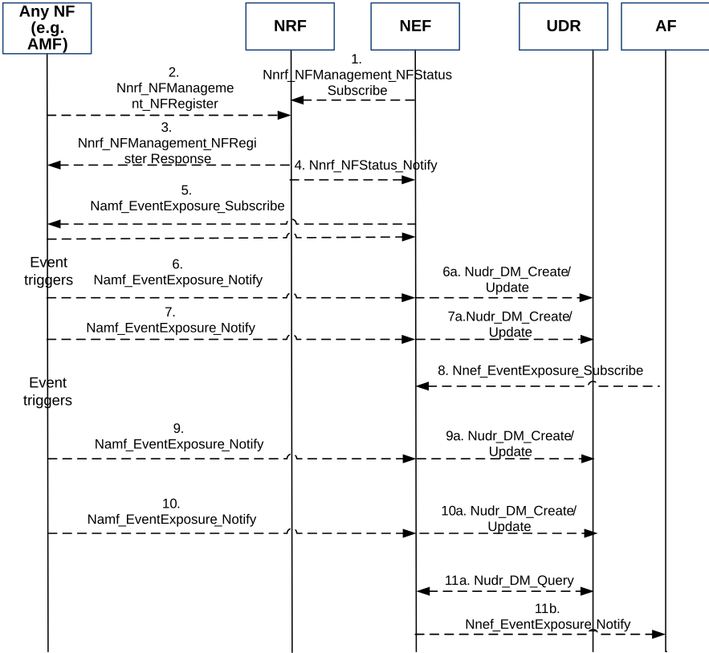

# 4.15.3.2.4 Exposure with bulk subscription

Based on operator configuration NEF may perform bulk subscription with the NFs that provides necessary services. This feature is controlled by local policies of the NEF that control which events (set of Event ID(s)) and UE(s) are target of a bulk subscription.

When the NEF performs bulk subscription (subscribes for any UE (i.e. all UEs), group of UE(s) (e.g. identifying a certain type of UEs such as IoT UEs)), it subscribes to all the NFs that provide the necessary services (e.g. In a given PLMN, NEF may subscribe to all AMFs that support reachability notification for IoT UEs). Upon receiving bulk subscription from the NEF, the NFs store this information. Whenever the corresponding event(s) occur for the requested UE(s) as in bulk subscription request, NFs notify the NEF with the requested information.

The following call flow shows how network exposure can happen for one UE, groups of UE(s) (e.g. identifying a certain type of UEs such as IoT UEs) or any UE.

Figure 4.15.3.2.4-1: NF registration/status notification and Exposure with bulk subscription

1\. NEF registers with the NRF for any newly registered NF along with its NF services.

2\. When an NF instantiates, it registers itself along with the supported NF services with the NRF.

3\. NRF acknowledges the registration

4\. NRF notifies the NEF with the newly registered NF along with the supported NF services.

5\. NEF evaluates the NF and NF services supported against the pre-configured events within NEF. Based on that, NEF subscribes with the corresponding NF either for a single UE, group of UE(s) (e.g. identifying a certain type of UEs such as IoT UEs), any UE. NF acknowledges the subscription with the NEF.

6 - 7. When the event trigger happens, NF notifies the requested information towards the subscribing NEF along with the time stamp. NEF may store the information in the UDR along with the time stamp using either Nudr_DM_Create or Nudr_DM_Update service operation as appropriate.

8\. Application registers with the NEF for a certain event identified by event filters. If the registration for the event is authorized by the NEF, the NEF records the association of the event and the requester identity.

9 - 10. When the event trigger happens, NF notifies the requested information towards the subscribing NEF. NEF may store the information in the UDR using either Nudr_DM_Create or Nudr_DM_Update service operation as appropriate.

11a-b. NEF reads from UDR with Nudr_DM_Query and notifies the application along with the time stamp for the corresponding subscribed events.
