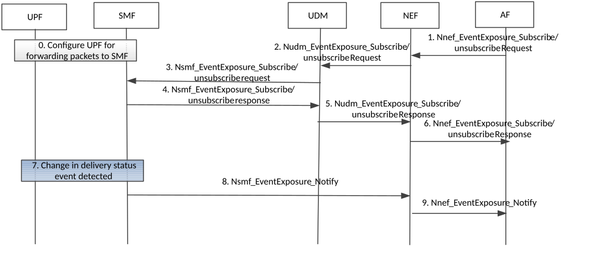

# 4.15.3.2.5 Information flow for downlink data delivery status with SMF buffering

The procedure is used if the SMF requests the UPF to forward downlink data packets that are subject of extended buffering in the SMF. The procedure describes a mechanism for the Application Function to subscribe downlink data delivery status notifications. The downlink data delivery status notifications relates to high latency communication, see also clauses 4.24.2 and 4.2.3.3.

Cancelling the subscription is done by sending Nnef_EventExposure_Unsubscribe request identifying the subscription to cancel with Subscription Correlation ID in the same order as indicated in figure 4.15.3.2.5-1 for the corresponding subscribe requests. Step 0 and the notification steps 7 to 9 are not applicable in cancellation case.

Figure 4.15.3.2.5-1: Information flow for downlink data delivery status with SMF buffering

0\. The SMF (in the non-roaming case the SMF, in the roaming case the V-SMF, in the case of PDU session with I-SMF the I-SMF) configures the relevant UPF to forward downlink data packets towards the SMF as described in clause 5.8.3 in 23.501 \[2\]. The SMF decides to apply this behaviour based on the "expected UE behaviour". Alternatively, step 0 is triggered by step 3,

1\. The AF sends Nnef_EventExposure_Subscribe Request to NEF requesting notification for event "Downlink data delivery status" with traffic descriptor (e.g. the source of the downlink IP or Ethernet traffic) for a UE or group of UEs. If the reporting event subscription is authorized by the NEF, the NEF records the association of the event trigger and the requester identity. The Downlink data delivery status events include:

\- First downlink Packet in extended buffering event:

\- This event is triggered when the first new downlink data packet is buffered with extended buffering matching the traffic descriptor.

\- in notifications about this Downlink data delivery status, the SMF provides the Extended Buffering time as determined in clause 4.2.3.3.

\- First downlink Packet discarded:

\- This event occurs when the first packet matching the traffic descriptor is discarded because the Extended Buffering time, as determined by the SMF, expires or the amount of downlink data to be buffered is exceeded.

\- First Downlink Packet transmitted:

\- This event occurs when the first packet matching the traffic descriptor is transmitted after previous buffering or discarding of corresponding packet(s) because the UE of the PDU Session becomes ACTIVE and buffered data can be delivered to UE according to clause 4.2.3.3.

2\. The NEF sends the Nudm_EventExposure_Subscribe Request to UDM. Identifier of the UE or group of UEs, the traffic descriptor, monitoring event received from AF in step 1 and notification endpoint of the NEF are included in the message. If the reporting event subscription is authorized by the UDM, the UDM records the association of the event trigger and the requester identity. Otherwise, the UDM continues in step 5 indicating failure.

3\. The UDM sends the Nsmf_EventExposure_Subscribe Request message to each SMF where at least one UE identified in step 2 has a PDU session established. If the UDM is able to derive the applicable DNN and S-NSSAI from the traffic descriptor via configured information, the UDM may send Nsmf_EventExposure_Subscribe Request messages only to SMFs with PDU sessions with that DNN and S-NSSAI for such UEs and includes the Identifier of the UE or Internal-Group-Id, traffic descriptor, monitoring event and the notification endpoint of NEF received in step 2 are included in the message. If the UDM becomes aware that such a UE has a PDU session established with the DNN and S-NSSAI corresponding to the traffic descriptor at a later time than when receiving step 2, the UDM then executes step 3.

In the case of home-routed PDU session or PDU session with I-SMF, the UDM sends the Nsmf_EventExposure_Subscribe Request message to each H-SMF or SMF and the H-SMF or SMF further sends Nsmf_EventExposure_Subscribe Request message to each related V-SMF or I-SMF. Steps 7-8 are performed by V-SMF or I-SMF.

4\. The SMF sends the Nsmf_EventExposure_Subscribe Response message to the UDM.

5\. The UDM send sends the Nsmf_EventExposure_Subscribe response message to the NEF.

6\. The NEF sends the Nsmf_EventExposure_Subscribe response to the AF.

7\. The SMF detects a change in Downlink Data Delivery Status event as described in clause 4.2.3. The SMF becomes aware that Downlink Packet(s) require extended buffering via a Namf_Communication_N1N2MessageTransfer service operation with the AMF. If the SMF decides to discard packets, the "Downlink Packet(s) discarded event" is detected. The SMF detects that previously buffered packets can be transmitted by the fact that the related PDU session becomes ACTIVE.

8\. The SMF sends the Nsmf_EventExposure_Notify with Downlink Delivery Status event message to NEF.

9\. The NEF sends Nnef_EventExposure_Notify with Downlink Delivery Status event message to AF.
