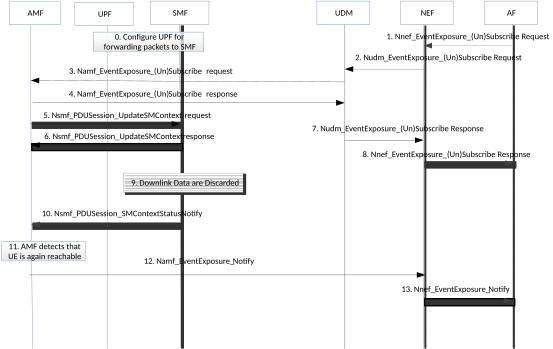

# 4.15.3.2.7 Information flow for Availability after DDN Failure with SMF buffering

The procedure is used if the SMF requests the UPF to forward packets that are subject of buffering in the SMF. The procedure describes a mechanism for the Application Function to subscribe to notifications about availability after downlink data notification failure. The Availability after Downlink Data Notification failure event is related to high latency communication, see also clauses 4.24.2 and 4.2.3.3.

Cancelling the subscription is done by sending EventExposure_Unsubscribe requests identifying the subscription to cancel with the Subscription Correlation ID in the same order as indicated in figure 4.15.3.2.7-1 for the corresponding subscribe requests (the AMF unsubscribes the DDN Failure status notification by sending the Nsmf_PDUSession_UpdateSMContext Request message to each SMF in step 5). Step 0 and the notification steps 9 to 13 are not applicable in the cancellation case.

Figure 4.15.3.2.7-1: Information flow for availability after DDN Failure with SMF buffering

0\. The SMF (in the no-roaming case the H-SMF. in the roaming case the V-SMF, in the case of PDU session with I-SMF the I-SMF) configures the relevant UPF to forward packets to the SMF as described in clause 5.8.3 in 23.501 \[2\]. The SMF decides to apply this behaviour based on the "expected UE behaviour". Alternatively, step 0 is triggered by step 5.

1\. The AF sends Nnef_EventExposure_Subscribe Request to the NEF requesting notifications for "Availability after DDN Failure" for a UE or group of UEs and providing a traffic descriptor identifying the source of the downlink IP or Ethernet traffic. If the reporting event subscription is authorized by the NEF, the NEF records the association of the event trigger and the requester identity.

The AF may include Idle Status Indication request in the Nnef_EventExposure_Subscribe Request. If Idle Status Indication request is included, the NEF includes it in Nudm_EventExposure_Subscribe message. If the NEF does not support the requested Idle Status Indication, then depending on operator policies, the NEF rejects the request.

2\. The NEF sends the Nudm_EventExposure_Subscribe Request to UDM. Identifier of the UE or group of UEs, the traffic descriptor, monitoring event received from AF at step 1 and notification endpoint of the NEF are included in the message. If the reporting event subscription is authorized by the UDM, the UDM records the association of the event trigger and the requester identity. Otherwise, the UDM continues in step 7 indicating failure.

If the UDM receives Idle Status Indication request, it includes it in Namf_EventExposure_Subscribe message.

3\. The UDM sends Namf_EventExposure_Subscribe messages to the AMF(s) which serve the UE(s) identified in step2 to subscribe to "Availability after DDN Failure". The UDM includes the DNN and S-NSSAI as well as the Traffic Descriptor if available A separate subscription is used for each UE. The NEF notification endpoint received in step 2 is included in the message. If the UDM becomes aware that such a UE is registered at a later time than when receiving step 2, the UDM then executes step 3.

4\. The AMF acknowledges the execution of Namf_EventExposure_Subscribe.

5\. If PDU Session exists for the DNN and S-NSSAI, the AMF subscribes to DDN Failure status notification by sending the Nsmf_PDUSession_UpdateSMContext Request message to each SMF, requesting the SMF to notify DDN Failure. The AMF also includes in Nsmf_PDUSession_UpdateSMContext the Traffic Descriptor and NEF correlation ID if received from the UDM. For new PDU Session establishment towards a DNN and S-NSSAI, the AMF subscribes to DDN Failure status notification in Nsmf_PDUSession_CreateSMContext Request message if the UDM has subscribed to Availability after DDN Failure event.

In the case of home-routed PDU session or PDU session with I-SMF, the AMF sends Nsmf_PDUSession_UpdateSMContext Request message(s) to the related V-SMF(s) or I SMF(s). Steps 9-10 are performed by those V-SMF(s) or I-SMF(s).

6\. The (I/V-)SMF sends the Nsmf_PDUSession_UpdateSMContext response message to the AMF.

NOTE: Step 7 can happen any time after step 4.

7\. The UDM sends the Nudm_EventExposure_Subscribe response to the NEF.

8\. The NEF sends the Nsmf_EventExposure_Subscribe response to the AF.

9-10. The SMF is informed that the UE is unreachable via a Namf_Communication_N1N2MessageTransfer service operation. The SMF then decides to discard downlink packets received from the UPF. By comparing those discarded downlink packets received from the UPF with the Traffic Descriptor(s) received in the event subscription(s), the SMF determines whether DDN Failure due to any traffic from an AF is to be notified to the AMF and if so, the SMF sends the DDN Failure status, by means of Nsmf_PDUSession_SMContextStatusNotify message including NEF Correlation ID, to the AMF. If the UE is not reachable after the AMF received the DDN Failure notification from the SMF, the AMF shall set a Notify-on-available-after-DDN-failure flag corresponding to the NEF Correlation ID.

11-12. \[Conditional\] The AMF detects the UE is reachable and sends the event report(s) based on the Notify-on-available-after-DDN-failure flag, by means of Namf_EventExposure_Notify message(s), only to the NEF(s) indicated as notification endpoint(s) identified via the corresponding subscription in step 3. In this way, only the AF(s) for which DL traffic transmission failed are notified.

If the AMF received Idle Status Indication request in step 3 and the AMF supports Idle Status Indication, the AMF includes also the Idle Status Indication.

13\. The NEF sends Nnef_EventExposure_Notify message with the "Availability after DDN Failure" event to AF.
