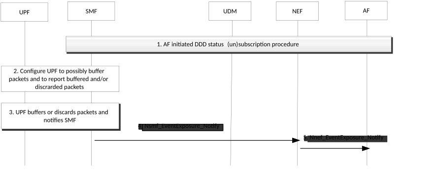

# 4.15.3.2.8 Information flow for downlink data delivery status with UPF buffering

The procedure is used if the SMF requests the UPF to buffer packets. The procedure describes a mechanism for the Application Function to subscribe to notifications about downlink data delivery status. The downlink data delivery status notifications relates to high latency communication, see also clauses 4.24.2 and 4.2.3.3.

Cancelling is done by sending Nnef_EventExposure_Unsubscribe request identifying the subscription to cancel with Subscription Correlation ID. Steps 2 to 5 are not applicable in the cancellation case.

Figure 4.15.3.2.8-1: Information flow for downlink data delivery status with UPF buffering

1\. AF interacts with NEF to subscribe DDD status event in SMF as described in steps 0-6 of clause 4.15.3.2.5.

In the case of subscription cancelling and SMF having interacted with the PCF during event subscription, the SMF reports to the PCF the unsubscribe of the DDD status event. The PCF updates or removes the PCC rule and this triggers the SMF to update or remove the corresponding PDR in the UPF. In case of home-routed PDU Session, the SMF unsubscribes the DDD status event from the V-SMF which in turn updates the N4 information (deactivating the notifications) in the V-UPF. In case of PDU Session with I-SMF, the SMF provides updated N4 information (deactivating the notifications) to the I-SMF which in turn updates the I-UPF.

2\. If the UPF is configured to apply extended buffering, step 2 is executed immediately after step 1. Otherwise, step 2 is executed when the SMF is informed that the UE is unreachable via a Namf_Communication_N1N2MessageTransfer service operation as described in clause 4.2.3 and the SMF then also updates the PDR(s) for flows requiring extended buffering to requests the UPF to buffer downlink packets. If the DDD status event with traffic descriptor has been received in the SMF in step 1, if extended DL Data buffering in the UPF applies, the SMF checks whether an installed PDR for the Traffic Descriptor exists and if so, requests the UPF to provide the requested type(s) of notifications. If PCC is not used and there is no installed PDR with the exact same traffic descriptor, the SMF copies the installed PDR that would have previously matched the incoming traffic described by the traffic descriptor, but provides that traffic descriptor, a higher priority and the requested type(s) of notifications. If PCC is used and if the "DDD Status event subscription with Traffic Descriptor" PCRT is set as defined in clause 6.1.3.5 of TS 23.503 \[20\], the SMF interacts with the PCF and forwards the traffic descriptor before contacting the UPF; the PCF then updates an existing PCC rule or provides a new PCC rule taking into consideration the traffic descriptor for the subscribed DDD status event.

NOTE: If a new PCC rule is provided by the PCF for the DDD status event detection, the PCF populates the PCC rules as defined in clause 6.1.3.5 of TS 23.503 \[20\].

In the case of home-routed PDU Session, the V-SMF generates the N4 information (activating the notifications) for the V-UPF based on local configuration.

In the case of PDU Session with I-SMF, the SMF provides N4 information (activating the notifications) to the I-SMF based on local policy or the "DDD Status event subscription with Traffic Descriptor" PCRT from PCF. The I-SMF updates the I-UPF with this N4 information.

For home-routed PDU Session or PDU Session with I-SMF, steps 3-4 below are performed by V-SMF/V-UPF or I-SMF/I-UPF.

3\. The UPF reports when there is buffered or discarded traffic matching the received PDR to the SMF. The SMF detects that previously buffered packets can be transmitted by the fact that the related PDU session becomes ACTIVE.

4\. The SMF sends the Nsmf_EventExposure_Notify with Downlink Delivery Status event message to NEF.

5\. The NEF sends Nnef_EventExposure_Notify with Downlink Delivery Status event message to AF.
