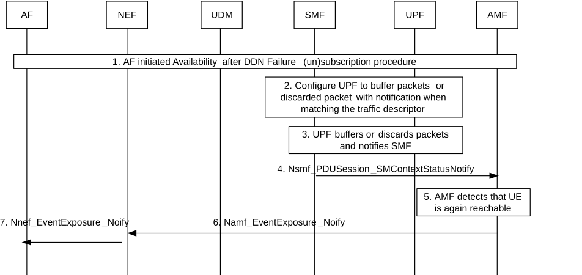

# 4.15.3.2.9 Information flow for Availability after DDN Failure with UPF buffering

The procedure is used if the SMF requests the UPF to buffer packets. The procedure describes a mechanism for the Application Function to subscribe to notifications about availability after DDN failure.

Cancelling is done by sending Nnef_EventExposure_Unsubscribe request identifying the subscription to cancel with Subscription Correlation ID. Steps 2 to 7 are not applicable in the cancellation case.

Figure 4.15.3.2.9-1: Information flow for availability after DDN Failure event with UPF buffering

1\. AF interacts with NEF to subscribe availability after DDN failure event in AMF/SMF as described in steps 0-8 of clause 4.15.3.2.7.

In case of subscription cancelling from AMF and SMF having interacted with the PCF during event subscription, the SMF reports to the PCF for the unsubscribe of DDN failure event. The PCF updates or removes the PCC rule and this triggers the SMF to update or remove the corresponding PDR and FAR in the UPF.

In the case of PDU Session with I-SMF or home-routed PDU Session, the AMF unsubscribes the DDN failure event towards I/V-SMF. In case of home-routed PDU Session, the V-SMF updates the N4 information (deactivating the notifications) in the V-UPF. In case of PDU Session with I-SMF, the I-SMF may request N4 information (deactivating the notifications) from the SMF and provides the Traffic Descriptor to the SMF. The SMF provides updated N4 information (deactivating the notifications) to the I-SMF which in turn updates the I‑UPF.

2\. The SMF checks whether an installed PDR for the Traffic Descriptor exists and if so, requests the UPF to report when the first downlink packet is received and when it is discarded in the UPF. If PCC is not used and there is no installed PDR with the exact same traffic descriptor, the SMF copies the installed PDR that would have previously matched the incoming traffic described by the traffic descriptor, but provides that traffic descriptor, a higher priority and requests the UPF to report when the first downlink packet is received and when it is discarded in the UPF.

If PCC is used and if the "DDN Failure event subscription with Traffic Descriptor" PCRT is set as defined in clause 6.1.3.5 of TS 23.503 \[20\], the SMF interacts with the PCF and forwards the traffic descriptor before contacting the UPF; the PCF then updates an existing PCC rule or provides a new PCC rule taking into consideration the traffic descriptor for the subscribed DDN failure event.

NOTE 1: If a new PCC rule is provided by the PCF for the DDN failure event detection, the PCF populates the PCC rules as defined in clause 6.1.3.5 of TS 23.503 \[20\].

In the case of PDU Session with I-SMF or home-routed PDU Session, the AMF subscribes the DDN failure event towards the I/V-SMF. In the case of home-routed PDU Session, the V-SMF generates the N4 information (activating the notifications) for the V-UPF based on local configuration.

In the case of PDU Session with I-SMF, the I-SMF may request N4 information (activating the notifications) from the SMF based on local configuration and provides the Traffic Descriptor to the SMF. The SMF provides updated N4 information (activating the notifications) to the I-SMF which in turn updates the I-UPF.

For home-routed PDU Session or PDU Session with I-SMF, steps 3-4 below are performed by V-SMF/V-UPF or I-SMF/I-UPF.

3-4. When the first downlink packet matching the traffic descriptor is received in the UPF, if in step 2 the SMF indicated drop notification to the UPF, the UPF notifies the SMF and the SMF reports the DDN Failure status with NEF Correlation ID, by means of Nsmf_PDUSession_SMContextStatusNotify message, to the AMF indicated as notification endpoint.

When the first downlink packet matching the traffic descriptor is received in the UPF, if in step 2 the SMF indicated buffer notification to the UPF, the UPF notifies the SMF and the SMF may initiate Network Triggered Service Request as specified in clause 4.2.3.3. If the AMF responds Namf_Communication_N1N2MessageTransfer response with failure (e.g. due to UE not reachable, or paging no response), in addition to what is specified in clause 4.2.3.3, the SMF reports DDN Failure status with NEF Correlation ID, by means of Nsmf_PDUSession_SMContextStatusNotify message, to the AMF indicated as notification endpoint.

When the AMF receives DDN Failure status from the SMF, the AMF shall set a Notify-on-available-after-DDN-failure flag corresponding to the Notification Correlation Id and the identifier of the UE if available.

5-6. \[Conditional\] The AMF detects the UE is reachable and sends the event report(s) based on the Notify-on-available-after-DDN-failure flag, by means of Namf_EventExposure_Notify message(s), only to the NEF(s) indicated as notification endpoint(s) identified via the corresponding subscription in step 1. In this way, only the AF(s) for which DL traffic transmission failed are notified.

If the AMF received Idle Status Indication request in step 1 and the AMF supports Idle Status Indication, the AMF includes also the Idle Status Indication in Namf_EventExposure_Notify message.

7\. The NEF sends Nnef_EventExposure_Notify message with the "Availability after DDN Failure" event to AF.
