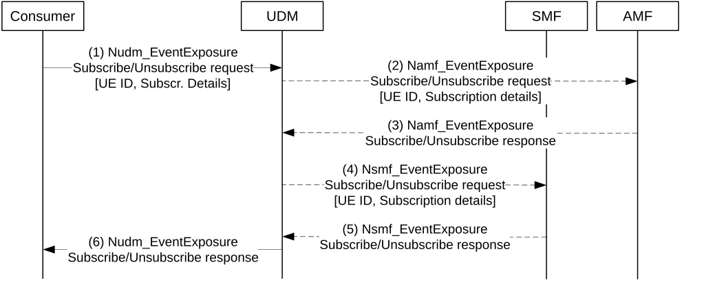

# 4.15.4.4 Internal Event Exposure Subscription/Unsubscription via UDM

This clause describes an indirect method of event exposure subscription in AMF and SMF via UDM for a UE or group of UEs. This can be used after the removal of UE context in the AMF including event exposure subscriptions, or the creation of new UE context in AMF or SMF. In this case, the UDM is responsible for (re)creating event exposure subscriptions in AMF and SMF.

Figure 4.15.4.4-1: Internal Event exposure subscription/unsubscription in AMF or SMF via UDM

1\. A consumer of event exposure for events detected in AMF or SMF (e.g. NWDAF) sends an Nudm_EventExposure Subscribe/Unsubscribe request to the UDM for a UE or group of UEs, including the subscription details (Event ID, Event filters, etc.).

2\. UDM examines the event type and subscription details to determine whether one or more events are to be detected by the AMF. In this case, for those applicable events that are detected by the AMF, if an AMF is registered in UDM for the UE (or for a UE that is member of the group of UEs), UDM creates an Namf_EventExposure Subscribe/Unsubscribe request and sends it to the AMF of the UE, including the subscription details.

3\. AMF answers with an Namf_EventExposure Subscribe/Unsubscribe response.

4\. UDM examines the event type and subscription details to determine whether one or more events are to be detected by the SMF. In this case, for those applicable events that are detected by the SMF, if one or more SMFs are registered in UDM for the UE (or for a UE that is member of the group of UEs), UDM creates an Nsmf_EventExposure Subscribe/Unsubscribe request and sends it to each applicable SMF of the UE, including the subscription details.

5\. SMF answers with an Nsmf_EventExposure Subscribe/Unsubscribe response.

6\. UDM sends an Nudm_EventExposure Subscribe/Unsubscribe response to the consumer of event exposure.
