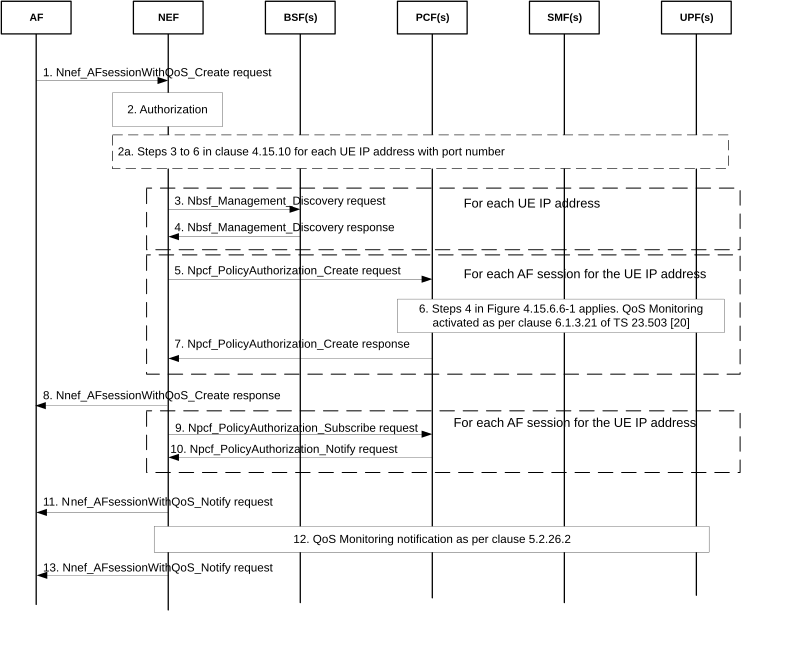
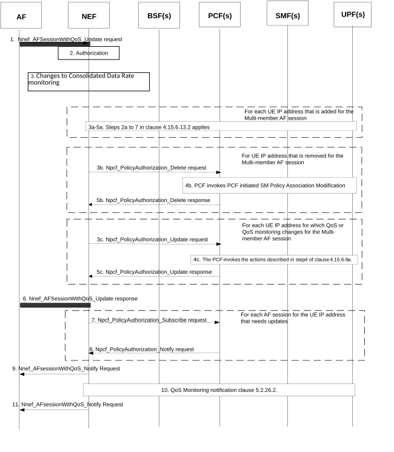
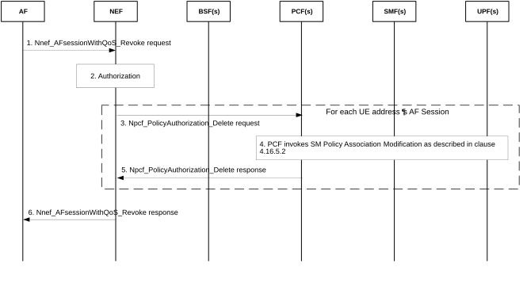

# 4.15.6.13 Multi-member AF session with required QoS

## 4.15.6.13.1 General Descriptions

This clause describes the procedure to request QoS and to perform QoS monitoring for the traffic flows for the communication between an AF and a set of UEs, identified by the list of UE address(es). For every UE in the set, this list contains the IP address and the port number that are used by the UE for the communication with the AF.

The NEF receives the request for a Multi-member AF session with required QoS for a set of UEs identified by their addresses. The NEF then maps the request for Multi-member AF session with required QoS to individual requests for AF session with required QoS (i.e., one request for individual AF session with required QoS per UE address) and interacts with each of the UE's serving PCFs on a per AF session basis. The interaction follows the AF session with required QoS procedure as described in clauses 4.15.6.6 and 4.15.6.6a, except that the involvement of the TSCTSF and the provisioning of TSCTSF related information are not supported.

The NEF receives the outcome of the individual requests for AF session with required QoS corresponding to each UE's IP address and consolidates them into a single response before forwarding it to the AF based on a locally configured timer (which could be set to zero).

NOTE 1: The consolidation of the outcome of the individual requests and the locally configured timer allow the optimization of the NEF to AF signalling according to the specific Multi-member AF session with required QoS. Multiple responses could be sent by an NEF (as RAN nodes may responds late or signalling messages may get lost) and the details of the NEF behaviour (e.g. handling of UE addresses for which no response has been received within the locally configured timer) are to be defined by stage 3.

The AF can subscribe to QoS Monitoring (as described in clause 5.45 of TS 23.501 \[2\]) for the Multi-member AF session with required QoS. If so, QoS monitoring will be activated by the NEF for the whole set of UEs by interacting with each of the UE's serving PCFs on a per AF session basis. The NEF shall always set the NEF ID as the Target of Reporting and include the indication of direct event notification in the request to PCFs regardless of whether AF included the indication of direct event notification or not to ensure that QoS Monitoring reports shall be sent by the UPF directly to the NEF. The NEF forwards the QoS Monitoring reports to the AF together with the respective UE address individually or, optionally, in an aggregated manner based on a locally configured timer.

When the AF subscribes to QoS Monitoring of UL and/or DL data rate (as described in clause 5.45 of TS 23.501 \[2\]) for the set of UEs, the AF may provide a Consolidated Data Rate threshold that is to be stored in the NEF. The Consolidated Data Rate threshold defines the upper bound of the aggregated data rate across all traffic flows corresponding to the list of UE addresses of the Multi-member AF session with required QoS. The AF may provide in addition a specific list of UE addresses subject to Consolidated Data Rate monitoring (which has to be the subset of the list of UE addresses for the Multi-member AF session), if only a part of the UEs participate in the current communication with the AF and the NEF maintains this list as well. The NEF aggregates the QoS Monitoring reports for data rate for those UEs identified by the specific list of UE addresses subject to Consolidated Data Rate monitoring (if available) or otherwise by the list of UE addresses for the Multi-member AF session with required QoS. The QoS Monitoring reports for data rate will then be sent to the AF by NEF, only if the aggregated data rate exceeds the Consolidated Data Rate threshold.

The following Table 4.15.6.13.1-1 describes the 4 types of requests for the Multi-member AF session with required QoS by the NEF and the corresponding requests to/from PCF using Npcf_PolicyAuthorization service. There may be different PCFs serving the PDU Sessions associated with the UE addresses in the Nnef_AFSessionWithQoS Request.

Table 4.15.6.13.1-1: Mapping of requests for Multi-member AF session with required QoS service to the corresponding Npcf_PolicyAuthorization service operations

<table>
<colgroup>
<col style="width: 49%" />
<col style="width: 50%" />
</colgroup>
<thead>
<tr class="header">
<th>Nnef_AFSessionWithQoS Request</th>
<th>Npcf_PolicyAuthorization request</th>
</tr>
</thead>
<tbody>
<tr class="odd">
<td>Create</td>
<td>
Npcf_PolicyAuthorization_Create request for each UE address received in the Nnef_AFSessionWithQoS Request.

Npcf_PolicyAuthorization_Subscribe to subscribe to QoS Monitoring reports for each UE address targeted for QoS monitoring received in the Nnef_AFSessionWithQoS Request.
</td>
</tr>
<tr class="even">
<td>Update</td>
<td>
Npcf_PolicyAuthorization_Update request to update the QoS and/or QoS monitoring according to the Nnef_AFSessionWithQoS_Update Request.

Npcf_PolicyAuthorization_Create request for each added UE address received in the Nnef_AFSessionWithQoS Request.

Npcf_PolicyAuthorization_Delete request for each removed UE address received in the Nnef_AFSessionWithQoS Request.

Npcf_PolicyAuthorization_Subscribe to subscribe to QoS Monitoring reports for each new UE address targeted for QoS monitoring received in the Nnef_AFSessionWithQoS Request.

More than one of the above operations can be requested at the same time.
</td>
</tr>
<tr class="odd">
<td>Revoke</td>
<td>Npcf_PolicyAuthorization_Delete request for each UE address received in the Nnef_AFSessionWithQoS Request.</td>
</tr>
<tr class="even">
<td>Notify</td>
<td>Npcf_PolicyAuthorization_Notify to report the events that NEF subscribed to.</td>
</tr>
</tbody>
</table>

NOTE 2: It is expected that the AF requests QoS and QoS monitoring for a specific traffic flow (used for the communication between a UE address and the AF) with either the procedure for Multi-member AF session with required QoS (described in this clause) or the procedure for AF session with required QoS as described in clause 4.15.6.6 and 4.15.6.6a.

## 4.15.6.13.2 Procedures for Creating a Multi-member AF session with required QoS

Figure 4.15.6.13.2-1: Procedures for creating a Multi-member AF session with required QoS

1\. The AF sends a request to reserve resources for the traffic flows for the communication between a set of UEs and an AF, using Nnef_AFsessionWithQoS_Create request message (a list of UE addresses, AF Identifier, Flow description information or External Application Identifier, QoS Reference or individual QoS parameters, Alternative Service Requirements (as described in clause 6.1.3.22 of TS 23.503 \[20\]), QoS parameter(s) to be measured, Reporting frequency, Target of reporting, optional an indication of direct event notification, DNN, S-NSSAI) to the NEF.

The Flow description information, if provided, is common for the list of UEs identified by the list of UE addresses.

\- The AF may, instead of a QoS Reference, provide one or more of the following individual QoS parameters: Requested 5GS Delay (optional), Requested Priority (optional), Requested Guaranteed Bitrate, Requested Maximum Bitrate, Maximum Burst Size and Requested Packet Error Rate. The optional Alternative Service Requirements provided by the AF shall either contain QoS References or Requested Alternative QoS Parameter Set(s) in a prioritized order as described in clause 6.1.3.22 of TS 23.503 \[20\]. The AF may provide QoS parameter(s) to be measured as defined in clause 5.45 of TS 23.501 \[2\], Reporting frequency, Target of reporting, optional an indication of direct event notification as described in clause 6.1.3.21 of TS 23.503 \[20\].

The AF may also provide the Consolidated Data Rate threshold and optionally, a list of UE addresses subject to Consolidated Data Rate monitoring. If so, the AF shall also subscribe to QoS Monitoring of UL and/or DL data rate described in clause 5.45 of TS 23.501 \[2\] .

NOTE 1: When the Consolidated Data Rate threshold is provided, it, by default, applies to the list of UE addresses associated with the Multi-member AF session with required QoS. However, if the specific list of UE addresses subject to Consolidated Data Rate monitoring is also provided together with the Consolidate Data Rate threshold, then such list has to be the subset of the list of UE addresses.

2\. The NEF authorizes the AF request that contains a list of UE addresses and may apply policies to control the overall amount of QoS authorized for the AF. If the authorisation is not granted, all steps (except step 8) are skipped and the NEF replies to the AF with a Result value indicating that the authorisation failed. The NEF assigns a Transaction Reference ID to the Nnef_AFsessionWithQoS_Create request. The NEF activates Consolidated Data Rate monitoring only when both the Consolidated Data Rate threshold and a request to do QoS Monitoring of data rate are provided by the AF.

2a. If the NEF recognizes, based on configuration, that the IP address(es) received in the list of UE addresses are different from the IP address(es) assigned by 5GC (i.e. the UE(s) are behind a NAT in UPFs), the NEF performs steps 3 to 6 of the AF specific UE ID retrieval procedure defined in clause 4.15.10 for each UE IP address with port number in order to identify the corresponding IP address (and IP domain, if necessary) that has been assigned by the 5GC. The NEF then uses the respective corresponding IP address (and IP domain, if necessary) in the following steps instead of the UE IP address provided by the AF.

3-4. The NEF finds BSF serving the UE IP address(es) using NRF and then for each UE IP address, the NEF uses Nbsf_Management_Discovery service operation, providing the UE IP address, to discover the responsible PCF for each of the PDU Sessions.

Steps 5-7 apply for each UE address in the list of UE addresses.

5\. The NEF provides the UE address and the received parameters in step 1 to the PCF in the Npcf_PolicyAuthorization_Create request. NEF shall include the Target of reporting and indication of direct event notification to PCF as described in clause 4.15.6.13.1.

6\. Step 4 in Figure 4.15.6.6-1 applies. The PCF generates authorized QoS Monitoring policy according to the QoS Monitoring information if received from the NEF in step 5 and provides PCC rules with the policy to the SMF as described in clause 6.1.3.21 of TS 23.503 \[20\]. The SMF configures the UPF to perform QoS Monitoring as described in clause 5.8.2.18 of TS 23.501 \[2\].

7\. The PCF sends the Npcf_PolicyAuthorization_Create response message to the NEF.

8\. The NEF aggregates the authorization responses from the PCFs and sends a Nnef_AFsessionWithQoS_Create response message (Transaction Reference ID, Result for list of UE addresses) with the aggregated authorization responses to the AF. Result for list of UE addresses includes whether the authorization was successful or has failed for every UE address in the list. The NEF stores the list of UE addresses for which the authorization was successful together with the Transaction Reference ID, the QoS and the QoS monitoring information.

Steps 9-10 apply for each UE address in the list of UE addresses.

9\. Step 6 in Figure 4.15.6.6-1 applies.

10\. Step 7 in Figure 4.15.6.6-1 applies.

11\. The NEF aggregates the notifications from the PCFs and sends a Nnef_AFsessionWithQoS_Notify message (Transaction Reference ID, Result for list of UE addresses) with the aggregated resource allocation status events to the AF. Result for list of UE addresses includes, for every UE address in the list, the information whether resources are allocated, resources are not allocated or resources are allocated while the currently fulfilled QoS matches an Alternative Service Requirement. The NEF updates the locally stored list of UE addresses by removing any UEs for which resources could not be allocated.

NOTE 2: For those UE address(es) that did not get any resources, the AF may request resource reservation again, by adding them to the list of UE address(es) as described in clause 4.15.6.13.3.

12\. As direct event notification is requested based on the parameters received in step 5, the QoS Monitoring events are reported by the UPF(s) to the NEF using Nupf_EventExposure service as described in clause 5.2.26.2.

13\. When the NEF receives QoS Monitoring events, the NEF sends Nnef_AFsessionWithQoS_Notify message with the individual or aggregated QoS Monitoring events to the AF as described for the QoS Monitoring and the Consolidated Data Rate monitoring in clause 4.15.6.13.1.

## 4.15.6.13.3 Procedure for updating a Multi-member AF session with required QoS

Figure 4.15.6.13.3-1: Procedure for updating a Multi-member AF session with required QoS

1\. The AF which controls the Multi-member AF Session with required QoS invokes the Nnef_AFSessionWithQoS_Update Request to update the list of UE addresses and/or to update the QoS and/or to update the QoS monitoring and/or to update the Consolidated Data Rate monitoring.

The Nnef_AFSessionWithQoS_Update request includes the Transaction Reference ID and one or more of the parameters that are listed in step 1 of the procedure for creating a Multi-member AF session with required QoS in clause 4.15.6.13.2 which the AF needs to update (or provide for the first time).

NOTE 1: For example, the AF can subscribe to QoS monitoring or Consolidated Data Rate monitoring for the Multi-member AF session with required QoS if this has not been done during the procedure for creating a Multi-member AF session with required QoS, as described in clause 4.15.6.13.2.

NOTE 2: If AF needs to terminate the Consolidated Data Rate monitoring for the Multi-member AF session with required QoS, the AF does not include the Consolidate Data Rate threshold in the AF request.

2\. The NEF authorizes the AF request and may apply policies to control the overall amount of QoS authorized for the AF. If the authorisation is not granted, all following steps are skipped and the NEF replies to the AF with a Result value indicating that the authorisation failed. The NEF performs Consolidated Data Rate monitoring only when both the Consolidated Data Rate threshold and a request to do QoS Monitoring of data rate are provided by the AF.

3-5. When the AF provides an Nnef_AFSessionWithQoS_Update Request in order to add/update/remove the Consolidated Data Rate threshold or the list of UE addresses subject to Consolidated Data Rate monitoring, the NEF updates its local context and does not interact with the PCF(s) (unless required for reasons described in the following).

When the AF provides an Nnef_AFSessionWithQoS_Update Request in order to update the list of UE addresses, to update the QoS and/or to update the QoS monitoring, the NEF refers to the locally stored information (i.e. the list of UE addresses, the QoS and the QoS monitoring information) and determines which new UE address is to be added to the list, which of the existing UE address is to be removed from the list and/or for which of the existing UE address(es) the QoS or the QoS monitoring (or both) is to be updated. Then, the NEF continues by invoking one of the following Npcf_PolicyAuthorization procedures for every affected UE address:

a\) If the NEF determines that a new UE is to be added to the list, the NEF performs steps 2a to 7 of clause 4.15.6.13.2 for the corresponding UE. The NEF uses the latest information on QoS and QoS monitoring for the interaction with the PCF. The NEF adds the address of the new UE to the locally stored list of UE addresses if the authorization was successful.

b\) If the NEF determines that an existing UE is to be removed from the list, the NEF initiates the Npcf_PolicyAuthorization_Delete as described in clause 5.2.5.3.4 excluding TSCTSF related info towards the PCF for the corresponding UE. The NEF removes the UE address from the locally stored list of UE addresses.

c\) If the NEF determines that an update of the QoS or the QoS monitoring or both for existing UE addresses is necessary, the NEF initiates the Npcf_PolicyAuthorization_Update to the respective UE's serving PCF(s) on a per AF session basis and step 4 in Figure 4.15.6.6a-1 applies. The NEF removes any UE addresses for which the authorization of the update request has failed from the list of UE addresses. The NEF stores any change to the QoS or the QoS monitoring information.

6\. When an interaction with PCF(s) has occurred during step 5, the NEF aggregates the authorization responses from the PCF(s) and sends the Nnef_AFSessionWithQoS Update response (Transaction Reference ID, Result for list of UE addresses) with the aggregated authorization results to the AF. Result for list of UE addresses includes whether the request is granted or not for every UE address in the list.

When no interaction with PCF(s) has occurred during step 4 and 5, the NEF sends the Nnef_AFSessionWithQoS Update response (Transaction Reference ID, Result) with the result of the Consolidated Data Rate monitoring related change to the AF.

7\. For every UE address that has been added to the locally stored list of UE addresses, the NEF shall send a Npcf_PolicyAuthorization_Subscribe message to the respective PCF(s) to subscribe to notifications of Resource allocation status and may subscribe to other events described in clause 6.1.3.18 of TS 23.503 \[20\]. If an update of event subscription is requested by the AF, the NEF updates the event subscription with the respective PCF(s) for every UE address in the locally stored list of UE addresses.

8\. Step 7 in Figure 4.15.6.6-1 applies, at least for those UE addresses for which the establishment or update of transmission resources was requested by the PCF(s).

9\. When the establishment or update of transmission resources occurs, the NEF receives Npcf_PolicyAuthorization_Notify messages from the UE's serving PCF(s) about the Resource allocation status. The NEF aggregates the notifications from the respective UEs' serving PCFs before notifying the AF with a Nnef_AFSessionWithQoS_Notify message (Transaction Reference ID, Result for list of UE addresses). Result for list of UE addresses includes, for every UE address in the list, the information whether resources are allocated, resources are not allocated or resources are allocated while the currently fulfilled QoS matches an Alternative Service Requirement. The NEF updates the locally stored list of UE addresses by removing any UEs for which resources could not be allocated.

NOTE 3: For those UE address(es) that did not get any resources, the AF may request resource reservation again, by adding them to the list of UE address(es) as described in clause 4.15.6.13.3.

10\. As direct event notification is requested, the UPF(s) provide the QoS Monitoring events to the NEF using Nupf_EventExposure service as described in clause 5.2.26.2.

11\. When the NEF receives QoS Monitoring events, the NEF sends Nnef_AFsessionWithQoS_Notify message with the individual or aggregated QoS Monitoring events to the AF as described for the QoS Monitoring and the Consolidated Data Rate monitoring in clause 4.15.6.13.1.

## 4.15.6.13.4 Procedure for Revoking a Multi-member AF session with required QoS

Figure 4.15.6.13.4-1: Procedure for revoking a Multi-member AF session with required QoS

1\. The AF sends a request to revoke the allocated resources for the traffic flows for the communication between a set of UEs and an AF, using Nnef_AFsessionWithQoS_Revoke request message (Transaction Reference ID).

2\. The NEF authorizes the AF request.

Steps 3-5 apply for each UE address in the list of UE addresses associated with the Transaction Reference ID:

3\. The NEF sends the Npcf_PolicyAuthorization_Delete request as described in clause 5.2.5.3.4 to the PCF.

4\. The PCF proceeds with the SM Policy Association Modifications procedure as defined in clause 4.16.5.2. If the NEF has subscribed to notifications (e.g. on resource allocation status, QoS Monitoring of UL and/or DL data rate) for the UE address in the Multi-member AF session, the subscription is also removed.

5\. The PCF sends the Npcf_PolicyAuthorization_Delete response message to the NEF.

6\. The NEF sends the Nnef_AFsessionWithQoS_Revoke response message (Transaction Reference ID) to the AF.
