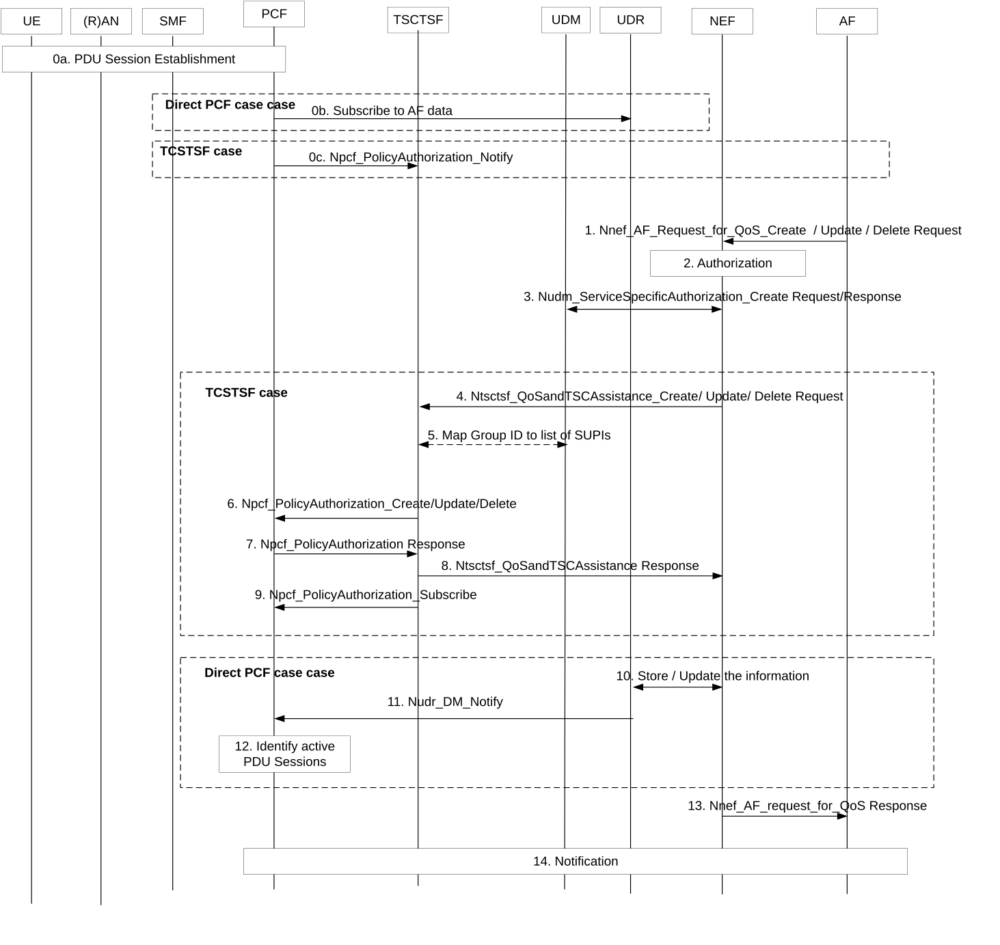

# 4.15.6.14 Procedures for AF requested QoS for a UE or group of UEs not identified by a UE address

Figure 4.15.6.14-1: Procedure for AF requested QoS for a UE or group of UEs not identified by a UE address

0\. When a new PDU Session is established, based on local configuration associated with the DNN/S-NSSAI, the PCF determines if the PDU Session needs involvement of TSCTSF. If the TSCTSF is used the PCF invokes Npcf_PolicyAuthorization_Notify service operation to the TSCTSF discovered and selected as described in clause 6.3.24 of TS 23.501 \[2\]. The Npcf_PolicyAuthorization_Notify service operation includes the UE address of the PDU Session and DNN/S-NSSAI. If the TSCTSF is not used, the PCF subscribes to notifications for Application Data from UDR.

NOTE: In the case of private IPv4 address being used for the UE, the DNN and S-NSSAI are required for session binding in the PCF.

The PCF registers to BSF as described in TS 23.503 \[20\]. When the TSCTSF is used, the TSCTSF invokes a Npcf_PolicyAuthorization_Create request message to the PCF and stores the DNN, S-NSSAI and IP address as received from PCF and SUPI as received from BSF and associates them with the AF-session.

1\. The AF sends a request to reserve resources using Nnef_AF_Request_QoS_Create request message (GPSI or External Group ID, AF Identifier, Flow description(s) or External Application Identifier, QoS reference or individual QoS parameters, Alternative Service Requirements (as described in clause 6.1.3.22 of TS 23.503 \[20\]), DNN, S-NSSAI) to the NEF. Optionally, QoS monitoring parameters (as described in clause 6.1.3.21 of TS 23.503 \[20\]) can be included in the AF request. Optionally, a period of time or a traffic volume for the requested QoS can be included in the AF request. The AF may, instead of a QoS Reference, provide the individual QoS parameters. Regardless, whether the AF request is formulated using a QoS Reference or Individual QoS paramaters, the AF may also provide one or more of the parameters that describe the traffic characteristics as described in clause 6.1.3.28 of TS 23.503 \[20\].

2\. This step is the same as step 2 in clause 4.15.6.6.

3\. This step is the same as steps 2-4 in clause 4.15.6.7a.

The NEF determines whether to invoke the TSCTSF or not, as described in step 2 in clause 4.15.6.6. If the NEF determines to invoke TSCTSF, steps 4-9 are executed and steps 10-12 are skipped. Otherwise steps 4-9 are skipped and steps 10-12 are executed. The procedure then continues in step 13.

4\. This step is the same as step 3a in clause 4.15.6.6 with the difference that Internal Group ID or SUPI is provided instead of UE address.

5\. If the group members are identified by GPSI or External/Internal Group ID, the TSCTSF uses the Nudm_SDM_Get request to retrieve the subscription information (SUPI(s)) from the UDM using each GPSI or the External/Internal Group Identifier received in step 4 The TSCTSF also determines which of these group members have active PDU Sessions matching the DNN/S-NSSAI and determines the relevant UE address. The TSCTSF manages the AF request QoS information targeting for a group as defined in TS 23.501 \[2\].

6\. For each PDU Session, the TSCTSF invokes Npcf_PolicyAuthorization service. This step is the same as step 3b in clause 4.15.6.6.

7\. The PCF replies to the TSCTSF. This step is the same as step 4a in clause 4.15.6.6.

8\. The TSCTSF replies to the NEF. This step is the same as step 4b in clause 4.15.6.6.

9\. This step is the same as step 6a in clause 4.15.6.6 with the difference that it is executed for all PDU Sessions identified in step 6 above.

10\. If the NEF determines to not invoke the TSCTSF, the NEF uses the Nudr_DM service to store the information related to the Internal Group ID or SUPI in UDR. The information is stored as Application Data in UDR. If the AF requested for notifications of Resource allocation status or other events, the NEF includes the information required for reporting the event, including the Notification Target Address pointing to the NEF or AF and the Notification Correlation ID containing the AF Transaction Internal ID. This step is the same as step 3 in clause 4.15.6.7.2 except the Data Subset of "Application Data" is set to "AF request for QoS information".

11\. The UDR notifies the PCF(s) that have subscribed.

12\. The PCF(s) identifies the active PDU Sessions associated with the data received from UDR. The PCF(s) manages the AF request QoS information targeting for a group as defined in TS 23.503 \[20\].

13\. The NEF replies to the AF. This step is the same as step 8 in clause 4.15.6.6.

14\. When an event condition is met, e.g. that the establishment of the transmission resources corresponding to the QoS update succeeded or failed, the PCF sends a notification to TSCTSF or NEF as applicable. This step is the same as steps 7-8 in clause 4.15.6.6.
