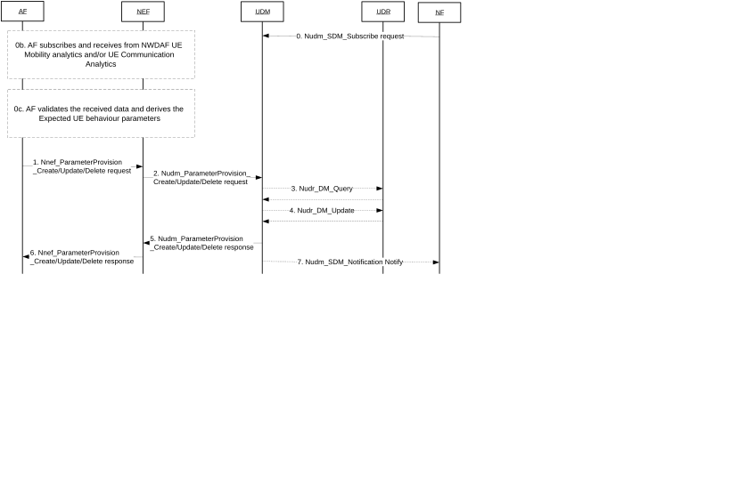

# 4.15.6.2 NEF service operations information flow

Figure 4.15.6.2-1: Nnef_ParameterProvision_Create / Nnef_ParameterProvision_Update / Nnef_ParameterProvision_Delete request/response operations

0\. NF subscribes to UDM notifications of UE and/or Group Subscription data updates. In the UDM subscription, the NF may request to be notified about expected UE behaviour parameter(s) in Table 4.15.6.3-1 or Application-Specific Expected UE Behaviour parameter(s) in Table 4.15.6.3f-1 that may have been externally provisioned by an AF.

NOTE 1: The NF can subscribe to Group Subscription data from UDM in this step and be notified of Group Subscription data updates in step 7 using the Shared Data feature defined in TS 29.503 \[52\].

NOTE 2: The external parameters in Table 4.15.6.3-1 may be provisioned by an AF hosting an AI/ML based application.

If an expected UE behaviour parameter subscription is provided by the NF, the subscription may include a threshold indicating that certain confidence and/or accuracy levels must be met for the parameter(s) to be notified by the UDM to the NF. Meeting the threshold condition may mean that the confidence and/or accuracy levels of a parameter are equal to certain threshold, or less than certain threshold, or greater than certain threshold, or less than or equal to certain threshold, or greater than or equal to certain threshold. The threshold may be in the form of a range (e.g. minimum value to maximum value, where each may be inclusive or exclusive) or a specific value.

NOTE 3: The threshold may be used to e.g. prevent certain Expected UE Behaviour parameters from being stored in the network when certain minimum level of confidence and/or accuracy are not met.

NOTE 4: Confidence level indicates a probability assertion for the associated Expected UE Behaviour parameter and accuracy level indicates the performance of the estimator (e.g. AI/ML model) used for the prediction.

0b. \[Conditional, on using NWDAF-assisted values\] The AF may subscribe to NWDAF via NEF in order to learn the UE mobility analytics and/or UE Communication analytics for a UE or group of UEs by applying the procedure specified in clause 6.1.1.2 of TS 23.288 \[50\]. The Analytics ID is set to any of the values specified in clause 6.7.1 of TS 23.288 \[50\].

0c. \[Conditional, on using NWDAF-assisted values\] AF validates the received data and derives any of the Expected UE behaviour parameters defined in clause 4.15.6.3 for a UE or group of UEs.

1\. The AF provides one or more parameter(s) to be created or updated, or deleted in a Nnef_ParameterProvision_Create or Nnef_ParameterProvision_Update or Nnef_ParameterProvision_Delete Request to the NEF. The parameters(s) may include corresponding confidence and/or accuracy levels.

The AF provides target UE identifier (e.g. GPSI or External Group ID) as described in clause 5.2.6.4. The Transaction Reference ID identifies the transaction request between NEF and AF. For the case of Nnef_ParameterProvision_Create, The NEF assigns a Transaction Reference ID to the Nnef_ParameterProvision_Create request.

NEF checks whether the requestor is allowed to perform the requested service operation by checking requestor's identifier (i.e. AF Identifier).

NOTE 5: When multiple AF parameter provisioning Create or Update requests with different values of the same Expected UE Behaviour parameters are received from different AFs, the network behaviour is unspecified.

For a Create request associated with a 5G VN group, the External Group ID identifies the 5G VN Group.

The payload of the Nnef_ParameterProvision_Update Request includes one or more of the following parameters:

\- Expected UE Behaviour parameters (see clause 4.15.6.3); or

\- Network Configuration parameters (see clause 4.15.6.3a); or

\- 5G VN group data (i.e. 5G VN configuration parameters) (see clause 4.15.6.3b), or

\- 5G VN group membership management parameters (see clause 4.15.6.3c); or

\- Location Privacy Indication parameters of the "LCS privacy" Data Subset of the Subscription Data (see clause 5.2.3.3.1 of the present document and clause 7.1 of TS 23.273 \[51\]); or

\- Ranging/Sidelink Positioning Indication parameters of the "Ranging/Sidelink Positioning privacy" Data Subset of the Subscription Data (see clause 5.2.3.3.1 of the present document and Annex B of TS 33.533 \[94\]); or

\- MTC Provider Information; or

\- AF provided ECS Address Configuration Information (see clause 4.15.6.3d); or

\- DNN and S-NSSAI specific Group Parameters (see clause 4.15.6.3e); or

\- Application-Specific Expected UE Behaviour parameters (see clause 4.15.6.3f).

The AF may request to delete 5G VN configuration by sending Nnef_ParameterProvision_Delete to the NEF.

2\. If the AF is authorised by the NEF to provision the parameters, the NEF requests to create, update and store, or delete the provisioned parameters as part of the subscriber data via Nudm_ParameterProvision_Create, Nudm_ParameterProvision_Update or Nudm_ParameterProvision_Delete Request message, the message includes the provisioned data and NEF reference ID and optionally MTC Provider Information.

If the AF is not authorised to provision the parameters, then the NEF continues in step 6 indicating the reason to failure in Nnef_ParameterProvision_Create/Update/Delete Response message. Step 7 does not apply in this case.

If the NEF did not receive DNN and/or S-NSSAI from the AF and such information is configured as needed within 5GC, the NEF determines the DNN and/or S-NSSAI from the AF Identifier.

If the AF provides the DNN and S-NSSAI specific Group Parameters, the AF shall indicate the External Group ID, targeted DNN and S-NSSAI in the request.

If the AF provides the service area in the form of geographical information, the NEF maps the geographical information to the list of TAs.

NOTE 6: For non-roaming case and no authorisation or validation by the UDM required and if the request is not associated with a 5G VN group, the NEF can directly forward the external parameter to the UDR via Nudr_DM_Update Request message. And in this case, the UDR responds to NEF via Nudr_DM_Update Response message.

3\. UDM may read from UDR, by means of Nudr_DM_Query, corresponding subscription information in order to validate required data updates and authorize these changes for this subscriber or Group for the corresponding AF.

Based on local configuration, UDM may determine if there is any requirement in terms of threshold conditions that need to be met by the provisioned parameter before storing the parameter in UDR. If there are no such requirement(s) or the requirement(s) are satisfied, UDM may proceed seamlessly. If not satisfied, step 5 is triggered as a failed procedure and a related cause value is provided, e.g. "confidence level not sufficient". In that case step 4 is skipped.

4\. If the AF is authorised by the UDM to provision the parameters for this subscriber, the UDM resolves the GPSI to SUPI and requests to create, update or delete the provisioned parameters as part of the subscriber data via Nudr_DM_Create/Update/Delete Request message, the message includes the provisioned data.

If a new 5G VN group is created, the UDM shall assign a unique Internal Group ID for the 5G VN group and include the newly assigned Internal Group ID in the Nudr_DM_Create Request message. If the list of 5G VN group members is changed or if 5G VN group data has changed, the UDM updates the UE and/or Group subscription data according to the AF/NEF request.

When the service area is configured or updated for a group, the UDM authorises the request.

If the Default QoS is configured or updated for a group, the UDM authorises the request and uses such Default QoS to set 5GS Subscribed QoS profile in Session Management Subscription data for each UE within the group. The 5GS Subscribed QoS profile in Session Management Subscription data will be considered by SMF as described in clause 5.7.2.7 of TS 23.501 \[2\].

UDR stores the provisioned data as part of the UE and/or Group subscription data and responds with Nudr_DM_Create/Update/Delete Response message.

If the Maximum Group Data Rate is configured or updated for a 5G VN group, the UDM authorises the request and the Maximum Group Data Rate is applied as described in clause 5.29.2 of TS 23.501 \[2\].

When the 5G VN group data (as described in clause 4.15.6.3b) or 5G VN group membership is updated, the UDR notifies to the subscribed PCF by sending Nudr_DM_Notify as defined in clause 4.16.12.2.

If the AF is not authorised to provision the parameters, then the UDM continues in step 5 indicating the reason to failure in Nudm_ParameterProvision_Update Response message and step 7 is not executed.

The UDM classifies the received parameters (i.e. Expected UE Behaviour parameters or Suggested Number of Downlink Packets or the 5G VN configuration parameters or DNN and S-NSSAI specific Group Parameters or Location Privacy Indication parameters or ECS Address Configuration Information), into AMF associated and SMF associated parameters. The UDM may use the AF Identifier received from the NEF in step 2 to relate the received parameter with a particular subscribed DNN and/or S-NSSAI. The UDM stores the SMF-Associated parameters under corresponding Session Management Subscription data type.

Each parameter or parameter set may be associated with a validity time. The validity time is stored at the UDM/UDR and in each of the NFs, to which parameters are provisioned (e.g. in AMF or SMF). Upon expiration of the validity time, each node deletes the parameters autonomously without explicit signalling.

If the ECS Address Configuration Information is provided to any UE in AF request, the UDM shall make use of the shared data mechanism defined in TS 29.503 \[52\] and notify all NFs (SMFs) that have subscribed to receiving such shared data change notifications.

5\. UDM responds the request with Nudm_ParameterProvision_Create/Update/Delete Response. If the procedure failed, the cause value indicates the reason.

6\. NEF responds the request with Nnef_ParameterProvision_Create/Update/Delete Response. If the procedure failed, the cause value indicates the reason.

NOTE 7: If AF receives a failure update notification due to threshold conditions not met and AF does not want NFs to keep using the old parameters, then AF can send an Nnef_ParameterProvision_Delete request.

7\. \[Conditional this step occurs only after successful step 4\] UDM notifies the subscribed Network Function of the updated UE and/or Group subscription data via Nudm_SDM_Notification Notify message.

a\) If the subscribed NF is AMF, the UDM performs Nudm_SDM_Notification (SUPI or Internal Group Identifier, AMF-Associated Expected UE Behaviour parameters, Subscribed Periodic Registration Timer, subscribed Active Time, 5G VN group data or DNN and S-NSSAI specific Group Parameters, etc.) service operation. If the AMF receives confidence and/or accuracy levels along the Expected UE behaviour parameter(s), the AMF may use the associated confidence level and/or accuracy level when handling the expected UE behaviour parameter(s). The AMF uses the received parameters to derive the appropriate UE configuration of the NAS parameters and to derive Core Network assisted RAN parameters. The AMF may determine a Registration area based on parameters Stationary indication or Expected UE Moving Trajectory.

If the AMF obtains service area for a group or SUPI, the AMF configures the DNN for the group as LADN DNN and applies the LADN per DNN and S-NSSAI taking into account the service area for the group as described in clause 5.6.5a of TS 23.501 \[2\].

b\) If the subscribed NF is SMF, the UDM performs Nudm_SDM_Notification (SUPI or Internal Group Identifier, SMF-Associated Expected UE Behaviour parameter set, DNN/S-NSSAI, Suggested Number of Downlink Packets, 5G VN group data, etc.) service operation.

The SMF stores the received parameters and associates them with a PDU Session based on the DNN and S-NSSAI included in the message from UDM.

If the SMF receives confidence and/or accuracy levels along the Expected UE behaviour parameter(s), the SMF may use the associated confidence level and/or accuracy level when handling the expected UE behaviour parameter(s). The SMF may use the parameters as follows:

\- SMF configures the UPF accordingly. The SMF can use the Scheduled Communication Type parameter or Suggested Number of Downlink Packets parameter to configure the UPF with how many downlink packets to buffer. The SMF may use Communication duration time parameter and/or Expected Inactivity Time parameter and/or Battery Indication parameter combined with their confidence and/or accuracy levels to set the inactivity timer for a PDU Session. The SMF then waits for a UP inactivity report to be received from UPF. Based on the received UP inactivity report, the SMF may determine to deactivate the corresponding UP connection associated to the PDU Session of a single UE or determine a collective pattern of deactivating UP connections for multiple UEs (e.g. for a group of UEs receiving application AI/ML traffic during FL operation) and perform CN-initiated selective deactivation of UP connection of an existing PDU Session.

\- The SMF may derive SMF derived CN assisted RAN information for the PDU Session. The SMF provides the SMF derived CN assisted RAN information to the AMF as described in PDU Session establishment procedure or PDU Session modification procedure.

NOTE 8: The NEF (in NOTE 1) or the UDM (in step 3) can also update the corresponding UDR data via Nudr_DM_Create/Delete as appropriate.

NOTE 9: The change of AF provided ECS configuration information is not meant to apply immediately: the UDM interface to the SMF can refer to Shared Data for the Subscription provided ECS configuration information.

NOTE 10: Specification details of confidence and accuracy levels are left to Stage 3 work.
