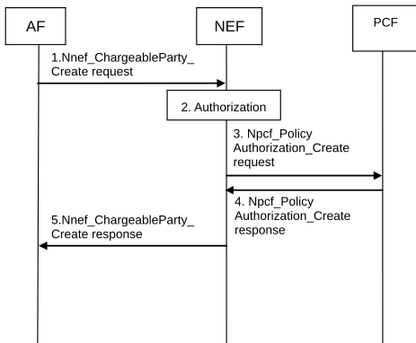

# 4.15.6.4 Set a chargeable party at AF session setup

Figure 4.15.6.4-1: Set the chargeable party at AF session set-up

1\. When setting up the connection between an ASP sponsoring a session and the UE, the ASP may communicate with the AF to request to become the chargeable party for the session to be set up by sending a Nnef_ChargeableParty_Create request message (AF Identifier, UE address, Flow description information or External Application Identifier, Sponsor Information, Sponsoring Status, Background Data Transfer Reference ID, DNN, S-NSSAI) to the NEF. The Sponsoring Status indicates whether sponsoring is started or stopped, i.e. whether the 3rd party service provider is the chargeable party or not. The Background Data Transfer Reference ID parameter identifies a previously negotiated transfer policy for background data transfer as defined in clause 4.16.7. The NEF assigns a Transaction Reference ID to the Nnef_ChargeableParty_Create request.

2\. The NEF authorizes the AF request to sponsor the application traffic and stores the sponsor information together with the AF Identifier and the Transaction Reference ID. If the authorisation is not granted, step 2 is skipped and the NEF replies to the AF with a Result value indicating that the authorisation failed.

NOTE: Based on operator configuration, the NEF may skip this step. In this case the authorization is performed by the PCF in step 3.

3\. The NEF interacts with the PCF by triggering a Npcf_PolicyAuthorization_Create request message and provides IP filter information or Ethernet filter information, sponsored data connectivity information (as defined in TS 23.503 \[20\]), Background Data Transfer Reference ID (if received from the AF) and Sponsoring Status (if received from the AF) to the PCF.

4\. The PCF determines whether the request is allowed and notifies the NEF if the request is not authorized. If the request is not authorized, NEF responds to the AF in step 5 with a Result value indicating that the authorization failed.

5\. The NEF sends a Nnef_ChargeableParty_Create response message (Transaction Reference ID, Result) to the AF. Result indicates whether the request is granted or not.
