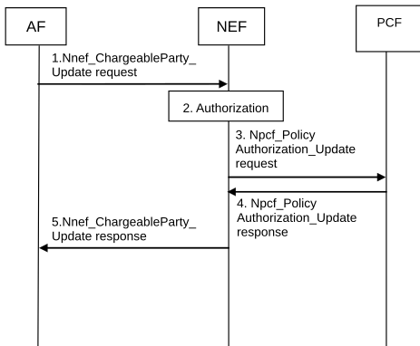

# 4.15.6.5 Change the chargeable party during the session

Figure 4.15.6.5-1: Change the chargeable party during the session

1\. For the ongoing AF session, the AF may send a Nnef_ChargeableParty_Update request message (AF Identifier, Transaction Reference ID, Sponsoring Status, Background Data Transfer Reference ID) to the NEF. The Sponsoring Status indicates whether sponsoring is enabled or disabled, i.e. whether the 3rd party service provider is the chargeable party or not. The Background Data Transfer Reference ID parameter identifies a previously negotiated transfer policy for background data transfer as defined in clause 4.16.7. The Transaction Reference ID provided in the Change chargeable party request message is set to the Transaction Reference ID that was assigned, by the NEF, to the a Nnef_ChargeableParty_Create request.

2\. The NEF authorizes the AF request of changing the chargeable party. If the authorisation is not granted, step 3 is skipped and the NEF replies to the AF with a Result value indicating that the authorisation failed.

NOTE: Based on operator configuration, the NEF may skip this step. In this case the authorization is performed by the PCF in step 3.

3\. The NEF interacts with the PCF by triggering a Npcf_PolicyAuthorization_Update request and provides IP filter information or Ethernet filter information, sponsored data connectivity information (as defined in TS 23.503 \[20\]), Background Data Transfer Reference ID (if received from the AF) and Sponsoring Status (if received from the AF) to the PCF.

4\. The PCF determines whether the request is allowed and notifies the NEF if the request is not authorized. If the request is not authorized, NEF responds to the AF in step 5 with a Result value indicating that the authorization failed.

5\. The NEF sends a Nnef_ChargeableParty_Update response message (Transaction Reference ID, Result) to the AF. Result indicates whether the request is granted or not.
