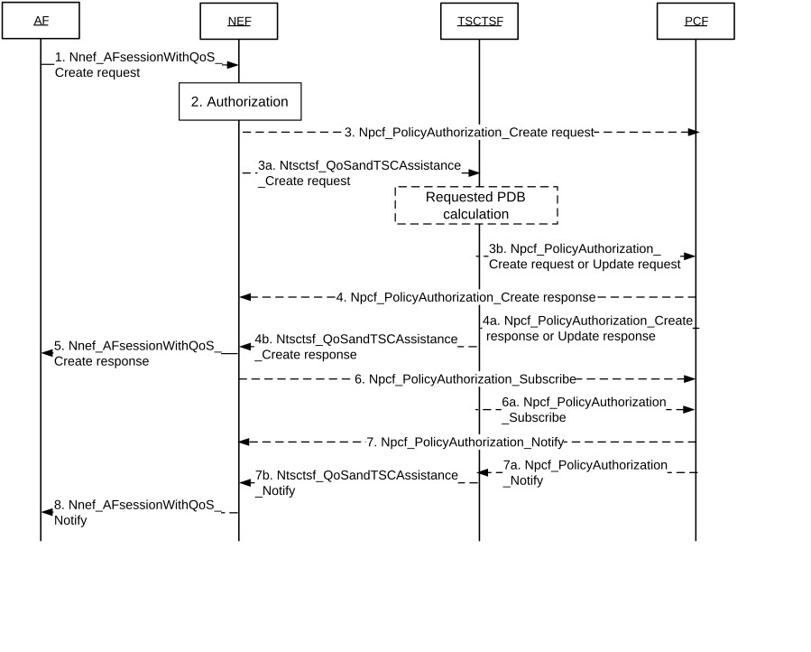

# 4.15.6.6 Setting up an AF session with required QoS procedure

Figure 4.15.6.6-1: Setting up an AF session with required QoS procedure

1\. The AF sends a request to reserve resources for an AF session using Nnef_AFsessionWithQoS_Create request message (UE address, AF Identifier, Flow description information or External Application Identifier, QoS Reference or individual QoS parameters, Alternative Service Requirements (as described in clause 6.1.3.22 of TS 23.503 \[20\]), DNN, S-NSSAI) to the NEF. Optionally, QoS monitoring requirements, Indication of ECN marking for L4S, PDU Set QoS Parameters (as described in clause 5.7.7 of TS 23.501 \[2\]) and Protocol Description (as described in clause 5.37.5 or 5.37.8.3 of TS 23.501 \[2\]) can be included in the AF request. For a Multi-modal service, the AF may provide a Multi-modal Service ID together with Multi-modal Service Requirements information for each data flow, as described in clause 6.1.3.27.3 of TS 23.503 \[20\]. Optionally, a period of time or a traffic volume for the requested QoS can be included in the AF request. The AF may, instead of a QoS Reference, provide one or more of the following individual QoS parameters: Requested 5GS Delay (optional), Requested Priority (optional), Requested Guaranteed Bitrate, Requested Maximum Bitrate, Maximum Burst Size and Requested Packet Error Rate. The AF may also provide an Averaging Window value for deriving such parameters for GBR QoS Flows. Regardless of whether the AF request is formulated using a QoS Reference or individual QoS parameters, the AF may also provide one or more of the following parameters that describe the traffic characteristics: flow direction, Burst Arrival Time at UE (uplink) or UPF (downlink), Periodicity, Time domain, Survival Time, Capability for BAT adaptation or BAT Window, Periodicity Range. The AF may also provide an RT Latency Indication. The optional Alternative Service Requirements provided by the AF shall either contain QoS References or Requested Alternative QoS Parameter Set(s) in a prioritized order as described in clause 6.1.3.22 of TS 23.503 \[20\]. Optionally, Packet Delay Variation requirements can be included in the AF request as described in clause 6.1.3.26 of TS 23.503 \[20\]. Optionally, the AF may provide QoS duration and QoS inactivity interval in order to indicate PCF the time period when the QoS should be applied.

NOTE 1: For multi-modal flows related to multiple UEs, multiple UE-specific AF requests are used and the AF provided information to NEF is the same as single UE case (as defined in clause 5.37.2 of TS 23.501 \[2\]).

2\. The NEF authorizes the AF request that contains a single UE address and may apply policies to control the overall amount of QoS authorized for the AF. If the authorisation is not granted, all steps (except step 5) are skipped and the NEF replies to the AF with a Result value indicating that the authorisation failed. The NEF assigns a Transaction Reference ID to the Nnef_AFsessionWithQoS_Create request.

The NEF determines whether to invoke the TSCTSF or to directly contact the PCF based on operator configuration. This determination may use the presence of a QoS Reference or individual QoS parameters in the AF request. The determination may also use the AF identifier or the presence of AF provided parameters that describe the traffic characteristics in the AF request.

NOTE 2: The determination can also be based on an SLA between operator and application provider, e.g. using the DNN/S-NSSAI for the AF session according to the SLA.

If the NEF determines not to invoke the TSCTSF, then steps 3, 4, 5, 6, 7, 8 are executed, otherwise, steps 3a, 3b, 4a, 4b, 5, 6a, 7a, 7b, 8 are executed.

3\. If the NEF determines to contact the PCF directly without invoking the TSCTSF, the NEF uses the UE address to discover the PCF from the BSF. The NEF forwards received parameters to the PCF in the Npcf_PolicyAuthorization_Create request. Any optionally received period of time or traffic volume mapped and forwarded as sponsored data connectivity information (as defined in TS 23.503 \[20\]).

If the AF is considered to be trusted by the operator, the AF uses the Npcf_PolicyAuthorization_Create request message to interact directly with PCF to request reserving resources for an AF session.

3a. If the NEF determines to invoke the TSCTSF, the NEF forwards received parameters in the Ntsctsf_QoSandTSCAssistance_Create request message to the TSCTSF. Any optionally received period of time or traffic volume is mapped and forwarded as sponsored data connectivity information (as defined in TS 23.503 \[20\]).

If the AF is considered to be trusted by the operator, the AF uses the Ntsctsf_QoSandTSCAssistance_Create request message to interact directly with TSCTSF to request reserving resources for an AF session.

A TSCTSF address may be locally configured (a single TSCTSF per DNN/S-NSSAI) in the NEF, PCF and trusted AF. Alternatively, the NEF uses the AF Identifier to determine the DNN/S-NSSAI and uses the DNN/S-NSSAI to discover the TSCTSF from the NRF.

3b. The TSCTSF determines whether it has an AF session with a PCF for the given UE address. In this case the TSCTSF sends a Npcf_PolicyAuthorization_Update request message to the PCF and forwards the received parameters after executing the adjustment and mapping actions described below.

If the TSCTSF does not have an AF-session for a given UE address, the TSCTSF discovers the PCF and a Npcf_PolicyAuthorization_Create request message to the PCF.

If the TSCTSF receives a Requested 5GS Delay, the TSCTSF calculates a Requested PDB by subtracting the UE-DS-TT Residence Time (either provided by the PCF or pre-configured at TSCTSF) from the Requested 5GS Delay and sends the Requested PDB to the PCF instead of the Requested 5GS Delay. If the TSCTSF receives any of the following parameters: flow direction, Burst Arrival Time, Periodicity, Time domain, Survival Time, Capability for BAT adaptation or BAT Window, Periodicity Range from the NEF, the TSCTSF determines the TSC Assistance Container and sends it to the PCF instead of these parameters.

4\. For requests received from the NEF in step 3, the PCF determines whether the request is authorized and notifies the NEF if the request is not authorized.

If the request is authorized, the PCF derives the required QoS parameters of the PCC rule based on the information provided by the NEF and determines whether this QoS is allowed (according to the PCF configuration) and notifies the result to the NEF. If the AF is considered to be trusted by the operator, the PCF sends the Npcf_PolicyAuthorization_Create response message directly to AF.

If the PCF receives the individual QoS parameters instead of QoS Reference, the PCF determines a 5QI that matches the individual QoS parameters as described in clause 6.1.3.22 of TS 23.503 \[20\]. It also sets the GBR and MBR for the PCC rule according to the requested values. The PCF may use the Requested Priority from the AF to determine Priority Level as defined in clause 5.7.3.3 of TS 23.501 \[2\]. Requested individual QoS parameter values supersede default values for the 5QI.

If the PCF receives the RT Latency Indication described in clause 6.1.3.22 of TS 23.503 \[20\], the PCF executes Uplink-Downlink Transmission Coordination as described in clause 5.37.7 of TS 23.501 \[2\] and the associated QoS monitoring for the two correlated QoS Flows as described in clause 6.1.3.27.2 of TS 23.503 \[20\].

If the PCF receives PDU Set QoS parameters described in clause 5.7.7 of TS 23.501 \[2\], the PDU Set QoS parameters are applied as described in clause 6.1.3.22 of TS 23.503 \[20\].

If the PCF receives an explicit indication (i.e. Indication of ECN marking for L4S) as described in clause 6.1.3.22 of TS 23.503 \[20\], PCF decides that the service data flow supports ECN marking for L4S. PCF then indicates to the SMF to enable ECN marking for L4S for that QoS flow.

In addition, if the Alternative Service Requirements are provided, the PCF derives the Alternative QoS parameter set(s) in the same way from the one or more QoS Reference parameters or the Requested Alternative QoS Parameter Set(s) contained in the Alternative Service Requirements keeping the same prioritized order (as defined in clause 6.1.3.22 of TS 23.503 \[20\]).

NOTE 3: The PCF derived Alternative QoS parameter set(s) for the PCC rule are subsequently used to establish Alternative QoS Profile(s). The Alternative QoS Profile parameters provided to the NG-RAN are specified in clause 5.7.1.2a of TS 23.501 \[2\].

For multi-modal flows, the PCF derives the required QoS parameters in the PCC rules and generates the QoS monitoring requirements policy for each media flow, based on the information provided by the NEF.

If the PCF determines that the SMF needs updated policy information, the PCF issues a Npcf_SMPolicyControl_UpdateNotify request with updated policy information about the PDU Session as described in the PCF initiated SM Policy Association Modification procedure in clause 4.16.5.2.

4a. For requests received from the TSCTSF in step 3b, the PCF determines whether the request is authorized and notifies the TSCTSF if the request is not authorized.

If the request is authorized, the PCF derives the required QoS parameters of the PCC rule in the same way it is described in step 4 based on the information provided by the TSCTSF and determines whether this QoS is allowed (according to the PCF configuration) and notifies the result to the TSCTSF.

If the PCF determines that the SMF needs updated policy information, the PCF issues a Npcf_SMPolicyControl_UpdateNotify request with updated policy information about the PDU Session as described in the PCF initiated SM Policy Association Modification procedure in clause 4.16.5.2.

If the PCF receives a subscription for the 5GS Bridge/Router information from the TSCTSF, if the PCF does not have the 5GS Bridge/Router information for the PDU Session, the PCF uses the PCF initiated SM Policy Association Modification procedure as described in clause 4.16.5.2 to subscribe for 5GS Bridge/Router information event from the SMF. Once the PCF has the 5GS Bridge/Router information, the PCF notifies the TSCTSF for the 5GS Bridge/Router information (including the UE-DS-TT Residence Time).

4b. The TSCTSF sends a Ntsctsf_QoSandTSCAssistance_Create response message (Transaction Reference ID, Result) to the NEF. Result indicates whether the request is granted or not.

If the AF is considered to be trusted by the operator, the TSCTSF sends the Ntsctsf_QoSandTSCAssistance_Create response message directly to AF.

5\. The NEF sends a Nnef_AFsessionWithQoS_Create response message (Transaction Reference ID, Result) to the AF. Result indicates whether the request is granted or not.

6\. The NEF shall send a Npcf_PolicyAuthorization_Subscribe message to the PCF to subscribe to notifications of Resource allocation status and may subscribe to other events described in clause 6.1.3.18 of TS 23.503 \[20\].

6a. The TSCTSF shall send a Npcf_PolicyAuthorization_Subscribe message to the PCF to subscribe to notifications of Resource allocation status and may subscribe to other events described in clause 6.1.3.18 of TS 23.503 \[20\].

The TSCTSF that receives Capability for BAT adaptation or BAT Window in step 3a shall subscribe to notification on BAT offset via sending a Npcf_PolicyAuthorization_Subscribe request message to the PCF.

7\. When the event condition is met, e.g. that the establishment of the transmission resources corresponding to the QoS update succeeded or failed, the PCF sends Npcf_PolicyAuthorization_Notify message to the NEF notifying about the event.

If the AF is considered to be trusted by the operator, the PCF sends the Npcf_PolicyAuthorization_Notify message directly to AF.

7a. When the event condition is met, e.g. that the establishment of the transmission resources corresponding to the QoS update succeeded or failed, the PCF sends Npcf_PolicyAuthorization_Notify message to the TSCTSF notifying about the event.

7b. The TSCTSF sends Ntsctsf_QoSandTSCAssistance_Notify message with the event reported by the PCF to the NEF.

If the AF is considered to be trusted by the operator, the TSCTSF sends the Ntsctsf_QoSandTSCAssistance_Notify message directly to AF.

8\. The NEF sends Nnef_AFsessionWithQoS_Notify message with the event reported by the PCF to the AF.

The AF may send Nnef_AFsessionWithQoS_Revoke request to NEF in order to revoke the AF request. The NEF authorizes the revoke request and triggers the Ntsctsf_QoSandTSCAssistance_Delete and/or Npcf_PolicyAuthorization_Delete service operations for the AF request.
