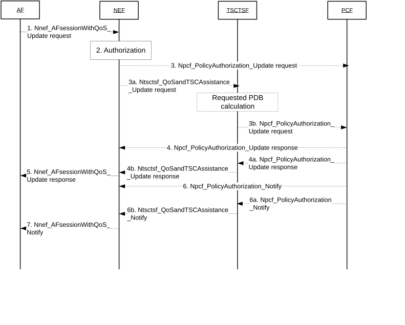

# 4.15.6.6a AF session with required QoS update procedure

Figure 4.15.6.6a-1: AF session with required QoS update procedure

1\. For an established AF session with required QoS, the AF may send a Nnef_AFsessionWithQoS_Update request message (AF Identifier, Transaction Reference ID, \[Flow description information\], \[QoS Reference or individual QoS parameters\], \[Alternative Service Requirements (as described in clause 6.1.3.22 of TS 23.503 \[20\])\]) to NEF for updating the reserved resources. Optionally, Indication of ECN marking for L4S, PDU Set QoS Parameters (as described in clause 5.7.7 of TS 23.501 \[2\]) and Protocol Description (as described in clause 5.37.5 or 5.37.8.3 of TS 23.501 \[2\]) can be included in the AF request. For a Multi-modal service, the AF may provide/update Multi-modal Service Requirements information of the existing data flows as described in clause 6.1.3.27.3 of TS 23.503 \[20\]. Optionally, a period of time or a traffic volume for the requested QoS can be included in the AF request. The Transaction Reference ID provided in the AF session with required QoS update request message is set to the Transaction Reference ID that was assigned, by the NEF, to the Nnef_AFsessionWithQoS_Create request message. The AF may, instead of a QoS Reference, provide one or more of the following individual QoS parameters: Requested 5GS Delay (optional), Requested Priority (optional), Requested Guaranteed Bitrate, Requested Maximum Bitrate, Maximum Burst Size and Requested Packet Error Rate. The AF may also provide an Averaging Window. Regardless whether the AF request is formulated using a QoS Reference or individual QoS parameters, the AF may also provide one or more of the following parameters that describe the traffic characteristics: flow direction, Burst Arrival Time at UE (uplink) or UPF (downlink), Periodicity, Time domain, Survival Time, Capability for BAT adaptation or BAT Window, Periodicity Range. The optional Alternative Service Requirements provided by the AF shall either contain QoS References or Requested Alternative QoS Parameter Set(s) in a prioritized order as specified in clause 6.1.3.22 of TS 23.503 \[20\]. Optionally, Packet Delay Variation requirements can be included in the AF request as described in clause 6.1.3.26 of TS 23.503 \[20\].

2\. The NEF authorizes the AF request of updating AF session with required QoS and may apply policies to control the overall amount of QoS authorized for the AF. If the authorisation is not granted, all steps (except step 5) are skipped and the NEF replies to the AF with a Result value indicating that the authorisation failed.

3\. The NEF shall contact the same NF type (i.e. TSCTSF or PCF) as with the initial Nnef_AFsessionWithQoS_Create request during the establishment procedure in clause 4.15.6.6. If the NEF determined not to invoke the TSCTSF, then steps 3, 4, 5, 6, 7 are executed, otherwise, steps 3a, 3b, 4a, 4b, 5, 6a, 6b, 7 are executed. If the Nnef_AfsessionWithQoS_Update adds any parameters that would require the NEF to invoke TSCTSF while the NEF determined not to invoke the TSCTSF for the initial Nnef_AFsessionWithQoS_Create request, the NEF shall reject the Nnef_AFsessionWithQoS_Update request with a cause value indicating the reason of failure.

If the NEF does not invoke the TSCTSF, the NEF interacts with the PCF by triggering a Npcf_PolicyAuthorization_Update request and forwards received parameters to the PCF. Any optionally received period of time or traffic volume is mapped and forwarded as sponsored data connectivity information (as defined in TS 23.503 \[20\]).

If the AF is considered to be trusted by the operator, the AF uses the Npcf_PolicyAuthorization_Update request message to interact directly with PCF to update the reserving resources for an AF session.

3a. If the NEF decided to contact the TSCTSF when the session was established, the NEF forwards received parameters in the Ntsctsf_QoSandTSCAssistance_Update request message to the TSCTSF. Any optionally received period of time or traffic volume is mapped and forwarded as sponsored data connectivity information (as defined in TS 23.503 \[20\]).

If the AF is considered to be trusted by the operator, the AF uses the Ntsctsf_QoSandTSCAssistance_Update request message to interact directly with TSCTSF to update the reserving resources for an AF session.

3b. The TSCTSF interacts with the PCF by triggering a Npcf_PolicyAuthorization_Update request and forwards the received parameters after executing the adjustment and mapping actions described in step 3b of clause 4.15.6.6.

4\. The PCF processes the Npcf_PolicyAuthorization_Update request according to the actions described in step 4 of clause 4.15.6.6.

4a. The PCF processes the Npcf_PolicyAuthorization_Update request according to the actions described in step 4a of clause 4.15.6.6. If the PCF has received a request to unsubscribe for 5GS Bridge/Router information Notification, the PCF uses the PCF initiated SM Policy Association Modification procedure as described in clause 4.16.5.2 to unsubscribe for 5GS Bridge/Router information event from the SMF.

4b. The TSCTSF sends a Ntsctsf_QoSandTSCAssistance_Update response message (Transaction Reference ID, Result) to the NEF. Result indicates whether the request is granted or not.

If the AF is considered to be trusted by the operator, the TSCTSF sends the Ntsctsf_QoSandTSCAssistance_Update response message directly to AF.

5\. The NEF sends a Nnef_AFsessionWithQoS_Update response message (Transaction Reference ID, Result) to the AF. Result indicates whether the request is granted or not.

6\. The PCF sends Npcf_PolicyAuthorization_Notify message to the NEF when the modification of the transmission resources corresponding to the QoS update succeeded or failed, or when an Alternative Service Requirement is being applied.

If the AF is considered to be trusted by the operator, the PCF sends the Npcf_PolicyAuthorization_Notify message directly to AF.

6a. The PCF sends Npcf_PolicyAuthorization_Notify message to the TSCTSF when the modification of the transmission resources corresponding to the QoS update succeeded or failed, or when an Alternative Service Requirement is being applied.

6b. The TSCTSF sends Ntsctsf_QoSandTSCAssistance_Notify message with the event reported by the PCF to the NEF.

If the AF is considered to be trusted by the operator, the TSCTSF sends the Ntsctsf_QoSandTSCAssistance_Notify message directly to the AF.

7\. The NEF sends Nnef_AFsessionWithQoS_Notify message with the event reported by the PCF to the AF.
