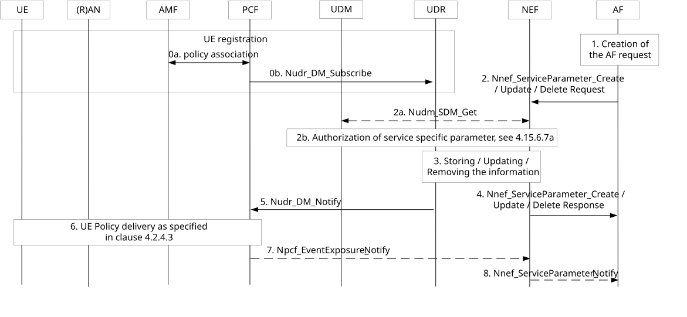
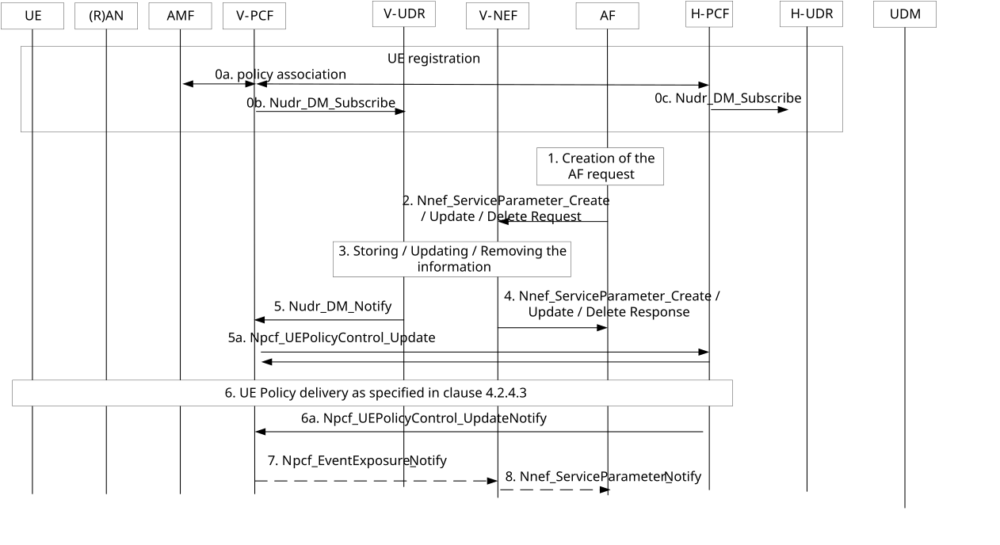

# 4.15.6.7 Service specific parameter provisioning

## 4.15.6.7.1 General

This clause describes the procedures for enabling the AF to provide service specific parameters to 5G system via NEF.

The AF may issue requests on behalf of applications not owned by the PLMN serving the UE.

NOTE 1: In the case of architecture without CAPIF support, the AF is locally configured with the API termination points for the service. In the case of architecture with CAPIF support, the AF obtains the service API information from the CAPIF core function via the Availability of service APIs event notification or Service Discover Response as specified in TS 23.222 \[54\].

The AF request sent to the NEF contains the information as below:

1\) Service Description.

Service Description is the information to identify a service the Service Parameters are applied to. The Service Description in the AF request can be represented by the combination of DNN and S-NSSAI, an AF-Service-Identifier or an External Application Identifier.

2\) Service Parameters.

Service Parameters are the service specific information which needs to be provisioned in the Network and delivered to the UE in order to support the service identified by the Service Description.

VPLMN ID(s) that indicates the PLMN(s) where the AF guidance on URSP determination and all its RSD(s), applies.

3\) Target UE(s) or a group of UEs or PLMN ID(s) of inbound roamers.

Target UE(s) or a group of UEs or PLMN ID(s) of inbound roamers indicate the UE(s) who the Service Parameters shall be delivered to. Individual UEs can be identified by GPSI, or an IP address/Prefix or a MAC address. Groups of UEs are identified by an External Group Identifiers as defined in TS 23.682 \[23\]. If identifiers of target UE(s) or a group of UEs or PLMN ID(s) of inbound roamers are not provided, then the Service Parameters shall be delivered to any UEs of the PLMN of the NEF using the service identified by the Service Description.

4\) Subscription to events.

The AF may subscribe to notifications about the outcome of the UE Policies delivery due to service specific parameter provisioning.

The NEF authorizes the AF request received from the AF and stores the information in the UDR as "Application Data". The Service Parameters are delivered to the targeted UE by the PCF when the UE is reachable.

## 4.15.6.7.2 Service specific parameter provisioning by AF to HPLMN

Figure 4.15.6.7.2-1 shows procedure for service specific parameter provisioning. The AF uses Nnef_ServiceParameter service to provide the service specific parameters to the HPLMN and the UE. In the roaming case, PCF is replaced by H-PCF, the AMF interacts with the V-PCF which interacts with H-PCF.

Figure 4.15.6.7.2-1: Service specific information provisioning by AF to HPLMN

0a. The AMF establishes UE Policy Association as specified in clause 4.16.11.

0b. PCF requests notifications from the UDR on changes in UE policy information.

1\. To create a new request, the AF invokes an Nnef_ServiceParameter_Create service operation. The request may include subscription information to the report of the outcome of UE Policy delivery.

To update or remove an existing request, the AF invokes an Nnef_ServiceParameter_Update or Nnef_ServiceParameter_Delete service operation together with the corresponding Transaction Reference ID which was provided to the AF in Nnef_ServiceParameter_Create response message.

The content of this service operation (AF request) includes the information described in clause 5.2.6.11.

2\. The AF sends its request to the NEF. The NEF authorizes the AF request. The NEF performs the following mappings:

\- Map the AF-Service-Identifier into DNN and S-NSSAI combination, determined by local configuration.

\- Map the External Application Identifier into the corresponding Application Identifier known in the core network.

2a. The NEF may invoke Nudm_SDM_Get service operation to perform the following mappings:

\- Map the GPSI in Target UE Identifier into SUPI, according to information received from UDM.

\- Map the External Group Identifier in Target UE Identifier into Internal Group Identifier, according to information received from UDM.

If the AF subscribed to the outcome of UE Policy delivery, the AF indicates where the AF receives the corresponding notifications.

(in the case of Nnef_ServiceParameter_Create): The NEF assigns a Transaction Reference ID to the Nnef_ServiceParameter_Create request.

2b. (in the case of Nnef_ServiceParameter_Create or Update): The NEF may need to authorize the service specific parameter provisioning request with the UDM by sending a Nudm_ServiceSpecificAuthorisation_Create service operation as defined in clause 4.15.6.7a.

NOTE 2: The NEF skips the mapping of GPSI or External Group Identifier in step 2a if it needs to authorize the service specific parameter provisioning request with the UDM as the response of the authorization request from UDM includes the SUPI or Internal Group Identifier.

(in the case of Nnef_ServiceParameter_delete): The NEF requests the UDM to remove the authorization of the service specific parameters provisioned by sending a Nudm_ServiceSpecificAuthorisation_Remove service operation.

3\. (in the case of Nnef_ServiceParameter_Create or Update): The NEF stores the AF request information in the UDR as the "Application Data" (Data Subset setting to "Service specific information") together with the assigned Transaction Reference ID.

(in the case of Nnef_ServiceParameter_delete): The NEF deletes the AF request information from the UDR.

4\. The NEF responds to the AF. In the case of Nnef_ServiceParameter_Create response message, the response message includes the assigned Transaction Reference ID.

If the UE is registered to the network and the PCF performs the subscription to notification to the data modified in the UDR by invoking Nudr_DM_Subscribe (AF service parameter provisioning information, SUPI, Data Set setting to "Application Data", Data Subset setting to "Service specific information") at step 0, the following steps are performed:

5\. The PCF(s) receive(s) a Nudr_DM_Notify notification of data change from the UDR.

NOTE 3: PCF does not have to subscribe for each UE the application specific information, e.g. if PCF has already received the application specific information for a group of UE or for a DNN by a subscription of other UE. The same application specific information is delivered to every UE in a group or a DNN.

For PIN service, PCF generates the URSP rules with PIN ID in the Traffic Descriptor as specified in Table 6.6.2.1-2 of TS 23.503 \[20\].

6\. The PCF initiates UE Policy delivery as specified in clause 4.2.4.3.

7\. If the AF subscribed to notifications about the outcome of UE Policies delivery due to Service specific parameter provisioning and the PCF is notified of UE Policy Container from the AMF, the PCF notifies the UE Policy delivery result contained in the UE Policy container as the outcome of the procedure to NEF by sending Npcf_EventExposure_Notify including the SUPI, the list of GPSI(s) if available, and if provided in the step 2a, the Internal-Group-Id.

If the PCF is notified about UE Policy delivery failure from the AMF due to UE not reachable, the PCF may determine to retry step 6 of this procedure when the UE becomes reachable. In such a case, the PCF may report the interim status i.e. UE is temporarily unreachable as the outcome of the procedure to NEF by sending Npcf_EventExposoure_Notify.

If the PCF determines the failure of the UE Policies delivery procedure, the PCF notifies the failure with an appropriate cause such as UE is unreachable as the outcome of the procedure to NEF by sending Npcf_EventExposure_Notify.

If the PCF determines that it cannot yet deliver URSP Rules that are based on the service parameters from the AF, then the PCF may report in the interim status that URSP Rules have not yet been delivered by the PCF as the outcome of the procedure to NEF by sending Npcf_EventExposure_Notify.

The content of event reporting in this step is described in clause 6.1.3.18 of TS 23.503 \[20\].

8\. When the NEF receives Npcf_EventExposure_Notify, the NEF performs information mapping (e.g. AF Transaction Internal ID provided in Notification Correlation ID to AF Transaction ID, SUPI to GPSI, Internal-Group-Id to External-Group-Id, etc.) and triggers the appropriate Nnef_ServiceParameter_Notify message.

## 4.15.6.7.3 Service specific parameter provisioning by AF to VPLMN

Figure 4.15.6.7.3-1 shows procedure for service specific parameter provisioning by the AF to VPLMN.

Figure 4.15.6.7.3-1: Service specific information provisioning by AF to VPLMN

0a. Same as in step 0a of Figure 4.15.6.7.2-1.

0b-0c. The V-PCF may request to V-UDR on changes in UE policy information and H-PCF may subscribe to H-UDR.

1-2. Steps 1-2 of Figure 4.15.6.7.2-1 apply with the following differences:

\- The AF and NEF belong to the VPLMN. The AF may belong to third party with agreement with VPLMN.

\- When the AF provides application guidance on URSP Rule determination to the VPLMN, it will target "PLMN ID(s) of inbound roamers". The NEF in the VPLMN rejects any request for a GPSI or an External-Group-ID of a different PLMN.

3-5. Steps 3-5 of Figure 4.15.6.7.2-1 apply with the following differences:

\- AF, NEF and UDR belong to VPLMN. The AF may belong to third party with agreement with VPLMN.

\- The UDR in the VPLMN notifies the V-PCF(s) that have subscribed to the reception of application guidance on URSP determination.

\- In step 5, the V-PCF receives updates on application guidance on URSP determination for the PLMN ID of a SUPI that has a UE Policy Association established. The PLMN ID of the SUPI is included in the target "PLMN ID(s) of inbound roamers" in step 2. In this case, the V-PCF checks whether application guidance on URSP determination applies for the SUPI as specified in clause 6.1.2.2.4 of TS 23.503 \[20\].

5a. The V-PCF sends the Service Parameters including the mapped HPLMN S-NSSAI values to the H-PCF and subscribes to the result of the delivery of UE Policies if the delivery result was requested by the AF, using the event reporting on "Notification on outcome of UE Policies delivery" described in clause 6.1.3.18 of TS 23.503 \[20\].

NOTE: The AMF determines whether LBO is allowed and performs SMF selection to select the SMF in VPLMN for LBO case as described in clause 6.3.2 of TS 23.501 \[2\].

The H-PCF requests V-PCF to notify the result of UE policy delivery to the UE.

6\. The H-PCF generates new or updated URSP Rules considering the Service Parameters received from the V-PCF in step 5a as specified in clause 6.1.2.2.4 of TS 23.503 \[20\].

7-8. Steps 7-8 of Figure 4.15.6.7.2-1 apply with the following differences:

\- Notification is sent from V-PCF to the AF belonging to the VPLMN or third party with agreement with VPLMN.
