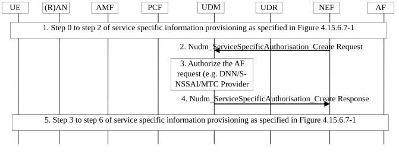
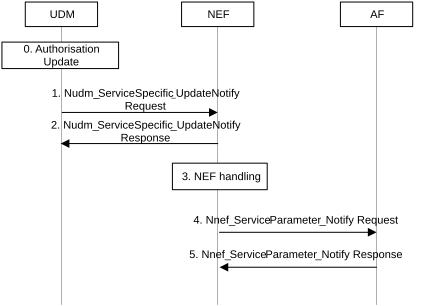

# 4.15.6.7a Authorization of service specific parameter provisioning

Figure 4.15.6.7a-1 shows the procedure to authorize the service specific parameter provisioning requests (e.g. for Application guidance for URSP determination as defined in clause 4.15.6.10).

Figure 4.15.6.7a-1: Service Specific Authorization for an individual UE or group of UEs

1\. The AF initiates the procedure as specified in clause 4.15.6.7.

2\. The NEF sends Nudm_ServiceSpecificAuthorisation_Create Request including the GPSI or External Group Id, S-NSSAI/DNN, service type, (optional) AF ID, (optional) MTC Provider Information and notification address to receive updates of the authorization from UDM.

3\. The UDM maps the GPSI or External Group Id included in the request from the NEF to SUPI or Internal Group Id.

If the request is for an individual UE, the UDM checks the list of subscribed/allowed S-NSSAI/DNNs for the UE and other service info (e.g. MTC provider is authorized for the UE).

If the request is for a group of UEs, the UDM checks whether the group related data (e.g. DNN/S-NSSAI group related data, see table 4.15.6.3b-1) and other service info, e.g. MTC provider is authorized for the group.

4\. The UDM responds to the NEF with the service authorization result. If authorization succeeds, the UDM includes the SUPI or Internal Group Id mapping the GPSI or External Group Id provided by the NEF.

If authorization fails (e.g. DNN is not subscribed for the UE or it is different from the group related data, UE subscription or group related data does not allow to modify URSP rules dynamically by an AF or by such specific AF or MTC provider), UDM returns a negative response with an appropriate error code and the NEF rejects the request with the proper error code to inform the AF about the request not authorized.

NOTE 1: The MTC Provider Information can be used by any type of Service Providers (MTC or non-MTC) or Corporate or External Parties for, e.g. to distinguish their different customers.

5\. The procedure continues as specified in clause 4.15.6.7.

Figure 4.15.6.7a-2 illustrates the procedure for updating or revoking an existing Service Specific Authorization.

Figure 4.15.6.7a-2: Service Specific Authorization Update procedure

0\. UDM provided a successful authorization for a request to provision service specific parameters as defined in Figure 4.15.6.7a-1. The authorization for the provisioning of the service specific parameters is modified in UDM (e.g. due to subscription withdrawal or to the DNN associated to the authorization being removed from UE subscription).

1\. The UDM sends a Nudm_ServiceSpecificAuthorisation_UpdateNotify Request (GPSI or External Group Id, SUPI or Internal Group Id, S-NSSAI, DNN, Service Type, (optional) AF ID, (optional) MTC Provider Information, Status, Cause) message to the NEF to update a UE's or group of UEs' authorization.

2\. The NEF sends Nudm_ServiceSpecificAuthorisation_UpdateNotify Response message to the UDM to acknowledge the authorization update.

3\. If the authorization is revoked, the NEF removes the service specific parameters from the UDR.

4\. The NEF informs the AF that the service parameters authorisation status has changed by sending Nnef_ServiceParameter_Notify Request (GPSI or External Group Id, TLTRI, Status, Cause) message to the AF to update the authorization.

5\. The AF responds to the NEF with Nnef_ServiceParameter_Notify Response message.
