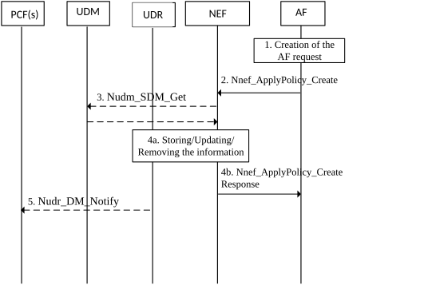

# 4.15.6.8 Set a policy for a future AF session

Figure 4.15.6.8-1: Set a policy for a future AF session

1\. The AF previously negotiated policy for background data transfer using the Procedure for future background data transfer as described in clause 4.16.7.2.

2\. The AF requests that the previously negotiated policy for background data transfer be applied to a group of UE(s) or any UE, by invoking the Nnef_ApplyPolicy_Create service operation (AF Identifier, External Identifier or External Group Identifier, Background Data Transfer Reference ID). The Background Data Transfer Reference ID parameter identifies a previously negotiated transfer policy for background data transfer as defined in clause 4.16.7. The NEF assigns a Transaction Reference ID to the Nnef_ApplyPolicy_Create request. The NEF authorizes the AF request and stores the AF Identifier and the Transaction Reference ID.

3\. The NEF invokes Nudm_SDM_Get (Identifier Translation, GPSI) to resolve the GPSI (External Identifier) to a SUPI or the NEF requests to resolve the External Group Identifier into the Internal Group Identifier using Nudm_SDM_Get (Group Identifier Translation, External Group Identifier).

4a. The NEF stores the AF request information in the UDR (Data Set = Application Data; Data Subset = Background Data Transfer, Data Key = Internal Group Identifier or SUPI).

4b. The NEF responds to the Nnef_ApplyPolicy_Create Request (Transaction Reference ID).

5\. The PCF(s) that have subscribed to modifications of AF requests (Data Set = Application Data; Data Subset = Background Data Transfer, Data Key = Internal Group Identifier or SUPI) receive(s) a Nudr_DM_Notify notification of data change from the UDR.
