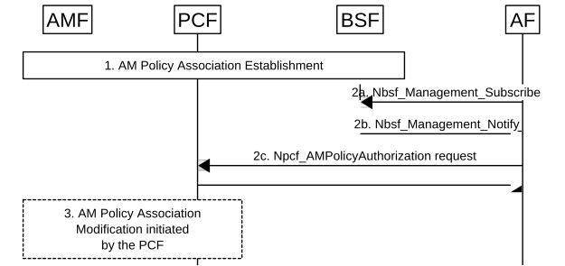
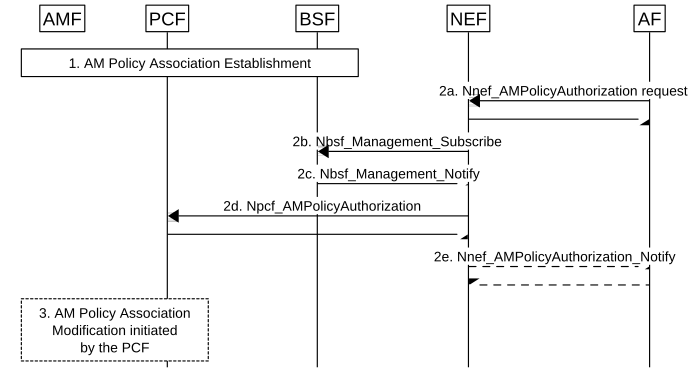
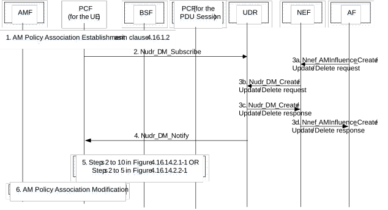

# 4.15.6.9 Procedures for AF-triggered dynamically changing access and mobility management policies

## 4.15.6.9.1 General

Access and mobility management policies may be modified due to several inputs including the AF as described in clause 4.16.2. Clause 4.15.6.9 describes the procedures for triggering such modifications in scenarios belonging to "case B" of clause 4.16.2.0 that are initiated by the AF.

The following cases can be distinguished:

\- AF requests targeting an individual UE (identified by its SUPI or GPSI) without conditions related to the application traffic; these requests are routed (by the AF or by the NEF) to the PCF for the UE as described in clause 6.2.1.6 of TS 23.503 \[20\], This case is described in clause 4.15.6.9.2.

\- AF requests targeting an individual UE (identified by its GPSI), a group of UEs (identified by an Internal Group Identifier or an External Group Identifier), any UE accessing a combination of DNN and S-NSSAI, or any UE, or any inbound roaming UEs identified by their home PLMN ID(s) using an application identified by an External Application Identifier. For such requests the AF shall contact the NEF and the NEF stores the AF request information in the UDR. The PCF(s) receive a corresponding notification if they had subscribed to the creation / modification / deletion of the AF request information corresponding to UDR Data Keys / Data Sub-Keys. The AF is not aware if the target UEs are with or without an already established AM Policy Association and with or without ongoing PDU Sessions. This case is described in clause 4.15.6.9.3.

NOTE: "any UE" refers to the UEs within the PLMN of the NEF.

## 4.15.6.9.2 Processing AF requests to influence access and mobility management policies targeting an individual UE

This procedure is used for individual UEs when the request shall be applied independently of conditions related to the application traffic. Depending on the AF deployment (see clause 6.2.10 of TS 23.501 \[2\]), the AF may interact with NFs of the Core Network either directly or via the NEF. The procedure for the direct case is described in Figure 4.15.6.9.2‑1, while the procedure for the NEF-mediated case is described in Figure 4.15.6.9.2-2.

Figure 4.15.6.9.2-1: Handling an AF request targeting an individual UE without using NEF

This procedure concerns only non-roaming scenarios, i.e. to cases where the involved entities serving the UE (AF, PCF, BSF, AMF) belong to the home PLMN.

1\. An AM Policy Association is established for a UE as described in clause 4.16.1.

2a. The AF searches the PCF for the UE using Nbsf_Management_Subscribe with SUPI or GPSI as input, indicating that it is searching for the PCF that handles the AM Policy Association of the UE.

2b. The BSF provides to the AF the identity of the PCF for the UE for the requested SUPI or GPSI via an Nbsf_Management_Notify operation. If a matching entry already exists in the BSF when step 2a is performed, this shall be immediately reported to the AF.

2c. The AF sends to the PCF for the UE its request for influencing the access and mobility management policy of the UE (identified by SUPI or GPSI) using Npcf_AMPolicyAuthorization (optionally providing a timer on how long this policy shall last, in which case the system behaviour upon expiration of this timer is as specified in TS 23.503 \[20\]). As part of the Npcf_AMPolicyAuthorization request, the AF may subscribe (within the Create and Update operations) or unsubscribe (within the Delete operation) to relevant events specified in clause 6.1.3.18 of TS 23.503 \[20\], e.g. events related to change of service area coverage.

3\. The PCF takes a policy decision and then an AM Policy Association Modification procedure initiated by the PCF for the UE may be performed as described in clause 4.16.2.2. If the AF has subscribed to access and mobility management related events (i.e. request for service area coverage outcome) in step 2, the PCF reports the event (i.e. outcome of the request for service area coverage) to the AF.

Figure 4.15.6.9.2-2: Handling an AF request targeting an individual UE using NEF

This procedure concerns only non-roaming scenarios, i.e. to cases where the involved entities serving the UE (AF, NEF, PCF, BSF, AMF) belong to the home PLMN, or the AF belongs to a third party with which the home PLMN has an agreement.

1\. An AM Policy Association is established for a UE as described in clause 4.16.1.

2a. The AF sends to NEF its request for influencing the access and mobility management policy of the UE (identified by GPSI) using Nnef_AMPolicyAuthorization (optionally providing a timer on how long this policy shall last, in which case the system behaviour upon expiration of this timer is as specified in TS 23.503 \[20\]). As part of the Nnef_AMPolicyAuthorization request, the AF may request to subscribe (within the Create and Update operations) or unsubscribe (within the Delete operation) for relevant events specified in clause 6.1.3.18 of TS 23.503 \[20\], e.g. events for request for service area coverage outcome. The NEF stores the request and sends a response to the AF.

2b. The NEF searches the PCF for the UE using Nbsf_Management_Subscribe with SUPI as input parameter, indicating that it is searching for the PCF that handles the AM Policy Association of the UE.

2c. The BSF provides to the NEF the identity of the PCF for the UE for the requested SUPI via an Nbsf_Management_Notify operation. If a matching entry already exists in the BSF when step 2b is performed, this shall be immediately reported to the NEF.

2d. The NEF sends to PCF for the UE the request for influencing the access and mobility management policy of the UE (identified by SUPI) using Npcf_AMPolicyAuthorization (having potentially translated GPSI to SUPI via UDM). As part of the Npcf_AMPolicyAuthorization request, the NEF may subscribe or unsubscribe (according to what the AF requested in step 2a) for relevant events specified in clause 6.1.3.18 of TS 23.503 \[20\], e.g. events for change of service area coverage.

2e. The NEF informs the AF about events to which the AF has potentially subscribed (i.e. events for change of service area coverage) using Nnef_AMPolicyAuthorization_Notify.

3\. The PCF takes a policy decision and then an AM Policy Association Modification procedure initiated by the PCF for the UE may be performed as described in clause 4.16.2.2. If the AF has subscribed to access and mobility management related events i.e. request for service area coverage outcome in step 2, then the PCF reports the event (i.e. outcome of the request for service area coverage) to the AF as described in clause 4.16.2.2.

## 4.15.6.9.3 Processing AF requests to influence access and mobility management policies

With this procedure, the AF can provide its request to influence access and mobility management policies (for one or multiple UEs) at any time.

Figure 4.15.6.9.3-1: Handling an AF request to influence access and mobility management policies Policy

This procedure concerns non-roaming scenarios, i.e. to cases where the involved entities serving the UE (i.e. AF, NEF, PCF, BSF, UDR, AMF) belong to the home PLMN, or the AF belongs to a third party with which the home PLMN has an agreement. This procedure concerns also the local breakout roaming case where the involved entities (i.e. AF, NEF, PCF, BSF, UDR, AMF) serving the UE belong to the VPLMN or the AF belongs to a third party with which the VPLMN has an agreement.

The PCF for the UE and the PCF for the PDU Session can be the same entity, then step 5 is not performed and the PCF itself determines the start/stop of application traffic or SM policy establishment/termination for a DNN, S-NSSAI and proceeds with step 6.

1\. AM Policy Association establishment as described in clause 4.16.1.

2\. The PCF for the UE may subscribe to policy data related to AM influence (Data Set = Application Data; Data Subset = AM influence information, Data Key = S-NSSAI and DNN and/or (Internal Group Identifier or SUPI or PLMN ID of inbound roamers)).

3a. To create a new request, the AF provides "AM influence information" data to the NEF using the Nnef_AMInfluence_Create service operation (together with the AF identifier and potentially further inputs as specified in clause 5.2.6.23.2), including a target (one UE identified by GPSI, a group of UEs identified by an External Group Identifier, or any UE (for non roaming case), or any inbound roaming UEs identified by their PLMN ID(s)), a list of (DNN, S-NSSAI)(s) and optionally a list of External Application Identifier(s) and requirements related to access and mobility management policies (e.g. service coverage requirements, throughput requirements). The AF request contains also an AF Transaction Id and may contain a timer on how long this policy shall last, in which case the system behaviour upon expiration of this timer is as specified in TS 23.503 \[20\]. If with this request the AF subscribes to access and mobility management related events, the AF indicates also where it desires to receive the corresponding notifications.

The target "any UE" is applicable if an External Application Identifier or list of (DNN, S-NSSAI) is also provided.

The target "any inbound roaming UEs identified by their PLMN ID(s)" is applicable if an External Application Identifier or list of (DNN, S-NSSAI) is also provided.

To update or remove an existing request, the AF invokes an Nnef_AMInfluence_Update or Nnef_AMInfluence_Delete service operation providing the corresponding AF Transaction Id.

3b. The NEF stores, updates, or removes the policy data of step 3a in the UDR, having translated any External Group Identifier to an Internal Group Identifier and any GPSI to a SUPI.

3c. The UDR informs the NEF about the result of the operation of step 3b.

3d. The NEF informs the AF about the result of the Nnef_AMInfluence operation performed in step 3a.

NOTE 1: Steps 1, 2 and 3 can occur in any order.

4\. The UDR notifies the PCF(s) that have a matching subscription (from step 2) about the data stored, updated, or removed in step 3. If matching entries already existed in the UDR when step 2 is performed, this shall be immediately reported to the PCF. The PCF may check that an SM Policy Association is established for the SUPI, DNN, S-NSSAI then subscribe to the SMF to Policy Control Request Trigger to detect the application traffic that triggers the allocation of a service area coverage or an allocation of RFSP index value, then step 6 follows.

5\. Steps 2 to 10 in Figure 4.16.14.2.1-1 applies if access and mobility management policies depend on application in use, or steps 2 to 5 in Figure 4.16.14.2.2-1 applies if access and mobility management policies depend on SM Policy Association establishment and termination for a DNN, S-NSSAI combination

6\. The PCF for the UE takes a policy decision and then it may initiate an AM Policy Association Modification procedure as described in clause 4.16.2.2. If the AF has subscribed to access and mobility management related events, i.e. request for service area coverage outcome in step 3, then the PCF reports the event (i.e. outcome of the request for service area coverage) to the AF as described in clause 4.16.2.2.

NOTE 2: The PCF for the UE can subscribe to the "start/stop of application traffic detection" events for multiple applications with different application identifiers in the same Npcf_PolicyAuthorization_Subscribe request. When PCF receives the notifications for multiple applications, the PCF for the UE can determine which access and mobility management policy to apply based on local configuration and operator policy.
