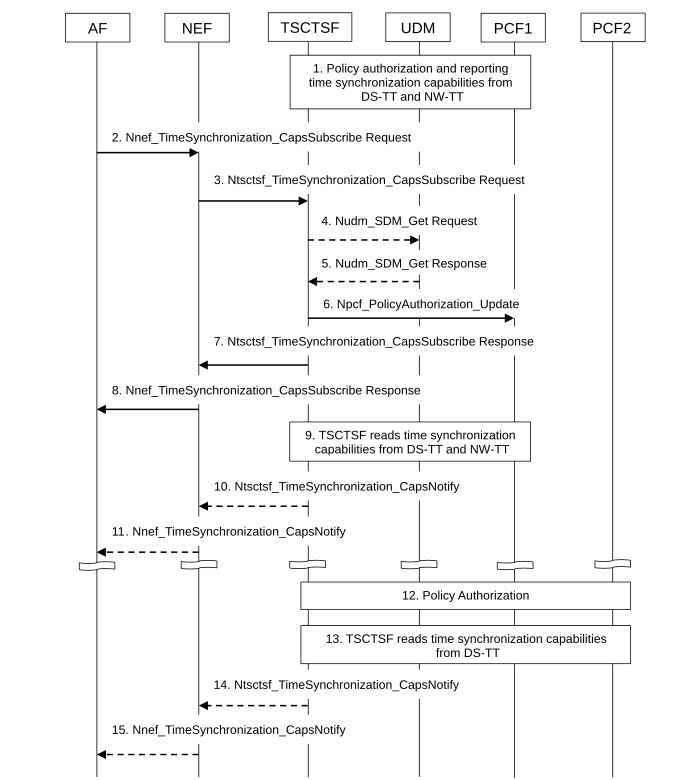

# 4.15.9.2 Exposure of UE availability for Time Synchronization service

The procedure is used by the AF to subscribe to notifications and to explicitly cancel a previous subscription for UE availability for time synchronization service. Cancelling is done by sending Nnef_TimeSynchronization_CapsUnsubscribe request identifying the subscription to cancel with Subscription Correlation ID.

Figure 4.15.9.2-1: Procedure for exposing 5GS and/or UE availability and capabilities for Time Synchronization services

1\. Upon PDU Session establishment, the PCF determines if the PDU Session is potentially impacted by time synchronization service (based on local configuration or 5GS Bridge/Router information event from SMF as described in SM Policy Association Establishment procedure in clause 4.16.4). In this case the PCF invokes Npcf_PolicyAuthorization_Notify service operation to the TSCTSF discovered and selected as described in clause 6.3.24 of TS 23.501 \[2\]. The Npcf_PolicyAuthorization_Notify service operation includes the UE address of the PDU Session and DNN/S-NSSAI.

NOTE: In the case of private IPv4 address being used for the UE, the DNN and S-NSSAI are required for session binding in the PCF.

The PCF registers to BSF as described in TS 23.503 \[20\]. TSCTSF invokes a Npcf_PolicyAuthorization_Create request message to the PCF and stores the DNN, S-NSSAI and IP address as received from PCF and SUPI as received from BSF and associates them with the AF-session.

If PMIC/UMIC information from the DS-TT or NW-TT is available at the PCF, the PCF reports it to the TSCTSF invoking Npcf_PolicyAuthorization_Notify.

2\. The AF subscribes to the UE availability for time synchronization service and provides the associated Notification Target Address of the AF by sending Nnef_TimeSynchronization_CapsSubscribe request.

Report Type defines the type of reporting requested (e.g. one-time reporting, periodic reporting or event based reporting).

The request may include DNN and slicing information (S-NSSAI) and shall include an AF-Service-Identifier. If the DNN and S-NSSAI are omitted in the request, the NEF uses the AF-Service-Identifier to determine the target DNN and slicing information (S-NSSAI).

The Event Filter may include a list of UE identities (GPSIs) or Groups of UEs identified by an External Group Identifier that further define the subset of the target UEs. If the request does not include UE identities nor External Group Identifier, the request is targeted to any UE with a PDU Session using the DNN and S-NSSAI. The NEF forwards the GPSIs or the External Group Identifier to the TSCTSF by including them/it inside the Ntsctsf_TimeSynchronization_CapsSubscribe request.

Additionally, the Event Filter may include one or more of the requested PTP instance type, requested transport protocol for PTP, or requested PTP Profile as described in Table 5.2.6.25.6-1.

When the NEF processes the AF request the AF-Service-Identifier may be used to authorize the AF request.

Depending on the AF-Service-Identifier and/or DNN/S-NSSAI, the NEF may reject the request if the list of UE identities or External Group Identifier is not included in the request.

To unsubscribe to the UE availability for time synchronization for a list of UE(s), the AF invokes Nnef_TimeSynchronization_CapsUnsubscribe service operation and provides the Subscription Correlation ID.

3\. (In the case of Ntsctsf_TimeSynchronization_CapsSubscribe): The NEF discovers the TSCTSF as described in clause 6.3.24 of TS 23.501 \[2\]. The NEF invokes the Ntsctsf_TimeSynchronization_CapsSubscribe request service operation to the selected TSCTSF.

(In the case of Ntsctsf_TimeSynchronization_CapsUnsubscribe): The NEF uses the Subscription Correlation ID to determine the TSCTSF and interacts with the TSCTSF by triggering a Ntsctsf_TimeSynchronization_CapsUnsubscribe request message.

The AF that is part of operator's trust domain may invoke the services directly with TSCTSF.

4\. If the Event Filter includes GPSI(s), an External Group Identifier or an Internal Group Identifier, the TSCTSF uses the Nudm_SDM_Get request to retrieve the subscription information (SUPI(s)) from the UDM using each GPSI or the External Group Identifier as received from the NEF or an Internal Group Identifier as provided directly by the AF (in the case when the AF is within the operator's domain).

The TSCTSF requests the Time Synchronization Subscription data from the UDM. The TSCTSF may also use stored Time Synchronization Subscription data which it retrieved from the UDM when the UE established PDU session, see clause 4.28.3.1.

5\. The UDM provides the Nudm_SDM_Get response containing SUPI that are mapped from each received GPSI or a list of SUPIs mapped from the External/Internal Group Identifier and identify UEs targeted by the AF request.

6\. (in the case of Ntsctsf_TimeSynchronization_CapsSubscribe): The TSCTSF uses the parameters received in step 3 and step 5 (i.e. DNN, S-NSSAI and the list of SUPIs if present) to find matching AF-session(s).

If the Time Synchronization Subscription data is available, the subscription data returned by the UDM includes the AF request authorization that indicates whether the AF is allowed to request (g)PTP-based time distribution for DNN/S-NSSAI. If the subscription data indicates that the AF is not allowed to request (g)PTP-based time synchronization, the AF-session is excluded from the list of matching AF-sessions.

For any such matching AF-session, the TSCTSF interacts with the PCF by triggering a Npcf_PolicyAuthorization_Update request message.

(in the case of Ntsctsf_TimeSynchronization_CapsUnsubscribe): The TSCTSF uses the Subscription Correlation ID to determine the AF sessions and interacts with the PCF(s) by triggering a Npcf_PolicyAuthorization_Delete request message. Steps 10-15 are skipped.

7\. TSCTSF acknowledges the execution of Ntsctsf_TimeSynchronization_CapsSubscribe to the requester that initiated the request. The acknowledgement contains a Subscription Correlation ID that the requester can use to cancel or modify the subscription.

8\. NEF acknowledges the execution of Nnef_TimeSynchronization_CapsSubscribe to the requester that initiated the request. The acknowledgement contains a Subscription Correlation ID that the AF can use to cancel or modify the subscription.

9\. As part of Npcf_PolicyAuthorization_Update request, the TSCTSF uses the procedures as described in clause K.2.1 of TS 23.501 \[2\] to determine the (g)PTP capabilities from the DS-TT. If the TSCTSF has not determined the (g)PTP capabilities from the NW-TT, the TSCTSF determines the capabilities using the procedures as described in clause K.2.1 of TS 23.501 \[2\].

The TSCTSF composes the time synchronization capabilities for the DS-TT/UE(s) connected to the NW-TT based on the capability information received from the DS-TT(s) and NW-TT. If the Ntsctsf_TimeSynchronization_CapsSubscribe request include an Event Filter with one or more of the requested PTP instance type, requested transport protocol for PTP, or requested PTP Profile, the TSCTSF considers only the DS-TT(s) and NW-TT(s) with these capabilities as part of the time synchronization capability set that is reported to the NEF (or AF).

The TSCTSF maintains association between the user-plane Node ID, the time synchronization capabilities, the reference to the capabilities (as identified by the Subscription Correlation ID), the Event Filter (if available), the NEF or AF Notification Target Address and list of the AF sessions with PCFs with this user-plane Node ID. If the Ntsctsf_TimeSynchronization_CapsSubscribe request includes one or more Event Filter(s), the TSCTSF considers only the matching UE identities and the DS-TT(s) and NW-TT(s) with the matching capabilities to be included in the associated AF sessions.

10\. The TSCTSF sends Ntsctsf_TimeSynchronization_CapsNotify (as described in clause 5.2.27.2.8) to the NEF. The message includes the time synchronization capabilities as composed in step 9. The message contains one or more user-plane Node ID(s) and a list of UE identities associated to each user-plane Node ID and time synchronization capabilities for each set of DS-TTs connected to given user-plane Node ID, as described in Table 5.2.6.25.8-1. The user-plane Node ID identifies the NW-TT to where the UE/DS-TT(s) are connected to.

11\. The NEF sends Nnef_TimeSynchronization_CapsNotify with Time Synchronization capability event (as described in Table 5.2.6.25.8-1) to the AF.

12-13. Upon PDU Session Establishment as defined clause 4.3.2.2.1, steps 1, 9, 10 and 11 are repeated for the new PDU Session.

14\. If necessary, e.g. upon PDU Session establishment or release, the TSCTSF may update the time synchronization capabilities for the DS-TT/UE(s) connected to the NW-TT(s). The TSCTSF sends Ntsctsf_TimeSynchronization_CapsNotify with Time Synchronization capability event (as described in Table 5.2.6.25.8-1) containing the updated capabilities to the NEF.

15\. The NEF sends Nnef_TimeSynchronization_CapsNotify containing the updated capabilities to the AF.
