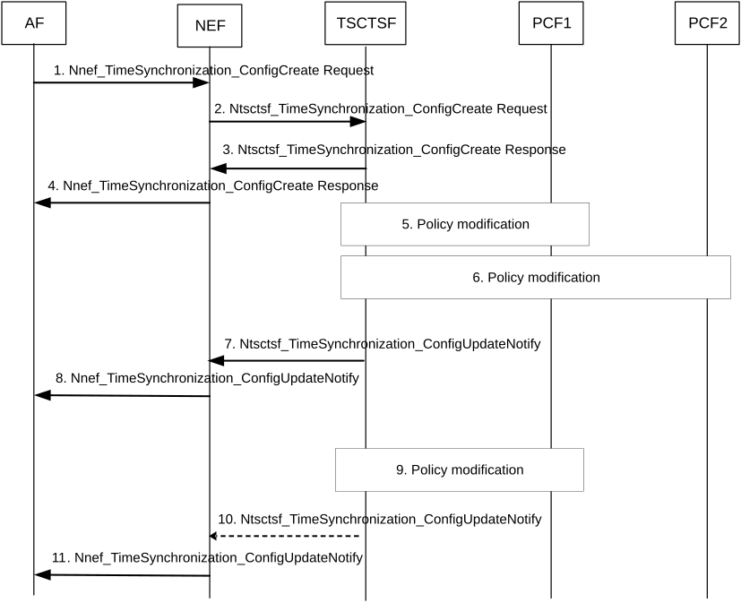

# 4.15.9.3.2 Time synchronization service activation

Figure 4.15.9.3.2-1: Time synchronization service activation

1\. The AF creates a time synchronization service configuration for a PTP instance by invoking Nnef_TimeSynchronization_ConfigCreate service operation. The request includes the parameters as described in Table 4.15.9.3-1. The request contains a Subscription Correlation ID and user-plane node ID as a reference to the target of the UEs and AF-sessions.

The create request creates also a subscription for the changes in the time synchronization service configuration. The AF may subscribe to receiving network time synchronization status report(s) as specified in clause 4.15.9.5.1.

2\. The NEF authorizes the request. After successful authorization, the NEF invokes the Ntsctsf_TimeSynchronization_ConfigCreate service operation with the corresponding TSCTSF, with the parameters as received from the AF.

If the request includes a spatial validity condition and if the AF uses a geographical area as a spatial validity condition, the NEF transforms this information into 3GPP identifiers (e.g. TAI(s)) based on pre-configuration.

The AF that is part of operator's trust domain may invoke the services directly with TSCTSF.

If the request includes a spatial validity condition and if the AF is within the operator's domain, the spatial validity condition shall comprise of a list of TA(s).

NOTE 1: It is assumed that AFs within the operator's domain is aware of TAs that can be used to formulate a spatial validity condition for Time Synchronization Coverage Area (see clause 5.27.1.10 of TS 23.501 \[2\]).

3\. TSCTSF checks whether the AF requested parameters comply with the stored Time Synchronization Subscription data as defined in clause 5.27.1.11 of TS 23.501 \[2\], for that, the TSCTSF retrieves the Time Synchronization Subscription data from the UDM (as defined in clause 4.15.9.2). The TSCTSF determines the Time Synchronization Coverage Area and responds with the Ntsctsf_TimeSynchronization_ConfigCreate response as specified in clause 5.27.1.11 of TS 23.501 \[2\]. The Ntsctsf_TimeSynchronization_ConfigCreate response includes a PTP instance reference.

4\. The NEF responds with the Nnef_TimeSynchronization_ConfigCreate response, including a reference to the time synchronization service configuration (PTP instance reference).

5-6. The TSCTSF uses the Subscription Correlation ID and user-plane node ID in Ntsctsf_TimeSynchronization_ConfigCreate to determine the target UEs and corresponding AF-sessions. The TSCTSF uses the parameters (e.g. requested PTP instance type, transport protocol and PTP profile) in the Ntsctsf_TimeSynchronization_ConfigCreate request to determine suitable DS-TT(s) and corresponding AF-sessions among all AF-sessions that are associated with the Subscription Correlation ID and user-plane node ID in the request.

The TSCTSF maintains association between list of suitable AF-sessions, corresponding time synchronization configuration, the PTP instance reference in 5GS, PTP instance references in each involved DS-TT and NW-TT and Subscription Correlation ID and user-plane node ID as given in step 1.

NOTE 2: The AF-sessions that are not associated with a time synchronization configuration, are available to be selected as suitable AF-sessions in another Ntsctsf_TimeSynchronization_ConfigCreate request.

The TSCTSF uses the procedures described in clause K.2.2 of TS 23.501 \[2\] to configure and initialize the PTP instance in the DS-TT(s) and NW-TT. The TSCTSF constructs a PMIC to each DS-TT/UE to activate the time synchronization service in DS-TT in respect to the service parameters in the request in step 2. The TSCTSF constructs PMIC(s) and UMIC to NW-TT to activate the time synchronization service in NW-TT in respect to the service parameters in the request in step 2.

Upon reception of responses from each DS-TT and NW-TT, the TSCTSF determines the state of the time synchronization configuration.

The TSCTSF constructs a PMIC to each DS-TT/UE to subscribe for the port management information changes in the DS-TT. The TSCTSF constructs PMIC(s) and UMIC to NW-TT to subscribe for the port management and user-plane management information changes in NW-TT. The TSCTSF retrieves the PMIC(s) and UMIC via means of Npcf_PolicyAuthorization service operations.

The create request creates also a subscription for notifications for the changes in the time synchronization service configuration. If the AF provided clock quality acceptance criteria in step 1, the TSCTSF subscribes for notifications for changes in the NG-RAN and UPF/NW-TT timing synchronization status, as described in clause 4.15.9.5.1:

\- To determine the impacted UEs due to a timing synchronization status update reported by the NG-RAN, the TSCTSF follows the operation described in clause 5.27.1.12 of TS 23.501 \[2\].

\- To determine the impacted UEs due to a timing synchronization status update reported by the UPF/NW-TT, the TSCTSF verifies if the UPF/NW-TT is configured to send (g)PTP messages to the UEs/DS-TTs.

If the Ntsctsf_TimeSynchronization_ConfigCreate request contains a temporal validity condition with a start-time and/or the stop-time that is in the future, the TSCTSF maintains the start-time and stop-time for the time synchronization service for the corresponding time synchronization configuration. If the start-time is in the past, the TSCTSF treats the request as if the time synchronization service was activated immediately. When the start-time is reached, the TSCTSF proceeds as described in this step above. When the stop-time is reached for active time synchronization service configuration, the TSCTSF proceeds as Ntsctsf_TimeSynchronization_ConfigDelete was received as described in clause 4.15.9.3.4.

If the Ntsctsf_TimeSynchronization_ConfigCreate request contains a spatial validity condition, then the TSCTSF performs the following operations:

\- TSCTSF determines whether the TSCTSF has subscribed for the UE presence in Area of Interest composed by the TA(s) in the Time Synchronization Coverage Area. If not, the TSCTSF may either discover the AMF(s) serving the TA(s) comprising the Time Synchronization Coverage Area or discover the serving AMF(s) for each UE identified by a GPSI/SUPI as described in clause 5.27.1.10 of TS 23.501 \[2\].

Then the TSCTSF subscribes to the AMF(s) to receive notifications about the UE presence in Area of Interest using Namf_EventExposure operation with the corresponding event filters as described in clause 5.2.2.3 and in clause 5.3.4.4. of TS 23.501 \[2\]. The subscribed area of interest may be the same as the Time Synchronization Coverage Area or may be a subset of the Time Synchronization Coverage Area (e.g. a list of TAs) based on the latest known UE location.

\- In order to ensure that a TAI list specifying the AoI for the AMF is aligned with UE's Registration Area (RA), the following steps shall be performed:

\- When invoking the subscription with the AMF(s), the TSCTSF may provide an indication, a new Parameter Type = "Adjust AoI based on RA", that the AMF may adjust the received AoI depending on UE's RA.

\- After receiving the Namf_EventExposure_Subscribe request from the TSCTSF with the Parameter Type = "Adjust AoI based on RA" and specified AoI, the AMF compares TAs from the AoI with the UE's Registration Area (RA). If the AoI includes one or more TA(s) that are part of UE's current RA, the AMF reports the UE is inside the Area Of Interest, otherwise the AMF reports the UE is outside the Area Of Interest, as described in Annex D.

\- The AMF notifies the TSCTSF about the UE's presence in the AoI using the Namf_EventExposure_Notify service operation.

\- Based on the notification from the AMF and the Time Synchronization Coverage Area determined in step 3, the TSCTSF determines whether to activate time synchronization service for this UE:

\- If the UE location is within the Time Synchronization Coverage Area, the TSCTSF determines to activate time synchronization service for the UE/DS-TT creating the PTP port in DS-TT and adding it to the PTP instance. The TSCTSF uses the procedures described in clause K.2.2 of TS 23.501 \[2\] to configure and initialize the PTP instance in the DS-TT(s) and NW-TT.

\- If the UE location is outside the Time Synchronization Coverage Area, the TSCTSF determines not to activate time synchronization service and not to create a PTP port in a DS-TT.

The TSCTSF uses the procedure in clause 4.15.9.4 to activate or modify the 5G access stratum time distribution for the UEs that are part of the impacted PTP instance.

7\. The TSCTSF notifies the NEF (or AF) with the Ntsctsf_TimeSynchronization_ConfigUpdateNotify service operation, containing the PTP instance reference and the current state of the time synchronization service configuration.

If TSCTSF received spatial validity condition as part of the Ntsctsf_TimeSynchronization_ConfigCreate request, the TSCTSF notifies the NEF (or AF) with the Ntsctsf_TimeSynchronization_ConfigUpdateNotify service operation, whenever the UE moves in or out of the Area of Interest. The notification contains the PTP instance reference and the current state of the time synchronization service configuration.

8\. The NEF notifies the AF with the Nnef_TimeSynchronization_ConfigUpdateNotify service operation, containing the PTP instance reference and the current state of the time synchronization service configuration.

9\. Upon a change in the PTP instance in the DS-TT or NW-TT, the DS-TT or NW-TT report the change via PMIC or UMIC to the TSCTSF as described in clause K.2.2 of TS 23.501 \[2\].

Upon PDU Session release indication from a PCF, the TSCTSF removes the corresponding AF-session from the list of AF-sessions associated with the time synchronization configuration. The TSCTSF uses the procedure in clause 4.15.9.4 to remove the 5G access stratum time distribution parameters for the UE that is removed from the impacted PTP instance.

Upon PDU Session Establishment as defined clause 4.3.2.2.1, steps 10-13 in Figure 4.15.9.2-1 are repeated for the new PDU Session and the TSCTSF may notify the NEF (or AF) for the Time Synchronization capability event, optionally with the updated time synchronization capabilities, as described in step 12 in Figure 4.15.9.2-1.

NOTE 3: Upon receiving the notification, the NEF (or AF) can use the Ntsctsf_TimeSynchronization_ConfigUpdate service operation to add the DS-TT/UE to the existing PTP instance and corresponding time synchronization service configuration.

If TSCTSF received spatial validity condition as part of the Ntsctsf_TimeSynchronization_ConfigCreate request, upon a change in the UE presence in Area of Interest, the TSCTSF determines if the spatial validity condition shall trigger an activation or deactivation of the time synchronization service:

\- If the UE has moved outside the Time Synchronization Coverage Area, then the TSCTSF temporarily removes the UE/DS-TT port from the PTP instance:

\- If the DS-TT is configured to send Sync, Follow_Up and Announce messages for the related PTP instance, then TSCTSF deactivates the Grandmaster functionality in the DS-TT using PMIC (see also clause K.2.2.4 of TS 23.501 \[2\]).

\- If NW-TT is configured to send Sync, Follow_Up and Announce messages on behalf of the DS-TT, then TSCTSF deactivates the Grandmaster functionality on behalf of the DS-TT in NW-TT using UMIC (see also clause K.2.2.4 of TS 23.501 \[2\]).

\- If the UE has moved inside the Time Synchronization Coverage Area, then the TSCTSF adds the DS-TT PTP port to the PTP instance and also (re-)activates the Grandmaster functionality (described in clause K.2.2 of TS 23.501 \[2\]).

Upon a NG-RAN timing synchronization status update, the NG-RAN report the change via AMF or provisioned via OAM to the TSCTSF as described in clause 4.15.9.5.1.

Upon a UPF/NW-TT timing synchronization status update, the UPF/NW-TT timing synchronization status update is reported via UMIC or provisioned via OAM to the TSCTSF as described in clause 4.15.9.5.1.

If TSCTSF received a NG-RAN or UPF/NW-TT timing synchronization status update and the time synchronization service has a configured clock quality acceptance criteria for the UE, the TSCTSF determines whether the clock quality acceptance criteria can still be met:

\- If the clock quality acceptance criteria can still be met, then TSCTSF may update the clockQuality information sent in Announce messages for the PTP instance using PMIC/UMIC reporting. The handling of Announce messages follows existing procedures as described in TS 23.501 \[2\].

\- If the clock quality acceptance criteria cannot be met or can be met again, then TSCTSF informs the AF about the acceptance criteria result (e.g., acceptable/not acceptable).

10\. The TSCTSF updates the state of the time synchronization configuration and may notify the NEF (or AF) with the Ntsctsf_TimeSynchronization_ConfigUpdateNotify service operation, containing the PTP instance reference and the updated state of the time synchronization service configuration, including whether there was a change in the UE's presence in the Time Synchronization Coverage Area (in cases when the AF has requested the service for a specific spatial validity condition), or the clock quality acceptance criteria result (in cases when the AF has requested the service with a clock quality acceptance criteria condition).

11\. The NEF notifies the AF with the Nnef_TimeSynchronization_ConfigUpdateNotify service operation, containing the reference to the time synchronization service configuration (PTP instance reference) and the updated state of the time synchronization service configuration.

If the AF receives a clock quality acceptance criteria result, the AF may update the configuration of the PTP instance by updating the PTP instance sending a Nnef/Ntsctsf_TimeSynchronization_ConfigUpdate or Nnef/Ntsctsf_TimeSynchronization_ConfigDelete request, as described in clauses 4.15.9.3.3 and 4.15.9.3.4.
