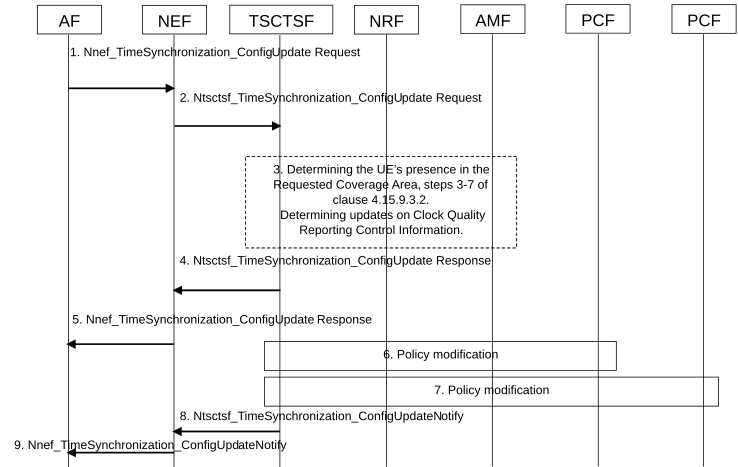

# 4.15.9.3.3 Time synchronization service modification

Figure 4.15.9.3.3-1: Time synchronization service modification

1\. To update an existing time synchronization service configuration of the PTP instance, the AF invokes a Nnef_TimeSynchronization_ConfigUpdate service operation providing the corresponding PTP instance reference.

2\. The NEF invokes the Ntsctsf_TimeSynchronization_ConfigUpdate service operation with the corresponding TSCTSF.

The AF that is part of the operator's trust domain may invoke the services directly with the TSCTSF.

3\. The TSCTSF checks whether the AF requested parameters in the update request comply with the stored Time Synchronization Subscription data as defined in clause 5.27.1.11 of TS 23.501 \[2\], for that, the TSCTSF retrieves the Time Synchronization Subscription data from UDM as defined in clause 4.15.9.2. If the Ntsctsf_TimeSynchronization_ConfigUpdate request includes or updates the Spatial validity condition and the Spatial validity condition is allowed per the subscription, the TSCTSF determines the UE's presence in the updated Spatial validity condition as specified in steps 3-7 of the time synchronization activation procedure in clause 4.15.9.3.2.

\- If the AF updates the clock quality acceptance criteria in step 1, the TSCTSF determines the clock acceptance criteria upon a time synchronization failure/degradation/improvement as specified in step 9 of the time synchronization activation procedure in clause 4.15.9.3.2. If AF provides clock quality acceptance criteria in step 1, and it was not available when the service was activated, the TSCTSF subscribes for notifications for changes in the NG-RAN and UPF/NW-TT timing synchronization status, as described in clause 4.15.9.5.1:

\- To determine the impacted UEs due to a timing synchronization status update reported by the NG-RAN, the TSCTSF follows the operation described in clause 5.27.1.12 of TS 23.501 \[2\].

\- To determine the impacted UEs due to a timing synchronization status update reported by the UPF/NW-TT, the TSCTSF verifies if the UPF/NW-TT is configured to send (g)PTP messages to the UEs/DS-TTs.

4\. The TSCTSF responds with the Ntsctsf_TimeSynchronization_ConfigUpdate response where the AF may include an indication that the UE(s) are (not) present in the Requested Coverage Area (in cases when the AF has requested the service for a specific area).

5\. The NEF responds with the Nnef_TimeSynchronization_ConfigUpdate.

6-7. The TSCTSF uses the PTP instance reference included in the Ntsctsf_TimeSynchronization_ConfigUpdate request to identify the time synchronization service configuration and the corresponding AF sessions.

If the Ntsctsf_TimeSynchronization_ConfigUpdate request includes updated service parameters for the PTP instance and if the corresponding DS-TT(s) and NW-TT are suitable with the parameters (e.g. requested PTP instance type, transport protocol and PTP profile), the TSCTSF uses the procedures described in clause K.2.2 of TS 23.501 \[2\] to update the PTP instance(s) in the DS-TT(s) and NW-TT.

If the Ntsctsf_TimeSynchronization_ConfigUpdate request includes one or more UE identities to be added to the PTP instance, if the corresponding DS-TT(s) are suitable with the parameters (e.g. requested PTP instance type, transport protocol and PTP profile) in the time synchronization service configuration as identified by the PTP instance reference in the request:

\- the TSCTSF adds the suitable AF-sessions to the list of AF-sessions that are associated with the time synchronization service configuration; and

\- the TSCTSF uses the procedures described in clause K.2.2 of TS 23.501 \[2\] to initialize and activate the PTP instance(s) in the corresponding DS-TT(s).

\- the TSCTSF uses the procedure in clause 4.15.9.4 to modify or activate the 5G access stratum time distribution for the UEs that are added to the impacted PTP instance.

If the Ntsctsf_TimeSynchronization_ConfigUpdate request includes one or more UE identities to be removed to the PTP instance, the TSCTSF removes the corresponding AF-sessions from the list of AF-sessions associated with the time synchronization configuration. The TSCTSF uses the procedure in clause 4.15.9.4 to remove the 5G access stratum time distribution parameters for the UEs that are removed from the impacted PTP instance.

8\. The TSCTSF notifies the NEF (or AF) with the Ntsctsf_TimeSynchronization_ConfigUpdateNotify service operation, containing the PTP instance reference and the current state of the time synchronization service configuration, including and whether there was a change in the UE's presence in the Spatial validity condition (in cases when the AF has requested the service for a specific area) and/or whether there was a change in network's timing synchronization status as described in clause 5.27.1.12 of TS 23.501 \[2\] including the clock quality acceptance criteria result.

9\. The NEF notifies the AF with the Nnef_TimeSynchronization_ConfigUpdateNotify service operation, containing the PTP instance reference, the current state of the time synchronization service configuration, network's time synchronization status and clock quality acceptance criteria result, if provided by Ntsctsf_TimeSynchronization_ConfigUpdateNotify. Based on the notification, the AF decides whether to modify the service configured for the UE of a PTP instance using Ntsctsf_TimeSynchronization_ConfigUpdate service, or whether to deactivate it using Nnef_TimeSynchronization_ConfigDelete service.
