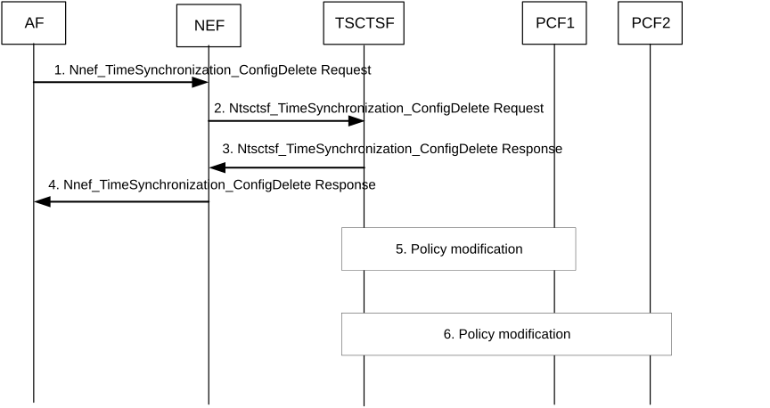

# 4.15.9.3.4 Time synchronization service deactivation

Figure 4.15.9.3.4-1: Time synchronization service deactivation

1\. To remove an existing time synchronization service configuration of the PTP instance, the AF invokes a Nnef_TimeSynchronization_ConfigDelete service operation providing the corresponding PTP instance reference.

2\. The NEF invokes the Ntsctsf_TimeSynchronization_ConfigDelete service operation with the corresponding TSCTSF.

The AF that is part of operator's trust domain may invoke the services directly with TSCTSF.

The TSCTSF may also invoke the Ntsctsf_TimeSynchronization_ConfigDelete service operation when it determines (based on notifications from the AMF(s), see steps 3-7 of clause 4.15.9.3.2) that the UE(s) are outside the Spatial validity condition.

3\. The TSCTSF responds with the Ntsctsf_TimeSynchronization_ConfigDelete response.

4\. The NEF responds with the Nnef_TimeSynchronization_ConfigDelete response.

5-6. The TSCTSF uses the PTP instance reference included in the Ntsctsf_TimeSynchronization_ConfigDelete request to identify the time synchronization service configuration and the corresponding AF sessions. The TSCTSF uses the procedures described in clause K.2.2 of TS 23.501 \[2\] to disable the corresponding PTP instance(s) in the DS-TT(s) and NW-TT. The TSCTSF deletes the time synchronization service configuration for the respective PTP instance.

The TSCTSF uses the procedure in clause 4.15.9.4 to deactivate the 5G access stratum time distribution for the UEs that are part of the impacted PTP instance.
