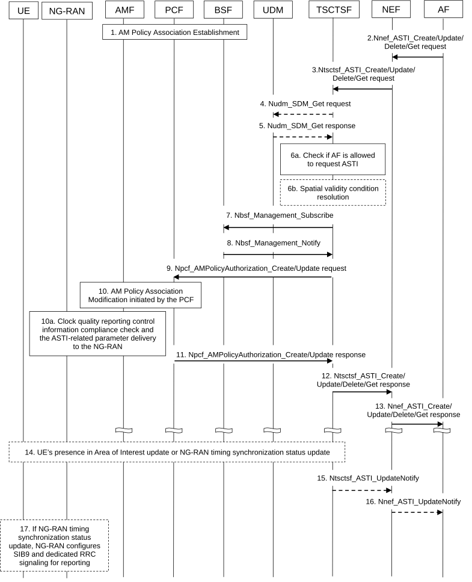

# 4.15.9.4 Procedures for management of 5G access stratum time distribution

The AF can use the procedure to activate, update or delete the 5G access stratum time distribution for one UE or a group of UEs.

The AF may query the status of the 5G access stratum time distribution using Nnef_ASTI_Get service operation. The Nnef_ASTI_Create and Nnef_ASTI_Update request may contain the parameters as described in Table 4.15.9.4-1. The AF may subscribe to 5G access stratum time synchronization status simultaneously while creating or updating the ASTI service. The AF may receive 5G access stratum time distribution status updates via Nnef_ASTI_UpdateNotify service operation.

Table 4.15.9.4-1: Description of 5G access stratum time distribution parameters

<table>
<colgroup>
<col style="width: 44%" />
<col style="width: 55%" />
</colgroup>
<thead>
<tr class="header">
<th>Parameter</th>
<th>Description</th>
</tr>
</thead>
<tbody>
<tr class="odd">
<td>5G access stratum time distribution indication (enable, disable)</td>
<td>Indicates that the access stratum time distribution via Uu reference point should be activated or deactivated for the associated UE identities.</td>
</tr>
<tr class="even">
<td>Time synchronization error budget</td>
<td>
Indicates the time synchronization error budget for the time synchronization service (as described in clause 5.27.1.9 of TS 23.501 [2]).

[optional]
</td>
</tr>
<tr class="odd">
<td>Temporal Validity Condition</td>
<td>
Indicates start-time and stop-time attributes that describe the time period when the time synchronization service is active.

[optional]
</td>
</tr>
<tr class="even">
<td>Spatial Validity Condition</td>
<td>
Indicates a geographical area (e.g. a civic address or shapes) or a TA list in which time synchronization service is enabled (NOTE 1).

[optional]
</td>
</tr>
<tr class="odd">
<td>Clock quality detail level</td>
<td>
It indicates whether and which clock quality information to provide to the UE and can take one of the following values "clock quality metrics" or "acceptable/not acceptable indication".

[optional]
</td>
</tr>
<tr class="even">
<td>Clock quality acceptance criteria</td>
<td>
It indicates acceptance criteria for the UE. It is defined based on the attributes specified in Table 5.27.1.12-1 of TS 23.501 [2]. The parameter shall be included if the "clock quality detail level" = "acceptable/not acceptable".

[conditional]
</td>
</tr>
<tr class="odd">
<td colspan="2">NOTE 1: A geographical area requested by an AF includes at least one tracking area (TA), i.e. the granularity is restricted to a TA level in this release of the specifications.</td>
</tr>
</tbody>
</table>

Figure 4.15.9.4-1: Management of 5G access stratum time information

1\. AM Policy Association establishment as described in clause 4.16.1.

2\. (When the procedure is triggered by the AF request to influence the 5G access stratum time distribution):

\- To create a new request, the AF provides access stratum time distribution parameters to the NEF using the Nnef_ASTI_Create service operation (together with the AF identifier and potentially further inputs as specified in table 4.15.9.4-1), including a target (one UE identified by SUPI or GPSI, a group of UEs identified by an External Group Identifier. The NEF forwards the GPSI or the External Group Identifier to the TSCTSF by including it inside the Ntsctsf_ASTI_Create request.

\- To update or remove an existing request, the AF invokes an Nnef_ASTI_Update or Nnef_ASTI_Delete service operation providing the corresponding time synchronization configuration id.

\- To query the status of the access stratum time distribution, the AF invokes Nnef_ASTI_Get service operation providing the target (a list of UE identities (SUPI or GPSIs) or an External Group Identifier).

\- If the AF includes clock quality detail level, the request creates a subscription at the NEF (for untrusted AF) or TSCTSF (for trusted AF) for notifications for the changes in 5G access stratum time distribution status.

\- The create request creates also a subscription for the changes in 5G access stratum time distribution status. To subscribe to NG-RAN timing synchronization status updates, the AF can subscribe to notifications as described in clause 4.15.9.5.1.

The AF that is part of operator's trust domain may invoke the services directly with the TSCTSF and identifies the targeted UE(s) using SUPI(s) or an Internal Group Identifier.

If the request includes a spatial validity condition and the AF uses a geographical area as a spatial validity condition, the NEF transforms this information into 3GPP identifiers (e.g. TAI(s)) based on pre-configuration.

NOTE 1: Steps 1 and 2 can occur in any order.

NOTE 2: It is assumed that AFs within the operator's domain is aware of TAs that can be used to formulate a spatial validity condition for Time Synchronization Coverage Area (see clause 5.27.1.10 of TS 23.501 \[2\]).

3\. (When the procedure is triggered by the AF request to influence the 5G access stratum time distribution):

\- The NEF authorizes the request. After successful authorization, the NEF invokes the Ntsctsf_ASTI_Create/Update/Delete/Get service operation with the TSCTSF discovered and selected as described in clause 6.3.24 of TS 23.501 \[2\].

\- The TSCTSF determines whether the targeted UE is part of a PTP instance in 5GS, if so the TSCTSF rejects the request (steps 4-11 are skipped).

\- The TSCTSF checks whether the AF requested parameters for the targeted UE comply with the stored Time Synchronization Subscription Data as defined in clause 5.27.1.11 of TS 23.501 \[2\]. If the AF request targets a group of UEs, steps 4-5 mapping an External/Internal Group Identifier to SUPI(s) are executed before the compliance check in step 6a between UE's subscription and the AF requested parameters.

\- The TSCTSF calculates the Uu time synchronization error budget as described in clause 5.27.1.9 of TS 23.501 \[2\]. This does not apply in case of Ntsctsf_ASTI_Delete service operation.

\- If the AF/NEF includes clock quality detail level, the request creates a subscription at the TSCTSF for notifications for the changes in 5G access stratum time distribution status.

(When the procedure is triggered by PTP instance activation or modification in the TSCTSF):

\- The TSCTSF calculates the Uu time synchronization error budget as described in clause 5.27.1.9 of TS 23.501 \[2\] for corresponding SUPIs that are part of the PTP instance.

4\. (When the procedure is triggered by the AF request to influence the 5G access stratum time distribution):

If the AF targeted UE(s) are identified by GPSI(s) or an External/Internal Group Identifier, the TSCTSF uses the Nudm_SDM_Get request to retrieve the subscription information (SUPI(s)) from the UDM using each GPSI or the External Group Identifier as received from the NEF, or an Internal Group Identifier as provided by the AF directly.

5\. (When the procedure is triggered by the AF request to influence the 5G access stratum time distribution):

The UDM provides the Nudm_SDM_Get response containing SUPI(s) that are mapped from each received GPSI or the External/Internal Group Identifier and identify the targeted UEs.

6a. (When the procedure is triggered by the AF request to influence the 5G access stratum time distribution):

The TSCTSF checks the AF request with the stored Time Synchronization Subscription data as described in clause 5.27.1.11 of TS 23.501 \[2\] for any targeted UE. If the AF is not authorized, steps 7-11 are skipped.

6b. (When the procedure is triggered by the AF request to influence the 5G access stratum time distribution):

If the Ntsctsf_ASTI_Create request in step 2 contains a spatial validity condition, then the TSCTSF performs the following operations:

\- For each target UE, TSCTSF checks with the stored Time Synchronization Subscription data if the spatial validity condition is allowed. The TSCTSF determines whether the TSCTSF has subscribed for the UE presence in Area of Interest composed by the TAs list in the spatial validity condition. If not, the TSCTSF may either discover the AMF(s) serving in the TAs comprising the spatial validity condition or discovers the serving AMF(s) for each UE identified by a GPSI/SUPI as described in clause 5.27.1.10 of TS 23.501 \[2\].

Then the TSCTSF subscribes to the AMF(s) to receive notifications about the UE presence in Area of Interest using Namf_EventExposure operation with the corresponding event filters as described in clause 5.2.2.3 and in clause 5.3.4.4 of TS 23.501 \[2\]. The subscribed area of interest may be the same as the spatial validity condition or may be a subset of the spatial validity condition (e.g. a list of TAs) based on the latest known UE location.

\- In order to ensure that a TAI list specifying the AoI for the AMF is aligned with UE's Registration Area (RA), the following steps shall be performed:

\- When invoking the subscription with the AMF(s), the TSCTSF may provide an indication, a new Parameter Type = "Adjust AoI based on RA", that the AMF may adjust the received AoI depending on UE's RA.

\- After receiving the Namf_EventExposure_Subscribe request from the TSCTSF with the Parameter Type = "Adjust AoI based on RA" and specified AoI, the AMF compares TAs from the AoI with the UE's Registration Area (RA). If the AoI includes one or more TA(s) that are part of UE's current RA, the AMF reports the UE is inside the Area Of Interest, otherwise the AMF reports the UE is outside the Area Of Interest, as described in Annex D.

\- The AMF notifies the TSCTSF about the UE's presence in the AoI using the Namf_EventExposure_Notify service operation.

\- Based on the notification from the AMF and spatial validity condition received in step 1, the TSCTSF determines whether to activate time synchronization service for this UE:

\- If the UE location is within the spatial validity condition, the TSCTSF determines to enable access stratum time distribution for the UE.

\- If the UE location is outside the spatial validity condition, the TSCTSF determines to disable access stratum time distribution for the UE.

If the Ntsctsf_ASTI_Create request in step 2 contains a temporal validity condition with a start-time and/or the stop-time that is in the future, the TSCTSF maintains the start-time and stop-time for the time synchronization service for the corresponding time synchronization configuration. If the start-time is in the past, the TSCTSF treats the request as if the time synchronization service was activated immediately. When the start-time is reached, the TSCTSF proceeds with the subsequent steps. When the stop-time is reached for active time synchronization service configuration, the TSCTSF proceeds as if Nnef_ASTI_Delete was received.

7\. The TSCTSF searches the PCF for the UE using Nbsf_Management_Subscribe with a SUPI as an input parameter, indicating that it is searching for the PCF that handles the AM Policy Association of the UE.

8\. The BSF provides to the TSCTSF the identity of the PCF for the UE for the requested SUPI via an Nbsf_Management_Notify operation. If matching entries already existed in the BSF when step 7 is performed, this shall be immediately reported to the TSCTSF.

9\. The TSCTSF sends to the PCF for the UE its request for the AM policy of the UE (identified by SUPI) using Npcf_AMPolicyAuthorization request, containing the 5G access stratum time distribution indication (enable, disable), optionally the calculated Uu time synchronization error budget, optionally the clock quality detail level and clock quality acceptance criteria.

(When the procedure is triggered by PTP instance activation, modification, or deactivation in the TSCTSF):

The TSCTSF ensures the 5G access stratum time distribution for the UE is enabled if at least one of the PTP instances the UE is part of is active.

10\. If the PCF receives multiple time synchronization error budgets for a given UE, then the PCF picks the most stringent budget. The PCF takes a policy decision and then the PCF may initiate an AM Policy Association Modification procedure for the UE as described in clause 4.16.2.2 to provide AMF the 5G access stratum time distribution parameters. As part of this:

\- The AMF shall, if supported, store the 5G access stratum time distribution indication (enable, disable), the Uu time synchronization error budget, clock quality detail level and clock quality acceptance criteria, and the UE reconnection indication in the UE context in AMF;

If the AMF receives Uu time synchronization error budget in the Access Stratum Time Synchronization Service Authorization as part of the Access and Mobility Subscription data during registration procedure (see clause 4.28.2.1) and in the AM Policy, the AMF should use the value received from the AM policy.

If the UE has indicated a support for network reconnection due to RAN timing synchronization status change as described in clause 5.4.4a of TS 23.501 \[2\], and if the AMF received "clock quality detail level" as part of an AM Policy Association Modification procedure, the AMF sets the "UE reconnection indication" for the UE to connect to the network in the case when the UE later detects that the NG-RAN timing synchronization status has changed while the UE is in CM-IDLE or CM-CONNECTED with RRC_INACTIVE state. The AMF shall send the UE reconnection indication to the UE updating the UE configuration as defined in clause 4.2.4.2.

10a. The AMF shall send the 5G access stratum time distribution indication (enable, disable), the Uu time synchronization error budget, clock quality detail level and clock quality acceptance criteria when they are available, to NG-RAN during mobility registration, AM policy modification, Service Request, N2 Handover and Xn handover as specified in TS 38.413 \[10\]. The NG-RAN node shall, if supported, store the information in the UE Context. Based on this information, the NG-RAN node provides the 5GS access stratum time to the UE according to the Uu time synchronization error budget as provided by the TSCTSF (if supported by UE and NG-RAN) and NG-RAN provides timing synchronization status reports to the UE (as described in clause 4.15.9.5.2).

NOTE 3: This release of the specification assumes that deployments ensure that the targeted UEs and the NG-RAN nodes serving those UEs support Rel-17 propagation delay compensation as defined in TS 38.300 \[9\].

11\. The PCF of the UE replies to the TSCTSF with the result of Npcf_AMPolicyAuthorization operation.

12\. (When the procedure is triggered by the AF request to influence the 5G access stratum time distribution):

The TSCTSF responds the AF with the Ntsctsf_ASTI_Create/Update/Delete/Get service operation response.

13\. (When the procedure is triggered by the AF request to influence the 5G access stratum time distribution):

The NEF informs the AF about the result of the Nnef_ASTI_Create/Update/Delete/Get service operation performed in step 2.

14\. (When the procedure is triggered by the AF request to influence the 5G access stratum time distribution):

If TSCTSF received spatial validity condition as part of the Ntsctsf_ASTI_Create request in step 2, upon the reception of a change in the UE presence in Area of Interest notification, the TSCTSF determines if the spatial validity condition shall trigger an activation or deactivation of the access stratum time distribution:

\- If the UE has moved inside the Time Synchronization Coverage Area, then the TSCTSF determines to enable access stratum time distribution for the UE.

\- If the UE has moved outside the Time Synchronization Coverage Area, then the TSCTSF determines to disable access stratum time distribution for the UE.

If TSCTSF received clock quality acceptance criteria as part of the Ntsctsf_ASTI_Create request in step 2, upon a reception of a UE presence in Area of Interest notification, the TSCTSF determines if the UE is impacted correlating UE presence in Area of Interest notifications provided by the serving AMF and the timing synchronization status received (e.g. degradation, failure, recovery) as described in clause 5.27.1.12 of TS 23.501 \[2\].

15-16. (When the procedure is triggered by the AF request to influence the 5G access stratum time distribution):

If TSCTSF determines to modify access stratum time distribution for the UE in step 14 for which the AF requested access stratum time distribution, the TSCTSF notifies the service status to AF.

If the TSCTSF determines a change in the support of the clock quality acceptance criteria for the UE in step 14 for which the AF requested access stratum time distribution, the TSCTSF includes the clock quality acceptance criteria result to the notification to the AF. Based on this notification, the AF decides whether to modify the ASTI service configured for the UE using Ntsctsf_ASTI_Update service.

17\. If there was a failure/degradation/improvement event in step 14, the NG-RAN provides timing synchronization status reports to the UE (as described in clause 4.15.9.5.2).
