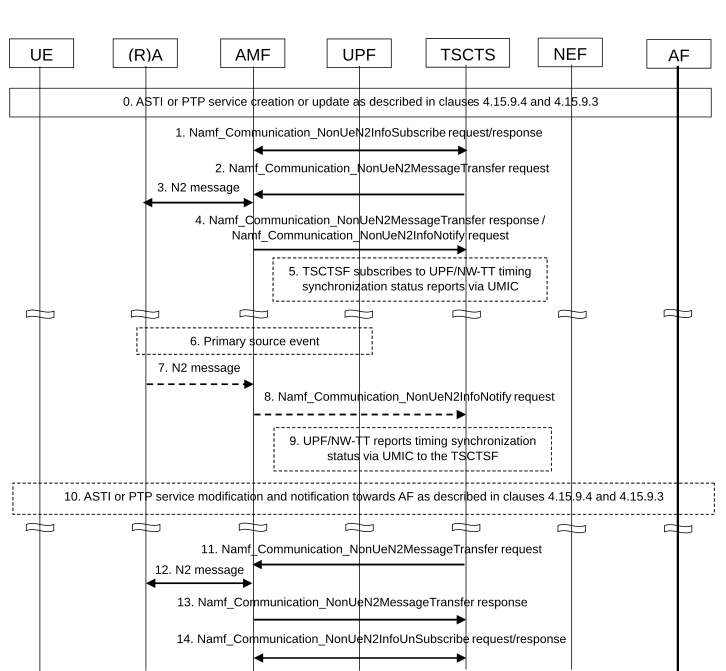
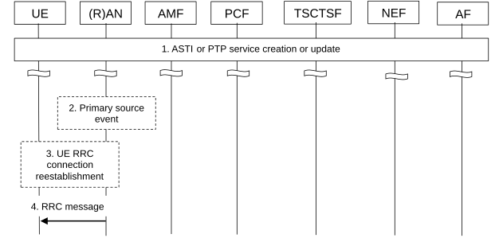

# 4.15.9.5 Procedures for subscription and management of network timing synchronization status monitoring

## 4.15.9.5.1 Network timing synchronization status

Figure 4.15.9.5.1-1: Procedure for TSCTSF subscription to RAN and/or UPF/NW-TT timing synchronization status

0\. The AF requests creation or modification of ASTI or PTP based time synchronization service as described in clauses 4.15.9.4 and 4.15.9.3 including clock quality detail level and clock quality acceptance criteria (if applicable) in the request.

If the request is received at the NEF, it checks whether the AF is authorized to send the request and forwards the request to the TSCTSF.

If network timing synchronization status reports are provisioned using node-level signalling via control plane, the TSCTSF determines the serving AMF(s) and the UPF/NW-TT nodes (if applicable) for the UE(s) that needs to initiate network timing synchronization status monitoring.

Otherwise, if network timing synchronizations status reports are provisioned via OAM, steps 1-4 and 7-9 are skipped.

1\. (When the procedure is triggered by the AF request to influence the 5G access stratum time distribution or by PTP instance activation, modification):

Upon the reception of the clock quality detail level and clock quality acceptance criteria (if applicable) in the AF request in step 0, the TSCTSF needs to be subscribed to NG-RAN timing synchronization status updates at the NG-RAN nodes that may provision access stratum time distribution information to the target UE. NG-RAN timing synchronization status updates provisioning may be configured via AMF (with node level signalling as illustrated in steps 1-4).

2\. The TSCTSF invokes an Namf_Communication_NonUeN2MessageTransfer request to the AMF. Inside this request, the TSCTSF includes an N2 Container indicating to the NG-RAN to start reporting TSS attributes and containing the TSCTSF Instance ID. Additionally, in this request the TSCTSF may specify TA(s) and/or NG-RAN node(s). Based on local configuration and/or TA or NG-RAN node information as received from the TSCTSF, the AMF may request some or all NG-RAN nodes in the TA(s) to perform the timing synchronizations status reporting.

3-4. The AMF sends the corresponding N2 messages to all applicable NG-RAN nodes. Upon receiving a response(s) from the NG-RAN node(s), the AMF includes in the Namf_Communication_NonUeN2MessageTransfer response or Namf_Communication_N2InfoNotify request to the TSCTSF a list of N2 Containers containing response messages from the NG-RAN nodes and the corresponding NG-RAN node identifier(s). The AMF may aggregate the response messages it receives from the NG-RAN nodes.

5\. (When the procedure is triggered by the AF request for PTP instance activation, modification and if the UPF/NW-TT is involved in providing time information to DS-TT):

Upon the reception of the clock quality acceptance criteria in the AF request in step 0, the TSCTSF needs to be subscribed to UPF/NW-TT timing synchronization status updates at the UPF/NW-TT that may provision time information via PTP to the target UE. UPF/NW-TT timing synchronization status updates provisioning may be configured via OAM or via UMIC.

6\. The RAN node and TSCTSF are pre-configured for the thresholds for each timing synchronization status attribute as described in clause 5.27.1.12 of TS 23.501 \[2\].

7-8. If the NG-RAN node detects a change on its timing synchronization status as described in clause 5.27.1.12 of TS 23.501 \[2\] and the timing synchronization status reporting is configured via the AMF in steps 1-3, the NG-RAN node notifies the AMF providing a NG-RAN timing synchronization status update. The update can contain the information elements listed in Table 5.27.1.12-1 of TS 23.501 \[2\], TSCTSF Instance ID and the scope of the timing synchronization status (as described in clause 5.27.1.12 of TS 23.501 \[2\]). The AMF forwards the latest received NG-RAN timing synchronization status update in the Namf_Communication_NonUeN2InfoNotify to the specific TSCTSF instance identified by the TSCTSF Instance ID as specified in step 2.

9\. If the UPF/NW-TT detects a change on its timing synchronization status and timing synchronization status reporting is configured via UMIC in step 3, the UPF/NW-TT notifies the TSCTSF providing a UPF/NW-TT timing synchronization status update via UMIC. The update can contain the information elements listed in Table K.1-2 of TS 23.501 \[2\].

10\. Upon the reception of a change in the NG-RAN and/or NW-TT timing synchronization status update, the TSCTSF shall determine if the UE is impacted and whether the clock quality acceptance criteria can still be met. For each scope of the timing synchronization status received from the RAN in step 6, if the status indicates degradation, TSCTSF may set the Area of Interest to gNB node ID(s) or Cell IDs in the scope of the timing synchronization status. The TSCTSF uses the resulted Area of Interest to subscribe for the UE presence in Area of Interest from the AMF that is serving the gNB node ID as described in clause 5.27.1.12 of TS 23.501 \[2\]. If the status indicates improvement, the TSCTSF may remove the corresponding scope from the subscription.

Upon reception of notification for the UE presence in the Area of Interest, if the TSCTSF determines that the UE is impacted for ASTI service, the TSCTSF performs steps 15-16 in clause 4.15.9.4 to notify the AF the acceptance criteria result.

Upon reception of notification for the UE presence in the Area of Interest, if the TSCTSF determines that the UE is impacted for PTP service, the TSCTSF performs steps 9-11 in clause 4.15.9.3.2 to notify the AF the acceptance criteria result.

11-14. If the TSCTSF determines to unsubscribe from the NG-RAN timing synchronization status updates, the following steps need to be taken:

11\. The TSCTSF instance invokes the Namf_Communication_NonUeN2MessageTransfer request that includes its TSCTSF Instance ID and an N2 Container indicating to the NG-RAN(s) to stop reporting the TSS attributes.

12\. The AMF sends the corresponding N2 message to the applicable NG-RAN nodes.

13\. NG-RAN responds to the AMF, and the AMF provides a response to the Namf_Communication_NonUeN2MessageTransfer request from the TSCTSF instance.

NG-RAN stops reporting the TSS attributes to the AMF for the TSCTSF instances that sent the Namf_Communication_NonUeN2MessageTransfer with an N2 Container indicating to stop reporting NG-RAN timing synchronization status.

NG-RAN stops reporting the TSS attributes to the AMF once all the TSCTSF have requested to stop reporting.

14\. After receiving an Namf_Communication_NonUeN2MessageTransfer response or Namf_Communication_N2InfoNotify request, the TSCTSF invokes the Namf_Communication_NonUeN2InfoUnSubscribe service operation to the AMF to unsubscribe from the NG-RAN timing synchronization status updates.

## 4.15.9.5.2 5G access stratum time distribution status reporting to the UE

Figure 4.15.9.5.2-1: Procedure for reporting RAN timing synchronization status to subscribed UE

1\. Creation or update of ASTI or PTP based time synchronization service (AF requested ASTI or PTP based time synchronization service is described in clauses 4.15.9.4 and 4.15.9.3; subscription based ASTI is described in clause 4.28.2.1) including in the request clock quality detail level indication and optionally the clock quality acceptance criteria. The clock quality level indication and optionally the clock quality acceptance criteria are sent to the NG-RAN and the UE reconnect indication is sent to the UE as described in clause 4.15.9.4.

2\. The RAN node is pre-configured for the thresholds for each timing synchronization status attribute as described in clause 5.27.1.12 of TS 23.501 \[2\]. If there is a change on its primary source so that the thresholds are exceeded or met again, the NG-RAN node indicates the status via SIB information as described in clause 5.27.1.12 in TS 23.501 \[2\].

3\. (When the UE is in RRC_INACTIVE or RRC_IDLE state):

If supported by the UE and If the UE determines, based on the reading of SIB9 information as described in clause 5.27.1.12 of TS 23.501 \[2\], a clock quality information update is available, and the AMF has provided the UE reconnection indication in step 10 of clause 4.15.9.4, the UE reconnects to the network as described in TS 24.501 \[25\].

4\. (When the UE is in RRC_CONNECTED state):

The NG-RAN node notifies the UE providing clock quality information as configured in step 0 (i.e. sending clock quality metrics or acceptable/not acceptable indication) using unicast RRC signalling whenever the UE enters RRC_CONNECTED state and while the UE remains in RRC_CONNECTED, when any of the clock quality metrics or the acceptable/not acceptable indication for the UE changes.
