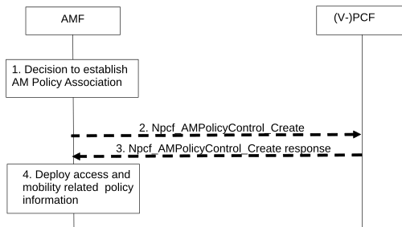

# 4.16.1 AM Policy Association Establishment

## 4.16.1.1 General

There are three cases considered for AM Policy Association Establishment:

1\. UE initial registration with the network.

2\. The AMF re-allocation with PCF change in handover procedure and registration procedure.

3\. EPS to 5GS mobility when there is no existing AM Policy Association between AMF and PCF for this UE.

## 4.16.1.2 AM Policy Association Establishment with new Selected PCF

Figure 4.16.1.2-1: AM Policy Association Establishment with new Selected PCF

This procedure concerns both roaming and non-roaming scenarios.

In the non-roaming case the role of the V-PCF is performed by the PCF. For the roaming scenarios, the V-PCF interacts with the AMF.

1\. Based on local policies, the AMF decides to establish AM Policy Association with the (V-)PCF then steps 2 to 3 are performed under the conditions described below.

2\. \[Conditional\] If the AMF has not yet obtained access and mobility related policy information for the UE or if the access and mobility related policy information in the AMF is no longer valid, the AMF requests the PCF to apply operator policies for the UE from the PCF. The AMF sends Npcf_AMPolicyControl_Create to the (V-)PCF to establish an AM Policy Association with the (V-)PCF. The request includes the following information: SUPI, Internal Group (see clause 5.9.7 of TS 23.501 \[2\]), subscription notification indication and if available, Service Area Restrictions, RFSP index, Subscribed UE-AMBR, List of Subscribed UE-Slice-MBR, the Allowed NSSAI, Partially Allowed NSSAI, S-NSSAI(s) rejected partially in the RA, Rejected S-NSSAI(s) for the RA, Pending NSSAI, Target NSSAI (see clause 5.3.4.3.3 of TS 23.501 \[2\]), Network Slice Replacement supported for the UE (see clause 5.15.19 of TS 23.501 \[2\]), GPSI, which are retrieved from the UDM during the update location procedure and may include Access Type and RAT Type, PEI, ULI, UE time zone and Serving Network (PLMN ID, or PLMN ID and NID, see clause 5.34 of TS 23.501 \[2\]).

When AMF utilizes an NWDAF, it may add the NWDAF serving the UE identified by the NWDAF instance ID. Per NWDAF service instance the Analytics ID(s) are also included.

3\. The PCF may invoke the Nudr_DM_Query service to the UDR. And the UDR may response with the requested policy control subscription data as in clause 6.2.1.3 of TS 23.503 \[20\] and/or application data as in clause 6.2.1.6 of TS 23.503 \[20\].

In non-roaming case, if the PCF determines that the policy decision depends on the status of the policy counters available at the CHF and such reporting is not established for the subscriber, the PCF initiates an Initial Spending Limit Report Retrieval as defined in clause 4.16.8.2. If policy counter status reporting is already established for the subscriber and the PCF determines that the status of additional policy counters is required, the PCF initiates an Intermediate Spending Limit Report Retrieval as defined in clause 4.16.8.3.

NOTE 1: The Nudr_DM_Query may include the Spending Limit Information, i.e., the policy counters and their latest status. Thus the PCF can provide the AM policy to the AMF before contacting the CHF. The PCF may need to update the AMF depending on the statuses of the policy counters provided by the CHF.

NOTE 2: Potential inconsistencies between the policy counter and its status in the UDR and in the CHF can happen given that the CHF may update the policy counter and its status at any time, as such it is recommended that the PCF contacts the CHF if the policy counters and its status stored in the UDR is used, to be able to receive updated information from the CHF.

In non-roaming case, the PCF may request notifications from the UDR on changes in the subscription information by invoking Nudr_DM_Subscribe service operation, Data Set "Policy Data" and Data Subset "Access and Mobility policy control data" as defined in clause 6.2.1.3 of TS 23.503 \[20\] and/or Data set "application data" and Data Subset "AM influence information" as defined in clause 6.2.1.6 of TS 23.503 \[20\].

The (V)-PCF responds to the Npcf_AMPolicyControl_Create service operation. The (V)-PCF provides access and mobility related policy information (e.g. Service Area Restrictions) as defined in clause 6.5 of TS 23.503 \[20\]. In addition, (V)-PCF can provide Policy Control Request Trigger of AM Policy Association to AMF. In the non-roaming case, the PCF may subscribe to Analytics from NWDAF as defined in clause 6.1.1.3 of TS 23.503 \[20\].

The AMF is implicitly subscribed in the (V-)PCF to be notified of changes in the policies.

The (V-)PCF may register to the BSF as the PCF that handles the AM Policy Association for this UE. This is performed by using the Nbsf_Management_Register operation, providing as inputs the UE SUPI/GPSI and the PCF identity.

4\. \[Conditional\] The AMF deploys the access and mobility related policy information which includes storing the Service Area Restrictions and Policy Control Request Trigger(s) of the AM Policy Association, provisioning Service Area Restrictions to the UE and provisioning the RFSP index, the UE-AMBR, List of UE-Slice-MBR, Service Area Restrictions to the NG-RAN as defined in TS 23.501 \[2\] and request for notification of SM Policy association establishment and termination to a list of (DNN, S-NSSAI)(s) together with PCF for the UE binding information.

## 4.16.1.3 Void
