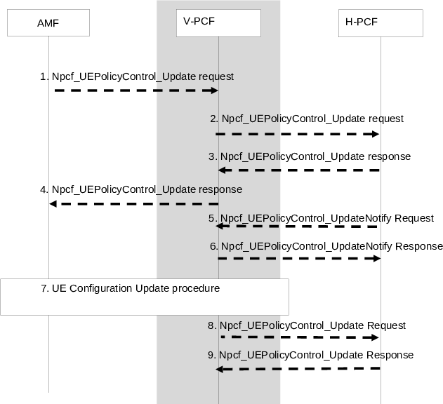
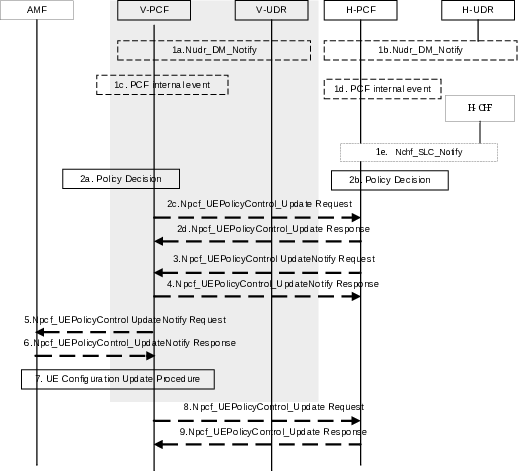

# 4.16.12 UE Policy Association Modification

## 4.16.12.1 UE Policy Association Modification initiated by the AMF

### 4.16.12.1.1 UE Policy Association Modification initiated by the AMF without AMF relocation

This procedure addresses the scenario where a Policy Control Request Trigger condition is met.

Figure 4.16.12.1.1-1: UE Policy Association Modification initiated by the AMF

This procedure concerns both roaming and non-roaming scenarios.

In the non-roaming case the V-PCF is not involved. In the roaming case, the AMF interacts with the V-PCF and the H-PCF interacts with the V-PCF.

1\. When a Policy Control Request Trigger condition is met the AMF updates UE Policy Control Association and provides information on the conditions that have changed to the PCF. The AMF sends a Npcf_UEPolicyControl Update Request with the following information: UE Policy Association ID associated with the SUPI defined in TS 29.525 \[58\] and the Policy Control Request Trigger met. In roaming scenario, based on operator policies, the AMF may provide to the V-PCF the PCF ID of the selected H-PCF. The V-PCF contacts the H-PCF.

See clause 6.1.2.5 of TS 23.503 \[20\] and clause 4.2.3.2 of TS 29.525 \[58\] for more details on Policy Control Request Trigger.

The AMF may indicate to the PCF that the UE supports N3IWF selection based on the slices the UE wishes to use over untrusted non-3GPP access and/or UE support for TNGF selection based on the slices the UE wishes to use over trusted non-3GPP access.

In the roaming case, steps 2 and 3 are executed, otherwise step 4 follows.

2\. The V-PCF forwards the information received from AMF in step 1 to the (H-)PCF.

3\. The H-PCF replies to the V-PCF. In the non-roaming case, the PCF may subscribe to Analytics from NWDAF as defined in clause 6.1.1.3 of TS 23.503 \[20\].

4\. The (V-) PCF sends a Npcf_UEPolicyControl Update Response to the AMF.

5\. The (H-)PCF may create the UE policy container including UE policy information as defined in clause 6.6 of TS 23.503 \[20\]. In the case of roaming the H-PCF may include the UE policy container in the Npcf_UEPolicyControl_UpdateNotify Request.

6\. The (V-)PCF sends a response to H-PCF using Npcf_UEPolicyControl_UpdateNotify Response.

Steps 7, 8 and 9 are the same as steps 8, 9 and 10 of procedure UE Policy Association Establishment in clause 4.16.11.

### 4.16.12.1.2 UE Policy Association Modification with old PCF during AMF relocation

This procedure addresses the scenario where a UE Policy Association Modification with the old PCF during AMF relocation.

Figure 4.16.12.1.2-1: Policy Association Modification with the old PCF during AMF relocation

This procedure addresses both roaming and non-roaming scenarios.

In the non-roaming case the V-PCF is not involved. In the roaming case, the AMF interacts with the V-PCF and the V-PCF interacts with the H-PCF.

1\. \[Conditional\] When the old AMF and the new AMF belong to the same PLMN, the old AMF transfers to the new AMF the UE Policy Association information including policy control request trigger(s) and the PCF ID(s). For the roaming case, the new AMF receives both V-PCF ID and H-PCF ID.

2\. Based on local policies, the new AMF decides to re-use the UE policy association for the UE Context with the (V-)PCF and contacts the (V)-PCF identified by the PCF ID received in step 1.

NOTE: The scenario that only the H-PCF is reused by the new AMF but the V-PCF is not reused is not considered in this Release.

3\. The new AMF sends Npcf_UEPolicyControl_Update to the (V-)PCF to update the UE policy association with the (V-)PCF. If a Policy Control Request Trigger condition is met, the information matching the trigger condition may also be provided by the new AMF.

In the roaming case, step 4 and 5 are executed, otherwise step 6 follows.

4\. The V-PCF forwards the information received from new AMF in step 3 to the (H-)PCF.

5\. The H-PCF replies to the V-PCF. In non-roaming case, the PCF may subscribe to Analytics from NWDAF as defined in clause 6.1.1.3 of TS 23.503 \[20\].

6\. The (V-)PCF updates the stored information provided by the old AMF with the information provided by the new AMF. The (V-)PCF sends a Npcf_UEPolicyControl Update Response to the AMF.

7\. The (H-)PCF may create the UE policy container including UE policy information as defined in clause 6.6 of TS 23.503 \[20\]. In the case of roaming the H-PCF may include the UE policy container in the Npcf_UEPolicyControl_UpdateNotify Request.

8\. The V-PCF sends a response to H-PCF using Npcf_UEPolicyControl_UpdateNotify Response.

Steps 9, 10 and 11 are the same as steps 8, 9 and 10 of procedure UE Policy Association Establishment in clause 4.16.11.

## 4.16.12.2 UE Policy Association Modification initiated by the PCF

This procedure is used to update UE policy and/or UE policy triggers.

In the non-roaming case, the H-PCF may interact with the CHF in HPLMN to make a decision about UE Policies based on spending limits.

Figure 4.16.12.2-1: UE Policy Association Modification initiated by the PCF

This procedure concerns both roaming and non-roaming scenarios.

In the non-roaming case the V-PCF is not involved and the role of the H-PCF is performed by the PCF. In the roaming case, the H-PCF provides UE policy decision and provides the policy to the AMF via V-PCF.

1a and 1b. If (H-)PCF subscribed to notification of subscriber´s policy data change or 5G VN Group Configuration (5G VN group data, 5G VN group membership) change and a change is detected, the UDR notifies that the subscriber´s policy data of a UE or 5G VN Group Configuration (5G VN group data, 5G VN group membership) has been changed.

The UDR notifies the (H-)PCF of the updated policy control subscription information profile via Nudr_DM_Notify (Notification correlation Id, Policy Data, either UE context policy control data or Policy Set Entry data or both, SUPI), or

The UDR notifies the (H-)PCF of the updated 5G VN Group Configuration (5G VN group data, 5G VN group membership) via Nudr_DM_Notify (Notification correlation Id, 5G VN Group Configuration, Internal-Group-Identifier), or

The (V-)UDR notifies the (V-)PCF of the updated policy control subscription information profile via Nudr_DM_Notify (Notification correlation Id, Policy Data, PolicySetEntry Data. PLMN ID).

The (V-)UDR notifies the (V-)PCF of the updated Service Parameters via Nudr_DM_Notify.

1c and 1d. PCF determines locally that UE policy information needs to be sent to the UE.

1e The CHF notifies the (H-)PCF about the change of the status of the subscribed policy counters available at the CHF for that subscriber.

2a and 2b. The PCF makes the policy decision. If the group data is updated, the (H-) PCF checks the UE Policy Associations for those SUPIs within the Internal-Group-Id and may need to perform step 3 to step 9 for each UE Policy Association that needs to be updated with new UE Policies sent to each UE. In the non-roaming case, the PCF may subscribe to Analytics from NWDAF as defined in clause 6.1.1.3 of TS 23.503 \[20\].

2c and 2d. In the roaming case, the V-PCF may provide the updated Service Parameters received from the V-UDR as specified in clause 4.15.6.10 to the H-PCF using the Npcf_UEPolicyControl_Update Request. The H-PCF sends a response to the V-PCF.

3\. The (H-)PCF may create the UE policy container including UE policy information as defined in clause 6.1.2.2.2 of TS 23.503 \[20\]. In the case of roaming, the H-PCF may send the UE policy container in the Npcf_UEPolicyControl_UpdateNotify Request. The H-PCF may provide updated policy control triggers for the UE policy association. If there is the received Service Parameters from the V-PCF in step 2, the H-PCF may take the Service Parameters obtained from V-PCF to generate URSP rules applicable in the VPLMN as specified in clause 4.15.6.10.

4\. The V-PCF sends a response to H-PCF using Npcf_UEPolicyControl_UpdateNotify Response.

5\. The (V-)PCF provides the Policy Control Request Trigger parameters in the Npcf_UEPolicyControl_UpdateNotify Request to the AMF. In the case of roaming, the V-PCF may also provide UE policy information to the UE. The V-PCF may also provide updated policy control triggers for the UE policy association to the AMF.

6\. The AMF sends a response to (V-)PCF.

Steps 7, 8 and 9 are the same as steps 8, 9 and 10 of procedure UE Policy Association Establishment in clause 4.16.11.
