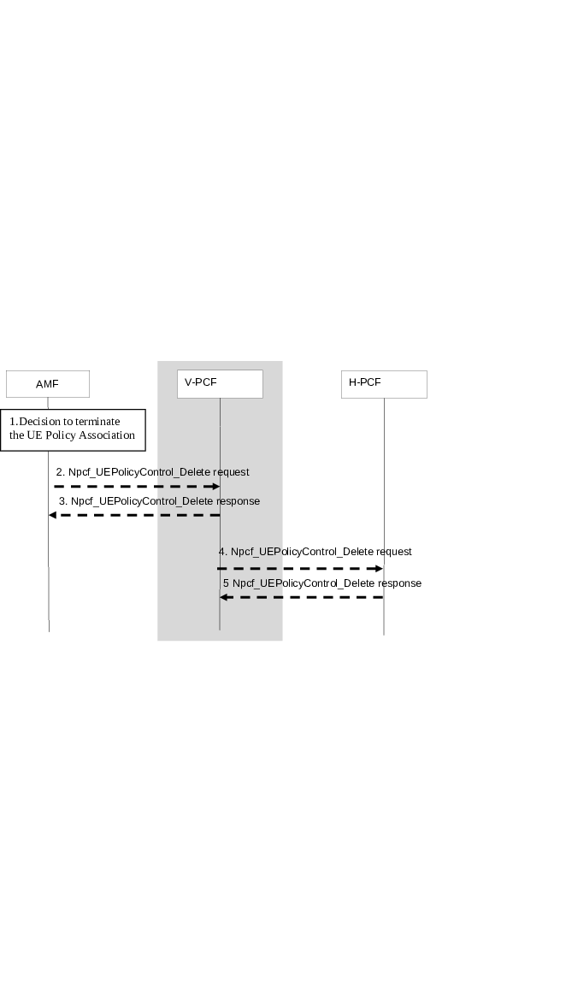
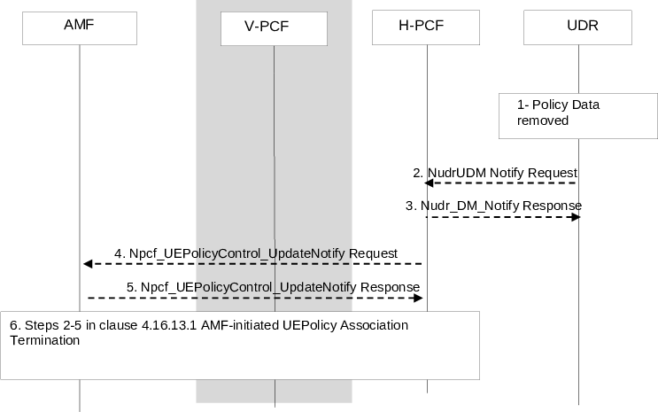

# 4.16.13 UE Policy Association Termination

## 4.16.13.1 AMF-initiated UE Policy Association Termination

The following case is considered for UE Policy Association Termination:

1\. UE Deregistration from the network when the UE is not registered in another access type.

2\. The mobility with change of AMF (e.g. new AMF is in different PLMN or new AMF in the same PLMN).

3\. \[Optional\] 5GS to EPS mobility with N26 if the UE is not connected to the 5GC over a non-3GPP access in the same PLMN.

In the non-roaming case, the H-PCF may interact with the CHF in HPLMN.

Figure 4.16.13.1-1: AMF-initiated UE Policy Association Termination

This procedure concerns both roaming and non-roaming scenarios.

In the non-roaming case, the V-PCF is not involved and the role of the H-PCF is performed by the PCF. For the roaming scenarios, the V PCF interacts with the AMF. The V PCF contacts the H-PCF to request removing UE Policy Association.

1\. The AMF decides to terminate the UE Policy Association.

2\. The AMF sends the Npcf_UEPolicyControl_Delete service operation including UE Policy Association ID to the (V-)PCF.

3\. The (V-)PCF removes the policy context for the UE and replies to the AMF with an Acknowledgement including success or failure. The V-PCF may interact with the H-PCF. The (V-)PCF may unsubscribe to subscriber policy data changes with UDR by Nudr_DM_Unsubscribe (Subscription Correlation Id). The AMF removes the UE Policy Context.

If the PCF has previously registered to the BSF as the PCF that is serving this UE, the PCF shall deregister from the BSF if no AM Policy Association for this UE exists anymore. This is performed by using the Nbsf_Management_Deregister service operation, providing the Binding Identifier that was obtained earlier from the BSF when performing the Nbsf_Management_Register service operation.

Step 4 and Step 5 apply only to the roaming case.

4\. The V-PCF sends the Npcf_UEPolicyControl_Delete service operation including UE Policy Association ID to the H-PCF.

5\. The H-PCF removes the policy context for the UE and replies to the V-PCF with an Acknowledgement including success or failure.

Optionally, based on operator policies, as described in clause 6.1.1.4 of TS 23.503 \[20\], the PCF may store the policy counters and their statuses of spending limits information into the UDR by invoking Nudr_DM_Update.

The H-PCF may unsubscribe to subscriber policy data changes with UDR by Nudr_DM_Unsubscribe (Subscription Correlation Id) for subscriber policy changes. In the non-roaming case, the PCF may unsubscribe to analytics from NWDAF.

The H-PCF may invoke the procedure defined in clause 4.16.8 to unsubscribe to policy counter status reporting or to modify the subscription to policy counter status reporting in CHF (if remaining Policy association for this subscriber requires policy counter status reporting).

## 4.16.13.2 PCF-initiated UE Policy Association Termination

Figure 4.16.13.2-1: PCF-initiated UE Policy Association Termination

This procedure concerns both roaming and non-roaming scenarios.

In the non-roaming case, the V-PCF is not involved and the role of the H-PCF is performed by the PCF. For the roaming scenarios, the H-PCF interacts with the V-PCF to request removing Policy Association.

The PCF is subscribed to notification of changes in Data Set "Policy Data" for a UE Policy Association ID.

1\. The Policy data is removed, either the Data Set "Policy Data" or the Data Subset "UE context policy control".

2\. The UDR sends the Nudr_DM_Notify_Request (Notification correlation Id, Policy Data, SUPI, UE Context Policy Control data, updated data) including the SUPI, the Data Set Identifier, the Data Subset Identifier and the Updated Data including empty "Policy Data" or empty "UE context policy control".

3\. The PCF sends the Nudr_DM_Notify_Response to confirm reception and the result to UDR.

4\. The PCF may notify the AMF of the removal of the UE Policy Association via Npcf_UEPolicyControl_UpdateNotify service operation. Alternatively, the PCF may decide to maintain the Policy Association if a default profile is applied, in this case steps 4, 5 and 6 are not executed.

In the non-roaming case, the PCF unsubscribes to analytics from NWDAF if any.

5\. The AMF acknowledges the operation.

6\. Steps 2-5 in clause 4.16.13.1 AMF-initiated UE Policy Association Termination are performed to remove the UE Policy Association for this UE and the subscription to Policy Control Request Triggers for that UE Policy Association.
