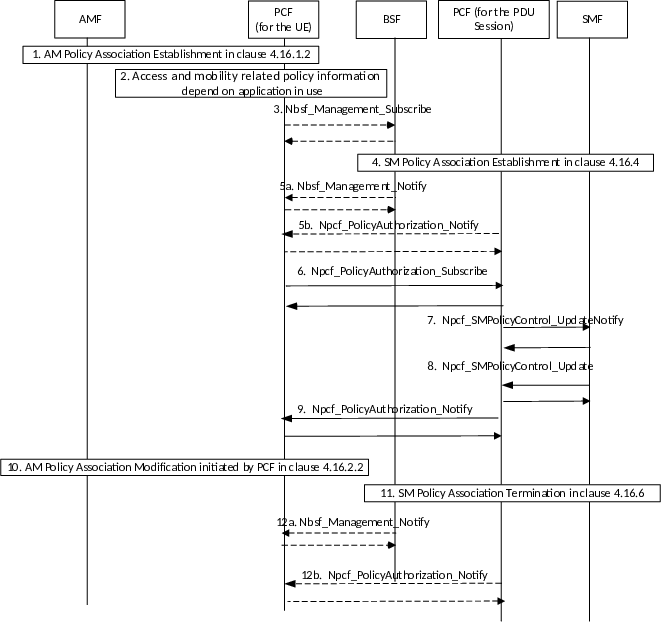
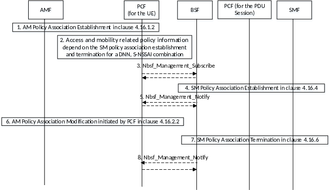

# 4.16.14 Management of access and mobility related policy information depending on the application in use

## 4.16.14.1 General

The procedure for management of access and mobility related policy information depending on the application in use enables modification of the access and mobility related policy information on detection of the start and stop of an application.

The content of this clause applies to non-roaming and LBO roaming scenario (for any inbound roaming UEs), i.e. to cases where the involved entities (e.g. PCF, SMF and UPF) belong to the serving PLMN. The PCF shall not apply a change of access and mobility related policy information for application traffic detected in PDU Sessions established in Home Routed mode.

If PCF for the UE and PCF for the PDU Session are the same PCF, then steps 3, 5, 6, 9 and 12 in Figure 4.16.14.2-1 are not performed.

If the PCF for the UE and the PCF for the PDU Session are different PCFs, then the PCF for the UE is informed when a SM Policy Association is established or released by either:

\- Subscription to the BSF:

= see steps 1, 2, 3, 4, 5a, 11 and 12a in Figure 4.16.14.2.1-1. The BSF notifies when a PCF is registered or deregistered for the PDU Session to a DNN, S-NSSAI.

\- see steps 1, 2, 3, 5a and 8 in Figure 4.16.14.2.2-1. The BSF reports the registration of a PCF for the PDU Session when the first SM Policy Association is established and the deregistration of the PCF for the PDU Session when the last SM Policy Association is terminated for a (DNN, S-NSSAI).

\- see steps 1, 2, 3, 5a, 11a in Figure 4.16.14.2.2-3. The BSF reports the registration of a PCF for the PDU Session when the first SM Policy Association is established and the deregistration of the PCF for the PDU Session when the last SM Policy Association is terminated for a (DNN, S-NSSAI).

\- Request for notification of SM Policy Association establishment or termination and the PCF binding information via AMF and SMF. See steps 1, 4, 5b, 11 and 12b in Figure 4.16.14.2-1, Figure 4.16.14.2-2 and Figure 4.16.14.2-3. The PCF for the PDU Session reports that the SM Policy Association is established as described in clause 4.16.4 and provides the UE address(es). The SM Policy Association Termination notifies the PCF for the UE as described in clause 4.16.6.

## 4.16.14.2 Procedures for management of access and mobility related policy information

### 4.16.14.2.1 Management of access and mobility related policy information at start and stop of application traffic

This procedure applies when the AF provides a service coverage area or the indication of high throughput associated with the Application Identifier(s).

Figure 4.16.14.2.1-1: Management of access and mobility related policy information at start and stop of application traffic

1\. The AMF establishes an AM Policy Association for retrieving access and mobility related policy information, e.g. RFSP index value, as described in clause 4.16.1.2.

2\. If the access and mobility related policy information depends on the application in use, then depending on operator policies in the PCF, the PCF may subscribe to the BSF, then step 3 follows, or provides its PCF binding information with the Request for notification of SM Policy Association establishment or termination for a DNN, S-NSSAI to the AMF, then step 5b follows.

3\. The PCF for the UE determines that access and mobility related policy information (e.g. RFSP index value) depends on the detection of one or more application(s) in use, the DNN, S-NSSAI used to access each Application Id is configured in the PCF or retrieved from the UDR as part of the Application Data Set, then subscribes to the BSF to be notified when a PCF for the PDU Session for this SUPI is registered in the BSF, by invoking Nbsf_Management_Subscribe (SUPI, list of (DNN, S-NSSAI)(s)). Steps 4 and 5 are repeated for each PCF registered for a PDU Session to a (DNN, S-NSSAI) included in the Nbsf_Management.

4\. The SMF establishes a SM Policy Association as described in clause 4.16.4. The allocated UE address/prefix, SUPI, DNN, S-NSSAI and the PCF address is registered in the BSF, as described in clause 6.1.1.2.2 of TS 23.503 \[20\].

5a. If the PCF for the UE subscribed to the BSF, then the BSF notifies that a PCF for the PDU Session is registered in the BSF, by invoking Nbsf_Management_Notify (DNN, S-NSSAI, UE address(es), PCF address, PCF instance id, PCF Set ID, level of binding). When there are multiple PDU Sessions to the same (DNN, S-NSSAI) the BSF provides multiple notification to the PCF.

5b. If the PCF for the UE sent the Request for notification of SM Policy Association establishment or termination and the PCF binding information to the AMF in step 2, then the PCF for the PDU Sessions sends Npcf_PolicyAuthorization_Notify (EventID set to SM Policy Association established, UE address, PCF address, PCF instance ID, PCF Set ID) to the PCF indicated in the PCF binding information provided by the SMF.

6\. The PCF for the UE subscribes to notifications of event "start/stop of application traffic" as defined in clause 6.1.3.18 of TS 23.503 \[20\], using Npcf_PolicyAuthorization_Subscribe (UE address, EventId, EventFilter set to "list of Application Identifiers") to the PCF for the PDU Session to the DNN, S-NSSAI. The PCF for the PDU Session then generates PCC Rules including the Application Identifier in the SDF template, if there are multiple Application Identifiers included in the Npcf_PolicyAuthorization, the PCF generates PCC Rules for each Application Identifier. The response includes the NotificationCorrelationId.

7\. The PCF installs PCC Rules and the Policy Control Request Trigger to detect "start/stop of application traffic" in the SMF.

8\. The SMF detects that the Policy Control Request Trigger is met, then reports the start/stop of application traffic to the PCF serving the PDU Session.

9\. The PCF for the UE is notified on the start/stop of application traffic by Npcf_PolicyAuthorization_Notify (NotificationCorrelationId, EventId set to "start/stop of application traffic", EventInformation including the ApplicationId). When the reporting of start and stop of a list of Application(s) was requested, the PCF for the PDU Session provides multiple notification to the PCF for the UE.

10\. The PCF checks operator policies and then may change access and mobility related policy information (e.g. RFSP index value) based on the reporting of start/stop of application traffic.

11\. The SM Policy Association is terminated as described in clause 4.16.6. The allocated UE address/prefix, SUPI, DNN, S-NSSAI and the PCF address are deregistered in the BSF.

12a. If the PCF for the UE subscribed to the BSF, then the BSF notifies that the PCF serving a PDU Session is deregistered in the BSF, by invoking Nbsf_Management_Notify (Binding Identifier for the PDU Session).

12b. If the PCF for the UE sent the Request for notification of SM Policy Association establishment or termination to the AMF in step 1, then the PCF for the PDU Session sends Npcf_PolicyAuthoritation_Notify ((EventID set to SM Policy Association termination, Notification Correlation Id).

NOTE: The PCF for the UE may subscribe to the notifications of newly registered PCF for the PDU Session and subscribe to the "start/stop of application traffic detection" events for multiple applications with different application identifiers. When PCF receives the notifications for multiple applications, the PCF for the UE can determine which access and mobility related policy information to apply based on local configuration and operator policy.

### 4.16.14.2.2 Management of access and mobility related policy information at SM Policy Association establishment and termination with the notification sent by the BSF

Figure 4.16.14.2.2-1: Management of access and mobility related policy information at SM Policy Association establishment and termination with the notification by the BSF

1\. The AMF establishes an AM Policy Association for retrieving access and mobility related policy information, e.g. RFSP index value, as described in clause 4.16.1.2.

2\. If the access and mobility related policy information depend on the SM Policy Association establishment and termination for a DNN, S-NSSAI combination, then depending on operator policies in the PCF, the PCF may subscribe to BSF and then step 3 follows, or the PCF may provide its PCF binding information to the AMF with the indication to be notified about the PCF for the PDU Session for a DNN, S-NSSAI and then step 4 follows.

3\. The PCF for the UE determines that access and mobility related policy information (e.g. RFSP index value) depend on the detection of SM Policy Association establishment associated with the (DNN, S-NSSAI) combinations configured in the PCF or retrieved from the UDR as part of the Application Data Set. The PCF for the UE then subscribes to the BSF to be notified when a PCF for the PDU Session is registered for the first SM Policy Association establishment and the PCF for the PDU Session is deregistered for the last SM Policy Association termination to the same (DNN, S-NSSAI) combination in the BSF, by invoking Nbsf_Management_Subscribe (SUPI, list of (DNN, S-NSSAI)(s), indication of registration/deregistration per (DNN, S-NSSAI)).

4\. The SMF establishes a SM Policy Association as described in clause 4.16.4. The allocated UE address/prefix, SUPI, DNN, S-NSSAI and the PCF address are registered in the BSF, as described in clause 6.1.1.2.2 of TS 23.503 \[20\].

5\. If the PCF for the UE subscribed to BSF, then the BSF notifies a PCF registration when the first SM Policy Association corresponding to the (DNN, S-NSSAI) combination is established, by invoking Nbsf_Management_Notify (DNN, S-NSSAI, notification of registration).

6\. The PCF checks operator policies and then may change access and mobility related policy information (e.g. RFSP index value) based on the reporting of SM Policy Association establishment.

7\. The SM Policy Association is terminated as described in clause 4.16.6 and the allocated UE address/prefix, SUPI, DNN, S-NSSAI and the PCF address are deregistered in the BSF.

8\. If the PCF for the UE subscribed to BSF, then BSF notifies of a PCF deregistration when the last SM Policy Association corresponding to the (DNN, S-NSSAI) combination is terminated, by invoking Nbsf_Management_Notify (DNN, S-NSSAI, notification of deregistration).
