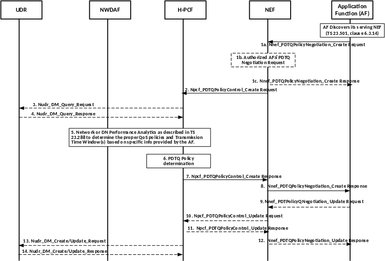

# 4.16.15 Negotiations for planned data transfer with QoS requirements

## 4.16.15.1 General

The intent of this clause is to specify generic service procedures to enable the AF to negotiate viable time window for the planned application data transfer with specific QoS requirements and operational conditions via the support of the NEF.

The PDTQ policies are defined for a specific ASP and each PDTQ policy includes a recommended time window for the traffic transfer for each of the AF sessions involved.

The Network Performance analytics or DN Performance analytics for NWDAF as described in TS 23.288 \[50\] will be subscribed by the PCF in order to assist its decision to derive the PDTQ policies.

One or more negotiated PDTQ policies could be provided by PCF to AF via NEF together with the PDTQ Reference ID. If the AF receives more than one PDTQ policies from the PCF, the AF will select one of them and inform the PCF about the selected PDTQ policy which may then be stored in the UDR. The selected PDTQ policy might be renegotiated, i.e. due to the degradation of the network performance. In this case, the PCF may determine a new list of candidate PDTQ policies and notify the AF via NEF. The AF may select one of the new PDTQ polices or not accept any of the PDTQ policies, it then notifies the PCF of the corresponding decision. Prior to the start of the selected time window for the planned data transfer, the AF requests the PCF to set up the AF session with required QoS. The PCF will then determine the appropriate PCC rules according to the AF request.

## 4.16.15.2 Procedures

### 4.16.15.2.1 Procedures for negotiation of planned data transfer with QoS requirements

This clause describes the PDTQ procedures to negotiate viable time window for the planned application data transfer via the support of the NEF.

Figure 4.16.15.2.1-1: Negotiation for planned data transfer with QoS requirements

Prior to the transmission of the Application AI/ML data, the AF negotiates with the 5G Core for the PDTQ policies that provide assistance for the application data transfer. The AF discovers its serving NEF, if it has not done so before, by using the mechanism described in clause 6.3.14 of TS 23.501 \[2\].

1a. The AF invokes the Nnef_PDTQPolicyNegotiation_Create Request (ASP Identifier, Number of UEs, list of Desired time windows, QoS Reference or individual QoS parameters, Alternative Service Requirements (optional), Network Area Information, Request for notification, Application Identifier). The Request for notification is an indication that PDTQ warning notification can be sent to the AF.

NOTE 1: Based on AF's internal logic (policy), the AF may determine the minimum QoS requirements by considering the UEs expected to participate in the Desired time windows, the network input data and the trigger conditions for group application data transfer.

1b-1c. The NEF may authenticate the AF and authorize the PDTQ request from the AF. If the authentication/authorization of the AF's request has failed, the NEF will respond to the AF's request through the Nnef_PDTQPolicyNegotiation_Create Response with a failure result and the following steps are skipped.

The NEF may map the ASP ID into DNN and S-NSSAI to be used in step 2.

NOTE 2: The Application ID provided by the AF and the Application ID provided to NWDAF can be different, and in such a case, a mapping is performed by the PCF.

2\. Based on an AF request, the NEF may translate the information provided by the AF (e.g. Network Area Information, etc.) based on the local policy and invokes the Npcf_PDTQPolicyControl_Create (ASP Identifier, Number of UEs, list of Desired time windows, QoS Reference or individual QoS parameters, Alternative Service Requirements (optional), Network Area Information, Request for notification, Application Identifier) with the H-PCF to authorize the creation of the policy regarding the PDTQ. If the PCF was provided with Request for notification, then PCF will send PDTQ warning notification to the AF as specified in clause 4.16.15.2.2 to notify the AF when the network performance or DN Performance in the area of interest reaches the Reporting Threshold set by the PCF based on operator configuration or the PCF determines to update the previously selected PDTQ policy based on the latest periodic reported network performance or DN Performance analytics as described in clause 6.1.2.7 of TS 23.503 \[20\].

The PCF may be configured to map the ASP identifier to a target DNN and S-NSSAI if the NEF did not provide the DNN, S-NSSAI to the PCF.

3\. \[Optional\] H-PCF queries the UDR to retrieve all existing PDTQ polices for all the ASPs using Nudr_DM_Query (Policy Data, Planned Data Transfer with QoS requirements) service operation. This step can be omitted if the H-PCF stores this information locally.

NOTE 3: If only one PCF is deployed in the PLMN, the PDTQ policy can be locally stored and no interaction with UDR is required.

4\. \[Conditional\] The UDR provides all the stored PDTQ policies and corresponding related information (e.g. the Number of UEs, the list of Desired time windows) to the H-PCF.

5\. Based on information provided by the AF and other available information as described in clause 6.1.2.7 of TS 23.503 \[20\], the H-PCF requests or subscribes to the NWDAF as defined in clause 6.6.4 or clause 6.14.4 of TS 23.288 \[50\] to receive the Network Performance analytics or the DN Performance analytics.

When requesting the Network Performance analytics or the DN performance analytics, if "any UE" is used, then the AoI information is used to identify the target gNB(s) for the prediction of the availability of the network resources.

The DNN, S-NSSAI and Application ID may be provided by H-PCF as Analytics Filter Information when requesting or subscribing to the relevant Analytic ID.

6\. By referring to the outcome of the analytics report as described in clause 6.1.2.7 of TS 23.503 \[20\], H-PCF determines one or more PDTQ policies. Each PDTQ policy includes a recommended time window for the traffic transfer for each of the AF sessions for each of the UEs involved.

NOTE 4: The existing PDTQ policies for all ASPs can be considered by the PCF when determining PDTQ policies for the requested ASP (e.g. the PCF can avoid selecting time windows that are already allocated to other ASPs).

7\. The PCF sends one or more PDTQ policies to NEF in Npcf_PDTQPolicyControl_Create Response including the PDTQ Reference ID.

8\. The NEF sends a Nnef_PDTQPolicyNegotiation_Create response to the AF to provide one or more PDTQ policies together with the PDTQ Reference ID. If the NEF received only one PDTQ policy from the PCF, steps 9-12 are not executed and the flow proceeds to step 13. Otherwise, the flow proceeds to step 9.

9\. If more than one PDTQ policies were provided to the AF, the AF selects one of the PDTQ policies and notifies NEF for the selected PDTQ policy via Nnef_PDTQPolicyNegotiation_Update request together with the PDTQ Reference ID. The AF stores the PDTQ Reference ID for the future interaction with the PCF.

10-12. The NEF notifies H-PCF about the selected PDTQ policy by the AF. The H-PCF acknowledges NEF. The NEF responds to the AF request with a Nnef_PDTQPolicyNegotiation_Update Response.

13-14. \[Optional\] The H-PCF may store the PDTQ Reference ID together with the new PDTQ policy in the UDR by invoking Nudr_DM_Create/Nudr_DM_Update (PDTQ Reference ID, Policy Data, Planned Data Transfer with QoS requirements). The UDR then sends a response to the H-PCF as acknowledgement. This step can be omitted if the H-PCF stores this information locally.

### 4.16.15.2.2 Procedure for PDTQ warning notification

Figure 4.16.15.2.2-1: The procedure for PDTQ warning notification

1\. The negotiation for PDTQ policy as described in clause 4.16.15.2.1 is completed. In addition, the PCF has subscribed to analytics on "Network Performance" or "DN Performance" from NWDAF for the area of interest and time window of a PDTQ policy following the procedures and services described in TS 23.288 \[50\], including a Reporting Threshold in the Analytics Reporting information. The value for Reporting Threshold is set by the PCF based on operator configuration.

2\. The PCF is notified with the Network Performance analytics or DN Performance analytics in the area of interest from the NWDAF when the NWDAF determines that the Network Performance or DN Performance reaches the Reporting Threshold as described for the Network Performance analytics or DN Performance analytics in TS 23.288 \[50\].

3\. \[Optional\] The H-PCF may request from the UDR the stored PDTQ policies using Nudr_DM_Query (Policy Data, Planned Data Transfer with QoS requirements) service operation. This step can be omitted if the H-PCF stores this information locally.

NOTE 1: If only one PCF is deployed in the PLMN, the PDTQ policy can be locally stored and no interaction with UDR is required.

4\. \[Conditional\] The UDR provides all the PDTQ Policies together with the relevant information received from the AFs (as defined in clause 6.1.2.7 of TS 23.503 \[20\]) to the H-PCF.

5\. The H-PCF identifies the PDTQ Policies affected based on the notification received from NWDAF. For each of them, the H-PCF determines the ASP of which the PDTQ traffic will be influenced by the degradation of network Performance or DN Performance and which requested the H-PCF to send the notification. The PCF then performs the following steps for each of the determined ASPs, i.e. Steps 6 - 11 can occur multiple times (i.e. once per ASP).

6\. The PCF decides based on operator policies, whether a new list of candidate PDTQ policies can be calculated for the ASP. If the PCF does not find any new candidate PDTQ policy, the previously negotiated PDTQ policy shall be kept, no interaction with that ASP shall occur and the procedure stops for that PDTQ policy.

NOTE 2: The PDTQ policies of an ASP which did not request to be notified are kept and no interaction with this ASP occurs.

7\. The PCF sends the notification to the NEF by invoking Npcf_PDTQPolicyControl_Notify (PDTQ Reference ID, list of candidate PDTQ policies) service operation.

8\. The NEF sends the PDTQ warning notification to the AF by invoking Nnef_PDTQPolicyNegotiation_Notify (PDTQ Reference ID, list of candidate PDTQ policies) service operation.

9\. The AF checks the new PDTQ policies included in the candidate list in the PDTQ warning notification.

10\. If the AF selects any of the new PDTQ policies, the steps 9-14 from clause 4.16.15.2.1 are executed with the difference that the AF has to respond as well when only one PDTQ policy was provided by the PCF and the PCF replaces the no longer valid PDTQ policy with the new PDTQ policy for the corresponding PDTQ Reference ID and with the additional difference that optionally the Nudr_DM_Update service operation is applied in steps 13-14.

11\. If the AF doesn't select any of the new PDTQ policies, the steps 9-12 from clause 4.16.15.2.1 are executed, with the AF indicating that none of the candidate PDTQ policies is acceptable. In this case, the AF response only includes PDTQ reference ID, but no PDTQ policy and the previously negotiated PDTQ policy shall be kept.

The AF can send a Stop notification by invoking Nnef_PDTQPolicyNegotiation_Update service, when the AF requests not to receive the PDTQ warning notification anymore. Then, the NEF invokes Npcf_PDTQPolicyControl_Update service in order to provide this information for the H-PCF.
