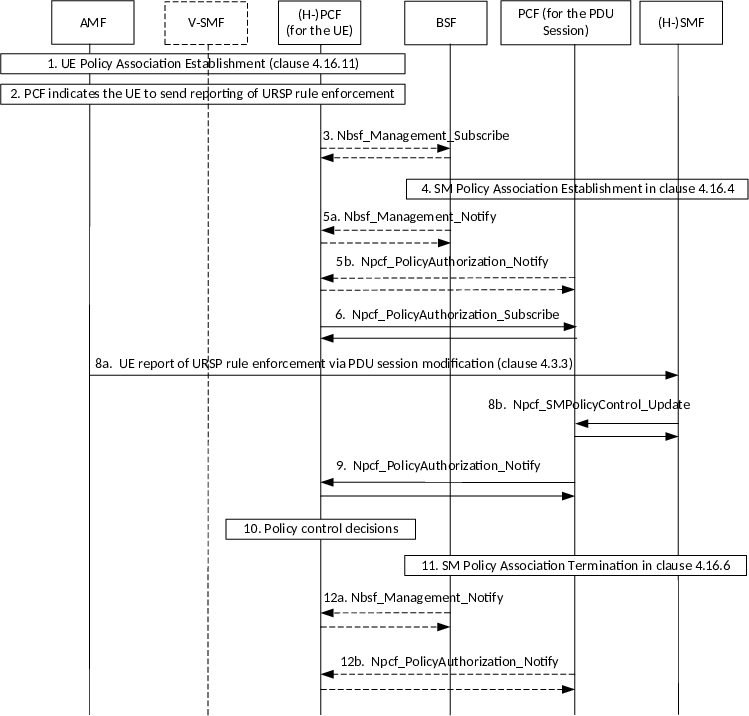

# 4.16.16 Awareness of URSP Rule Enforcement

## 4.16.16.1 General

Awareness of URSP rule enforcement is specified in clause 6.6.2.4 of TS 23.503 \[20\].

The content of this clause describes the PCF procedures necessary to realize this functionality.

## 4.16.16.2 Forwarding of URSP Rule Enforcement Information (for non-roaming and HR roaming)

This procedure applies when the PCF serving the PDU session receives URSP rule enforcement information from the SMF and forwards this information to the (H-)PCF serving the UE (see clause 6.1.3.18 of TS 23.503 \[20\] for non-roaming and HR roaming).

Figure 4.16.16.2-1: Forwarding of URSP Rule Enforcement Information (for non-roaming or HR roaming)

1\. The UE Policy Association is established, as described in clause 4.16.11.

2\. If the (H-)PCF indicates the UE to send reporting of URSP rule enforcement as described in clause 6.6.2.4 of TS 23.503 \[20\], then depending on operator policies in the (H-)PCF, the (H-)PCF may subscribe to the BSF, then step 3 follows, or provides its PCF binding information to the AMF in step 1 with the Request for notification of SM Policy Association establishment or termination for a UE, then step 5b follows.

3\. The (H-)PCF for the UE determines that URSP rules depend on the UE reporting of URSP rule enforcement, it then subscribes to the BSF to be notified when a PCF for the PDU Session for this SUPI is registered in the BSF, by invoking Nbsf_Management_Subscribe (SUPI, DNN, S-NSSAI). Nbsf_Management_Subscribe may be invoked for multiple combinations of DNN and S-NSSAI for the same SUPI. Steps 4 and 5a are repeated for each PCF registered for a PDU Session to a SUPI included in the Nbsf_Management.

4\. The (H-)SMF establishes a SM Policy Association as described in clause 4.16.4. The allocated UE address/prefix, SUPI, DNN, S-NSSAI and the PCF address is registered in the BSF, as described in clause 6.1.1.2.2 of TS 23.503 \[20\]. The SMF may provide the PCF binding information (address(es) of PCF for UE, instance id of PCF for UE) which receives from AMF to the PCF for session during SM Policy Association establishment procedure. If the (H-)SMF has received UE report of URSP rule enforcement via PDU session establishment as described in clause 4.3.2 (step 4), it includes the received traffic information in the SM Policy Association establishment request.

5a. If the (H-)PCF for the UE subscribed to the BSF in step 3, then the BSF notifies that a PCF for the PDU Session is registered in the BSF, by invoking Nbsf_Management_Notify (UE address(es), PCF address, PCF instance id, PCF Set ID, level of binding). When there are multiple PDU Sessions to the same UE the BSF provides multiple notification to the PCF.

5b. If the (H-)PCF for the UE sent Request for notification of SM Policy Association establishment or termination to the AMF in step 1, then the PCF for the PDU Sessions sends Npcf_PolicyAuthorization_Notify (EventID set to SM Policy Association established, UE address, PCF address, PCF instance is, PCF Set ID) to the PCF indicated in the PCF binding information provided by the SMF.

6\. The (H-)PCF for the UE subscribes to notifications of event "UE reporting Connection Capabilities from associated URSP rule" as defined in clause 6.1.3.18 of TS 23.503 \[20\], using Npcf_PolicyAuthorization_Subscribe (EventId set to "UE reporting Connection Capabilities from associated URSP rule", EventFilter set to at least "list of Connection Capabilities") and immediate reporting flag set to the PCF for the PDU Session. The response includes the NotificationCorrelationId and any Connection Capabilities if already available at the PCF for the PDU Session.

7\. Void.

8\. When the (H-)SMF receives a UE report of URSP rule enforcement via PDU session modification as described in clause 4.3.3 (step 8a), it reports the received traffic information to the PCF serving the PDU Session, by invoking Npcf_SMPolicyControl_Update as defined in clause 6.1.3.5 of TS 23.503 \[20\] (step 8b).

NOTE: The case when the (H-)SMF receives a UE report of URSP rule enforcement via PDU session establishment is covered by steps 4-6a above and is described in clause 6.6.2.4 of TS 23.503 \[20\].

9\. The (H-)PCF for the UE is notified on the "UE reporting Connection Capabilities from associated URSP rule" by Npcf_PolicyAuthorization_Notify (NotificationCorrelationId, EventId set to "UE reporting Connection Capabilities from associated URSP rule", EventInformation including the Connection Capabilities) as defined in clause 6.1.3.18 of TS 23.503 \[20\].

10\. The (H-)PCF for the UE checks operator policies and then may make policy control decisions based on awareness of URSP rule enforcement as described in clause 6.1.1.5 of TS 23.503 \[20\].

11\. The SM Policy Association is terminated as described in clause 4.16.6. The allocated UE address/prefix, SUPI, DNN, S-NSSAI and the PCF address are deregistered in the BSF.

12a. If the (H-)PCF for the UE subscribed to the BSF, then the BSF notifies that the PCF serving a PDU Session is deregistered in the BSF, by invoking Nbsf_Management_Notify (Binding Identifier for the PDU Session).

12b. If the (H-)PCF for the UE sent the Request for notification of SM Policy Association establishment or termination to the AMF in step 1, then the PCF for the PDU Session sends Npcf_PolicyAuthoritation_Notify (EventID set to SM Policy Association termination, Notification Correlation Id).

## 4.16.16.3 Forwarding of URSP Rule Enforcement Information (for LBO roaming)

This procedure applies when the PCF serving the PDU session in VPLMN receives URSP rule enforcement information from the SMF and forwards this information to the V-PCF serving the UE in VPLMN and V-PCF forwards the information to the H-PCF serving the UE in HPLMN.

Figure 4.16.16.3-1: Forwarding of URSP Rule Enforcement Information (for LBO roaming)

1\. The UE Policy Association is established among the AMF, V-PCF and H-PCF, as described in clause 4.16.11. During this procedure, if the UE indicated support for URSP Rule enforcement report, the H-PCF for the UE may request to forward the UE reporting Connection Capabilities from an associated URSP rule, the H-PCF sends the PCRT to report the Connection Capabilities of the associated URSP rule to the V-PCF.

2\. If the H-PCF for the UE indicates the UE to send reporting of URSP rule enforcement as described in clause 6.6.2.4 of TS 23.503 \[20\] and H-PCF for the UE has requested to forward the UE reporting Connection Capabilities from an associated URSP rule to the V-PCF as in the step 1, then depending on operator policies in the V-PCF, the V-PCF may subscribe to the BSF in VPLMN, then step 3 follows, or provides its PCF binding information to the AMF in step 1 with the Request for notification of SM Policy Association establishment or termination for a UE, then step 5b follows.

3 to 7. The same as the steps 3 to 7 of Figure 4.16.16.2-1 with replacing PCF with V-PCF. The SMF in this figure is located in VPLMN while the H-PCF for the UE is located in HPLMN.

8\. If the UE supports the UE capability of reporting URSP enforcement and sends the indication to the H-PCF for the UE at the step 1, and detects the application matching a URSP rule including the Connection Capabilities, the UE reports the Connection Capabilities to the SMF during the PDU Session Establishment/Modification request to the SMF.

When the SMF receives a UE report of URSP rule enforcement via PDU Session Modification, it reports the received traffic information to the PCF serving the PDU Session, by invoking Npcf_SMPolicyControl_Update as defined in clause 6.1.3.5 of TS 23.503 \[20\] (step 8b).

NOTE: The case when the (H-)SMF receives a UE report of URSP rule enforcement via PDU session establishment is covered by steps 3-7 above and is described in clause 6.6.2.4 of TS 23.503 \[20\].

9\. The same step as the step 9 of Figure 4.16.16.2-1 with replacing PCF with V-PCF.

10\. to 11. The same steps as the steps 11 to 12 of Figure 4.16.16.2-1 with replacing PCF with V-PCF. The SMF in this figure is located in VPLMN.

12\. If the V-PCF has received the request to forward the UE reporting Connection Capabilities from an associated URSP rule from the H-PCF in the step 1 and the V-PCF for the UE is either notified on the "UE reporting Connection Capabilities from associated URSP rule" by Npcf_PolicyAuthorization_Notify in step 9 or receives "UE reporting Connection Capabilities from associated URSP rule" by Npcf_PolicyAuthorization_Subscribe response in steps 3-7, the V-PCF reports the received the information from the PCF for the PDU Session to the H-PCF.

13\. The (H-)PCF for the UE checks operator policies and then may make policy control decisions based on awareness of URSP rule enforcement as described in clause 6.1.1.5 of TS 23.503 \[20\], and also the H-PCF may take an appropriate action as described in clause 6.6.2.4 of 23.503 \[20\].
