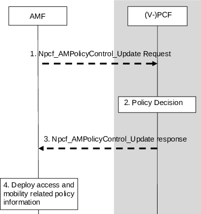
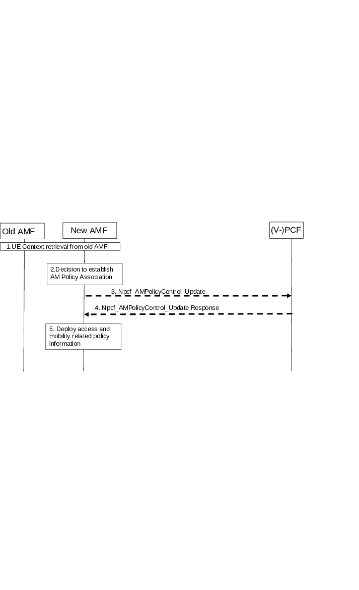

# 4.16.2 AM Policy Association Modification

## 4.16.2.0 General

There are three cases considered for AM Policy Association Modification:

\- Case A: A Policy Control Request Trigger condition is met: the procedure is initiated by the AMF.

\- Case B: PCF policy decision per local decision or per trigger by other peers of the PCF (i.e. UDR, AF or NWDAF): the procedure is initiated by the PCF.

\- Case C: AM Policy Association Modification with the old PCF during AMF relocation: the procedure is initiated by the AMF.

In the non-roaming case, the PCF may interact with the CHF to make policy decisions, for Access and Mobility related policies, based on spending limits.

## 4.16.2.1 AM Policy Association Modification initiated by the AMF

### 4.16.2.1.1 AM Policy Association Modification initiated by the AMF without AMF relocation

This procedure is applicable to Case A.

Figure 4.16.2.1.1-1: AM Policy Association Modification initiated by the AMF

This procedure concerns both roaming and non-roaming scenarios.

In the non-roaming case the role of the V-PCF is performed by the PCF. For the roaming scenarios, the V-PCF interacts with the AMF.

1\. When a Policy Control Request Trigger condition is met the AMF updates the AM Policy Association and provides information on the conditions that have changed to the PCF by invoking Npcf_AMPolicyControl_Update.

2\. The (V-)PCF stores the information received in step 1 and makes the policy decision. In the non-roaming case, the PCF may subscribe to Analytics from NWDAF as defined in clause 6.1.1.3 of TS 23.503 \[20\]. If the PCF determines a change to policy counter status reporting is required, it may alter the subscribed list of policy counters using the Initial, Intermediate or Final Spending Limit Report Retrieval procedures as defined in clause 4.16.8.

3\. The (V-)PCF responds to the AMF with the updated access and mobility related policy information as defined in clause 6.5 of TS 23.503 \[20\] and the updated Policy Control Request Trigger parameters. If an AF has previously subscribed to request for allocation of service area coverage outcome event, the (V-)PCF checks if reporting is needed, using the Policy Control Request Trigger that was met (see step 1) as input, then sends a respective notification to the AF using Npcf_AMPolicyAuthorization_Notify, as defined in clause 6.1.3.18 of TS 23.503 \[20\].

4\. The AMF deploys the access and mobility related policy information, which includes storing the Service Area Restrictions and Policy Control Request Trigger of AM Policy Association, provisioning the Service Area Restrictions to the UE and provisioning the RFSP index, UE-AMBR, List of UE-Slice-MBR, Service Area Restrictions to the NG-RAN as defined in TS 23.501 \[2\] and request for notification of SM Policy association establishment and termination to a list of (DNN, S-NSSAI)(s) together with PCF for the UE binding information.

### 4.16.2.1.2 AM Policy Association Modification with old PCF during AMF relocation

This procedure is applicable to Case C. In this case, AMF relocation is performed without PCF change in handover procedure and registration procedure.

Figure 4.16.2.1.2-1: AM Policy Association Modification with the old PCF during AMF relocation

This procedure concerns both roaming and non-roaming scenarios.

In the non-roaming case the role of the V-PCF is performed by the PCF. For the roaming scenarios, the V-PCF interacts with the AMF:

1\. \[Conditional\] When the old AMF and the new AMF belong to the same PLMN, the old AMF transfers to the new AMF the AM Policy Association information including Policy Control Request Trigger(s) and the PCF ID. For the roaming case, the new AMF receives V-PCF ID.

2\. Based on local policies, the new AMF decides to establish an AM Policy Association with the (V-)PCF and contacts the (V‑)PCF identified by the PCF ID received in step 1.

3\. The new AMF sends Npcf_AMPolicyControl_Update to the (V-)PCF to update the AM Policy Association with the (V-)PCF. The request may include the following information: Policy Control Request Trigger which has been met, Subscribed Service Area Restrictions (if updated), subscribed RFSP index (if updated) which are retrieved from the UDM during the update location procedure and may include access type and RAT, PEI, ULI, UE time zone, service network. The (V-)PCF updates the stored information provided by the old AMF with the information provided by the new AMF. In the non-roaming case, the PCF may subscribe to Analytics from NWDAF as defined in clause 6.1.1.3 of TS 23.503 \[20\]. If the PCF determines a change to policy counter status reporting is required, it may alter the subscribed list of policy counters using the Initial, Intermediate or Final Spending Limit Report Retrieval procedures as defined in clause 4.16.8.

When AMF utilizes an NWDAF, it may add the NWDAF serving the UE identified by the NWDAF instance ID. Per NWDAF service instance the Analytics ID(s) are also included.

4\. The (V-)PCF may update the policy decision based on the information provided by the new AMF and responds to the Npcf_AMPolicyControl_Update service operation providing access and mobility related policy information as defined in clause 6.5 of TS 23.503 \[20\]. If an AF has previously subscribed to request for allocation of service area coverage outcome event the (V-)PCF checks if reporting is needed, using the Policy Control Request Trigger that was met (see step 1) as input, then sends a respective notification to the AF using Npcf_AMPolicyAuthorization_Notify, as defined in clause 6.1.3.18 of TS 23.503 \[20\].

5\. The AMF deploys the access and mobility related policy information, which includes storing the Service Area Restrictions, provisioning Service Area Restrictions to the UE and provisioning the RFSP index, UE-AMBR, Service Area Restrictions to the NG-RAN and request for notification of SM Policy association establishment and termination to a list of (DNN, S-NSSAI)(s) together with PCF for the UE binding information.

## 4.16.2.2 AM Policy Association Modification initiated by the PCF

The AM Policy Association modification procedure may be initiated by an internal PCF event or by PCF obtaining pertinent analytics information from an NWDAF.

The following procedure is applicable to AM Policy Association modification due to Case B.

Figure 4.16.2.2-1: AM Policy Association Modification initiated by the PCF

The procedure driven by a PCF internal event applies to both roaming and non-roaming scenarios and when driven by NWDAF or CHF, applies only to non-roaming scenarios.

An AM Policy Association is established, with the V-PCF in case of roaming or with the PCF in a non-roaming case as described in clause 4.16.1.2 before this procedure is triggered.

In the non-roaming case the role of the V-PCF is performed by the PCF. For the roaming scenarios, the V-PCF interacts with the AMF.

NOTE: The V-PCF/PCF stores the access and mobility related policy information provided to the AMF.

1\. \[Conditional\] The PCF determines internally that the new status of the UE context requires new policies, potentially triggered by an AF as described in clause 4.15.6.9 or by a notification from the UDR or optionally, the CHF provides a Spending Limit Report to the PCF as described in clause 4.16.8. This may be triggered by obtaining pertinent analytics information from an NWDAF as described in clause 6.1.1.3 of TS 23.503 \[20\].

2\. The (V-)PCF in case of roaming and PCF in a non-roaming case makes a policy decision. The PCF may also decide to subscribe to a new Analytics ID from NWDAF as described in clause 6.1.1.3 of TS 23.503 \[20\].

3\. The (V-)PCF in the roaming case and the PCF in a non-roaming case sends Npcf_AMPolicyControl_UpdateNotify including AM Policy Association ID associated with the SUPI defined in TS 29.507 \[32\]. The policy update may include Service Area Restrictions, UE-AMBR, RFSP index value and RFSP Index in Use Validity Time, access stratum time distribution indication, Uu time synchronization error budget, clock quality detail level and optionally clock quality acceptance criteria. If an AF has previously subscribed to event request for allocation of service area coverage outcome in step 1, the (V-)PCF checks if the allocated service area coverage was changed and sends a respective notification to the AF using Npcf_AMPolicyAuthorization_Notify as defined in clause 6.1.3.18 of TS 23.503 \[20\].

4\. The AMF deploys and stores the updated access and mobility related policy information, which includes storing the Service Area Restrictions and Policy Control Request Trigger of AM Policy Association, provisioning of the Service Area Restrictions to the UE, provisioning the RFSP index, UE-AMBR, Service Area Restrictions to the NG-RAN, optionally the access stratum time distribution indication, Uu time synchronization error budget, clock quality detail level and optionally clock quality acceptance criteria to the NG-RAN and request for notification of SM Policy association establishment and termination to a list of (DNN, S-NSSAI)(s) together with PCF for the UE binding information.
