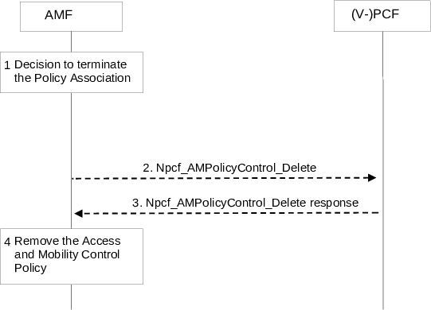

# 4.16.3 AM Policy Association Termination

## 4.16.3.1 General

The following case is considered for AM Policy Association Termination:

1\. UE Deregistration from the network.

2\. The mobility with change of AMF (e.g. new AMF is in different PLMN or new AMF in the same PLMN).

3\. \[Optional\] 5GS to EPS mobility with N26 if the UE is not connected to the 5GC over a non-3GPP access in the same PLMN.

In the non-roaming case, the PCF may interact with the CHF to make policy decisions, for Access and Mobility related policies, based on spending limits.

## 4.16.3.2 AMF-initiated AM Policy Association Termination

Figure 4.16.3.2-1: AMF-initiated AM Policy Association Termination

This procedure concerns both roaming and non-roaming scenarios.

In the non-roaming case the role of the V-PCF is performed by the PCF. For the roaming scenarios, the V-PCF interacts with the AMF.

1\. The AMF decides to terminate the AM Policy Association during Deregistration procedure or due to mobility with change of AMF and (V-)PCF in the registration procedure or handover procedure, then if a AM Policy Association was established with the (V-)PCF steps 2 to 3 are performed.

2\. The AMF sends the Npcf_AMPolicyControl_Delete service operation including AM Policy Association ID to the (V-)PCF.

3\. The (V-)PCF removes the policy context for the UE and replies to the AMF with an Acknowledgement including success or failure. In the non-roaming case, the PCF may unsubscribes to analytics from NWDAF. The (V-)PCF may deregister from the BSF as the PCF that handles the AM Policy Association for this UE. This is performed by using the Nbsf_Management_Deregister service operation, providing the Binding Identifier that was obtained earlier from the BSF when performing the Nbsf_Management_Register service operation.

If the PCF has subscribed to the policy counter status to the CHF, it invokes the procedure defined in clause 4.16.8 to unsubscribe to policy counter status reporting.

Optionally, based on operator policies, as described in clause 6.1.1.4 of TS 23.503 \[20\], the PCF may store the policy counters and their statuses of spending limits information into the UDR by invoking Nudr_DM_Update.

4\. The AMF removes the AM Policy Association for this UE, including the Access and Mobility Control Policy related to the UE. The AMF deletes the subscription to AMF detected events requested for that Policy Association.

## 4.16.3.3 Void
