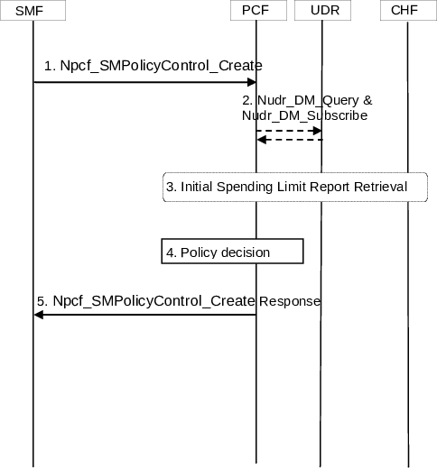

# 4.16.4 SM Policy Association Establishment

Figure 4.16.4-1: SM Policy Association Establishment

This procedure concerns both roaming and non-roaming scenarios.

In the non-roaming case the V-PCF is not involved. In the local breakout roaming case, the H-PCF is not involved. In the home routed roaming case, the V-PCF is not involved and the H-PCF interacts with the H-SMF.

This procedure is used in UE requests a PDU Session Establishment as explained in clause 4.3.2.2.1, for non-roaming and local breakout roaming. For home-routed roaming, as explained in clause 4.3.2.2.2.

For local breakout roaming, the interaction with HPLMN (e.g. step 3) is not used. In local breakout roaming, the V-PCF interacts with the UDR of the VPLMN.

1\. The SMF determines that the PCC authorization is required and requests to establish an SM Policy Association with the PCF by invoking Npcf_SMPolicyControl_Create operation, including information about the PDU Session as specified in clause 5.2.5.4.2.

The SMF provides Trace Requirements to the PCF when it has received Trace Requirements and it has selected a different PCF than the one received from the AMF.

If the DNN Selection Mode indicates that the DNN is not explicitly subscribed, the PCF may use the local configuration instead of PDU Session policy control data in UDR.

The QoS constraints from the VPLMN are provided by the H-SMF to the H-PCF in the home routed roaming scenario as defined in clause 4.3.2.2.2.

If the SMF utilizes an NWDAF or in case the SMF has received information from AMF or UPF that are consumer of analytic services, the SMF includes the IDs of each of these NWDAFs serving the UE (for SMF, AMF and UPF), identified by the NWDAF instance Id. The Analytics ID(s) are also included per NWDAF service instance.

The SMF provides the PCF binding information (of the PCF for the UE) to the PCF if the Request for notification of SM Policy Association establishment and termination to a DNN, S-NSSAI together with PCF binding information is received from the AMF.

2\. If the PCF does not have the subscriber's subscription related information, it sends a request to the UDR by invoking Nudr_DM_Query (SUPI, DNN, S-NSSAI, Policy Data, PDU Session policy control data, Remaining allowed Usage data) service in order to receive the information related to the PDU Session. The PCF may request notifications from the UDR on changes in the subscription information by invoking Nudr_DM_Subscribe (Policy Data, SUPI, DNN, S-NSSAI, Notification Target Address (+ Notification Correlation Id), Event Reporting Information (continuous reporting), PDU Session policy control data, Remaining allowed Usage data) service. If the PCF does not have the 5G VN group data for the group identified by Internal Group Identifier as indicated by SMF in Npcf_SMPolicyControl_Create, the PCF retrieves the 5G VN group data from UDR and subscribes to changes on the 5G VN group data, see similar way to how the PCF does it during UE Policy Association establishment as described in clause 4.16.11. If the PCF receives the Maximum Group Data Rate in 5G VN group data, the PCF performs the group related policy control as described in clauses 6.1.5 and 6.2.1.11 of TS 23.503 \[20\].

NOTE 1: For local breakout roaming, PDU Session policy control subscription information and Remaining allowed usage subscription information for monitoring control as defined in clause 6.2.1.3 of TS 23.503 \[20\] are not available in V-UDR and V-PCF uses locally configured information according to the roaming agreement with the HPLMN operator.

3\. If the PCF determines that the policy decision depends on the status of the policy counters available at the CHF and such reporting is not established for the subscriber, the PCF initiates an Initial Spending Limit Report Retrieval as defined in clause 4.16.8.2. If policy counter status reporting is already established for the subscriber and the PCF determines that the status of additional policy counters is required, the PCF initiates an Intermediate Spending Limit Report Retrieval as defined in clause 4.16.8.3.

NOTE 2: The Nudr_DM_Query in step 2 may include the Spending Limit Information, i.e., the policy counters and their latest status. Thus the PCF can provide the SM policy to the SMF before contacting the CHF. The PCF may need to update the SMF depending on the statuses of the policy counters provided by the CHF.

NOTE 3: Potential inconsistencies between the policy counter and its status in the UDR and in the CHF can happen given that the CHF may update the policy counter and its status at any time, as such it is recommended that the PCF contacts the CHF if the policy counters and its status stored in the UDR is used, to be able to receive updated information from the CHF.

4\. The PCF makes the authorization and the policy decision. The PCF may reject Npcf_SMPolicyControl_Create request when Validation condition is not satisfied. (see clause 6.1.2.4 of TS 23.503 \[20\]).

The PCF may invoke Nbsf_Management_Register service operation to create the binding information in BSF.

The PCF may report that a SM Policy Association is established as described in clause 4.16.14.2.

In the non-roaming case, the PCF may subscribe to Analytics from NWDAF as defined in clause 6.1.1.3 of TS 23.503 \[20\].

In the home-routed roaming scenario, the H-PCF ensures that the QoS constraints provided by the VPLMN are taken into account as described in TS 23.503 \[20\].

5\. The PCF answers with a Npcf_SMPolicyControl_Create response; in its response the PCF may provide policy information defined in clause 5.2.5.4 (and in TS 23.503 \[20\]). The SMF enforces the decision. The SMF implicitly subscribes to changes in the policy decisions.

NOTE 4: After this step the PCF can subscribe to SMF events associated with the PDU Session.

If the PCF determines based on a local policy, that the PDU Session is potentially impacted by (g)PTP time synchronization service, or the PDU Session belongs to a 5GS DetNet router, the PCF can include a subscription for SMF event for "5GS Bridge/Router information" associated with the PDU Session into the Npcf_SMPolicyControl_Create response. In this case, if the SMF has stored the 5GS Bridge/Router information and has not reported the event to the PCF, the SMF initiates an SM Policy Association Modification procedure and notifies the PCF for the event of "5GS Bridge/Router information Notification".
