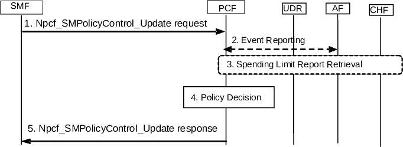

# 4.16.5 SM Policy Association Modification

## 4.16.5.0 General

The following SM Policy Association Modification procedures concern both roaming and non-roaming scenarios.

In the non-roaming case the V-PCF is not involved. In the local breakout roaming case, the H-PCF is not involved. In the home routed roaming case, the V-PCF is not involved and the H-PCF interacts with the H-SMF.

The SM Policy Association Modification procedure may be initiated either by the SMF or by the PCF.

## 4.16.5.1 SMF initiated SM Policy Association Modification

The SMF may initiate the SM Policy Association Modification procedure if a Policy Control Request Trigger is met.

NOTE 1: When SMF instance is changed within the same SMF set the callback URI can be updated via this procedure.

Figure 4.16.5.1-1: SMF initiated SM Policy Association Modification

For local breakout roaming, the interaction with HPLMN (e.g. step 2) is not used. In local breakout roaming, the V-PCF interacts with the UDR of the VPLMN.

1\. When a Policy Control Request Trigger condition is met the SMF requests to update (Npcf_SMPolicyControl_Update) the SM Policy Association and provides information on the conditions that have been met as specified in clause 5.2.5.4.5.

If the SMF is notified by NRF that the stored PCF instance is not reachable, it should query the NRF for PCF instances within the PCF set and select another instance (see clause 6.3.1.0 of TS 23.501 \[2\]).

The QoS constraints from the VPLMN are provided by the H-SMF to the H-PCF in the home routed roaming scenario as defined in clause 4.3.2.2.2.

2\. When an AF has subscribed to an event that is met due to the report from the SMF, the PCF reports the event to the AF or TSCTSF by invoking the Npcf_PolicyAuthorization_Notify service operation.

If the SMF has reported that new 5GS Bridge/Router information has been detected and no AF session exists for this PDU session yet:

\- If integration with TSN applies (see clause 5.28 of TS 23.501 \[2\]), then the PCF informs a pre-configured TSN AF using the Npcf_PolicyAuthorization_Notify (User-plane Node ID, the port number of the DS-TT port, MAC address of the DS-TT Ethernet port for the PDU Session and UE-DS-TT Residence Time (if available)) service operation for the event of "5GS Bridge/Router information Notification" as described in clause 6.1.3.18 of TS 23.503 \[20\].

\- Otherwise, i.e. if the integration with TSN does not apply, the PCF may inform discovered and selected TSCTSF (as described in clause 6.3.24 of TS 23.501 \[2\]) using the Npcf_PolicyAuthorization_Notify (User Plane Node ID, UE-DS-TT Residence Time (if available), the port number for the PDU session and MAC address of the DS-TT Ethernet port for Ethernet type PDU Session or IP address for IP type PDU Session, MTU size for IPv4 or IPv6 (if available)) service operation for the event of "5GS Bridge/Router information Notification" as described in clause 6.1.3.18 of TS 23.503 \[20\]. In the case of private IPv4 address being used for IP type PDU Session, the Npcf_PolicyAuthorization_Notify also contains DNN and S-NSSAI of the PDU Session.

NOTE 2: For a given DNN and S-NSSAI, it is assumed that the network only needs to deploy one or TSCTSF Set in this Release of the specification.

When the TSN AF or TSCTSF receives the Npcf_PolicyAuthorization_Notify message and no AF session exists for this PDU Session, the TSN AF shall use the Npcf_PolicyAuthorization service described in clause 5.2.5.3 to request creation of a new AF session specific to the received MAC address of the DS-TT Ethernet port of the PDU Session, while the TSCTSF shall use the Npcf_PolicyAuthorization service to request creation of a new AF session specific to the received MAC address of the DS-TT Ethernet port (if available, for Ethernet type PDU Session) or IP address (for IP type PDU Session) of the PDU Session. In the case of private IPv4 address being used for IP type PDU Session, the TSCTSF shall use the Npcf_PolicyAuthorization service to request creation of a new AF session specific to the received IP address, DNN and S-NSSAI of the IP type PDU Session. The TSN AF or TSCTSF shall then use the Npcf_PolicyAuthorization service to subscribe for notifications for 5GS Bridge/Router information Notification event over the newly established AF session. The TSN AF or TSCTSF may provide a Port or User-Plane Management Information Container for the PDU Session and related port number in the Npcf_PolicyAuthorization creation request.

If the SMF has reported PMIC with port number or UMIC, then the PCF also provides these information elements to the TSN AF or TSCTSF.

When integration with TSN applies (see clause 5.28 of TS 23.501 \[2\]), the TSN AF calculates the bridge delay for each port pair, using the UE-DS-TT Residence Time of the DS-TT Ethernet port(s) for the 5GS bridge indicated by the 5GS user-plane Node ID.

3\. If the PCF determines a change to policy counter status reporting is required, it may alter the subscribed list of policy counters using the Initial, Intermediate or Final Spending Limit Report Retrieval procedures as defined in clause 4.16.8.

4\. The PCF makes a policy decision as described in TS 23.503 \[20\]. The PCF may determine that updated or new policy information needs to be sent to the SMF.

If the SMF reported accumulated usage for the PDU session in step 1 the PCF deducts the value from the remaining allowed usage for the subscriber, DNN and S-NSSAI in the UDR by invoking Nudr_DM_Update (SUPI, DNN, S-NSSAI, Policy Data, Remaining allowed Usage data, updated data) service operation.

If the SMF reported accumulated usage for a MK(s) in step 1 the PCF deducts the value from the remaining allowed usage for the MK in the UDR by invoking Nudr_DM_Update (SUPI, DNN, S-NSSAI, Policy Data, Remaining allowed Usage data, updated data (including MK(s))) service operation.

When new PCF instance is selected in step 1, the new PCF should invoke Nbsf_Management_Update service operation to update the binding information in BSF.

In the non-roaming case, the PCF may subscribe to Analytics from NWDAF as defined in clause 6.1.1.3 of TS 23.503 \[20\].

In the home-routed roaming scenario, the H-PCF ensures that the QoS constraints provided by the VPLMN are taken into account as described in TS 23.503 \[20\].

NOTE 3: For local breakout roaming, PDU Session policy control subscription information and Remaining allowed usage subscription information for monitoring control as defined in clause 6.2.1.3 of TS 23.503 \[20\] are not available in V-UDR and V-PCF uses locally configured information according to the roaming agreement with the HPLMN operator.

5\. The PCF answers with a Npcf_SMPolicyControl_Update response with updated policy information about the PDU Session determined in step 4.

## 4.16.5.2 PCF initiated SM Policy Association Modification

The PCF may initiate SM Policy Association Modification procedure based on internal PCF event or triggered by other peers of the PCF (AF, NWDAF, CHF, UDR and TSCTSF).

Figure 4.16.5.2-1: PCF initiated SM Policy Association Modification

This procedure may be triggered by a local decision of the PCF or based on triggers from other peers of the PCF (AF, NWDAF, CHF, UDR and TSCTSF):

An SM Policy Association is established, with the PCF as described in clause 4.16.4 before this procedure is triggered.

For local breakout roaming, the interaction with HPLMN (e.g. step 1b and step 2) is not used. In local breakout roaming, the V-PCF interacts with the UDR of the VPLMN.

1a. Alternatively, optionally, the AF, NEF or TSCTSF provides/revokes service information to the PCF e.g. due to AF session signalling, by invoking Npcf_PolicyAuthorization_Create Request or Npcf_PolicyAuthorization_Update Request or Npcf_PolicyAuthorization_Subscribe Request service operation. The PCF responds to the AF, NEF or TSCTSF.

1b. Alternatively, optionally, the CHF provides a Spending Limit Report to the PCF as described in clause 4.16.8. and responds to the CHF.

1c. Alternatively, optionally, the UDR notifies the PCF about a policy subscription change by invoking Nudr_DM_Notify (Notification correlation Id, Policy Data, SUPI, updated data, "PDU Session Policy Control Data" \| "Remaining allowed Usage data"); if the PCF uses the 5G VN group data and subscribes to 5G VN group data change, the UDR notifies the PCF about the 5G VN group data change by invoking Nudr_DM_Notify (Notification correlation Id, Subscription Data, Group Data). The PCF responds to the UDR.

1d. Alternatively, optionally, some internal event (e.g. timer, or local decision based on analytics information requested and received from NWDAF) occurs at the PCF. The analytics (i.e. Analytics ID) which can be requested from NWDAF are described in clause 6.1.1.3 of TS 23.503 \[20\].

2\. If the PCF determines a change to policy counter status reporting is required, it may alter the subscribed list of policy counters using the Initial, Intermediate or Final Spending Limit Report Retrieval procedures as defined in clause 4.16.8.

NOTE 1: The PCF ensures that information received in step 1 and 2 can be used by later policy decisions.

NOTE 2: For local breakout roaming, PDU Session policy control subscription information and Remaining allowed usage subscription information for monitoring control as defined in clause 6.2.1.3 of TS 23.503 \[20\] are not available in V-UDR and V-PCF uses locally configured information according to the roaming agreement with the HPLMN operator.

3\. The PCF makes a policy decision. The PCF may determine that updated or new policy information need to be sent to the SMF. In the non-roaming case, the PCF may also decide to subscribe to a new Analytics ID from NWDAF as described in clause 6.1.1.3 of TS 23.503 \[20\].

If the AF provided a Background Data Transfer Reference ID in step 1a, the PCF may retrieve it from the UDR by invoking the Nudr_DM_Query (BDT Reference Id, Policy Data, Background Data Transfer) service.

4\. If the PCF has determined that SMF needs updated policy information in step 3 or if the PCF has received a Port Management Information Container for the PDU Session and related port number from the AF or TSCTSF in step 1a, the PCF issues a Npcf_SMPolicyControl_UpdateNotify request with possibly updated policy information about the PDU Session.

If the PCF has received a subscription for 5GS Bridge/Router information Notification in Step 1a, the PCF can include a subscription for SMF event for "5GS Bridge/Router information" associated with the PDU Session into the Npcf_SMPolicyControl_UpdateNotify request. In this case, if the SMF has stored the 5GS Bridge/Router information and has not reported the event to the PCF, the SMF notifies the PCF for the event of "5GS Bridge/Router Information ".

If the PCF has received a Npcf_PolicyAuthorization_Unsubscribe request to unsubscribe for 5GS Bridge/Router information Notification, the PCF can remove the subscription for SMF event for "5GS Bridge/Router information" associated with the PDU Session and issue a Npcf_SMPolicyControl_UpdateNotify request with the updated policy information about the PDU Session.

NOTE 3: If the TSCTSF receives a Requested 5GS delay and the TSCTSF does not have the 5GS Bridge/Router information for the AF-session, the TSCTSF can subscribe for the 5GS Bridge/Router information from the PCF by triggering a Npcf_PolicyAuthorization_Subscribe request.

If the PCF has received a subscription to notification on BAT offset along with the TSC Assistance Container from TSCTSF in step 1a, the PCF can include a subscription to notification on BAT offset associated with the PDU Session into the Npcf_SMPolicyControl_UpdateNotify request.

5\. The SMF acknowledges the PCF request with a Npcf_SMPolicyControl_UpdateNotify response.

If the Npcf_SMPolicyControl_UpdateNotify request is received from new PCF instance in the PCF Set, the SMF store the SM policy association towards the new PCF instance.
