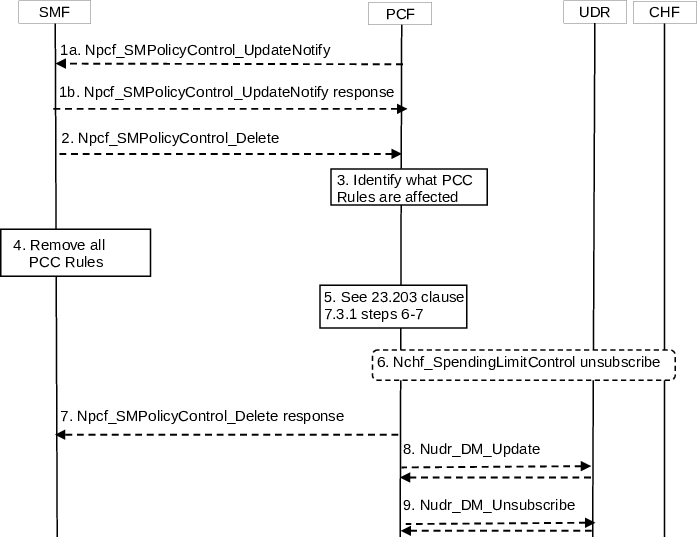

# 4.16.6 SM Policy Association Termination

Figure 4.16.6-1: SM Policy Association Termination

This procedure concerns both roaming and non-roaming scenarios.

In the non-roaming case the V-PCF is not involved. In the local breakout roaming case, the H-PCF is not involved. In the home routed roaming case, the V-PCF is not involved and the H-PCF interacts only with the H-SMF.

The procedure for Session Management Policy Termination may be initiated by:

\- (Case A) the PCF.

\- (Case B) the SMF.

For local breakout roaming, the interaction with HPLMN (e.g. step 6) is not used. In local breakout roaming, the V-PCF interacts with the UDR of the VPLMN.

1\. (Case A) The PCF may invoke the Npcf_SMPolicyControl_UpdateNotify service operation to request the release of a PDU Session. The SMF acknowledges the request.

The rest of the procedure corresponds to both Case A &B.

2\. The SMF may invoke the Npcf_SMPolicyControl_Delete service operation to request the deletion of the SM Policy Association with the PCF. The SMF provides relevant information to the PCF.

3\. When receiving the request from step2, the PCF finds the PCC Rules that require an AF to be notified and removes PCC Rules for the PDU Session.

If the SMF reported accumulated usage for the PDU session in step 1 the PCF deducts the value from the remaining allowed usage for the subscriber, DNN and S-NSSAI in the UDR by invoking Nudr_DM_Update (SUPI, DNN, S-NSSAI, Policy Data, Remaining allowed Usage data, updated data) service operation.

If the SMF reported accumulated usage for a MK(s) in step 1 the PCF deducts the value from the remaining allowed usage for the MK in the UDR by invoking Nudr_DM_Update (SUPI, DNN, S-NSSAI, Policy Data, Remaining allowed Usage data, updated data (including MK(s))) service operation.

NOTE: For local breakout roaming, PDU Session policy control subscription information and Remaining allowed usage subscription information for monitoring control as defined in clause 6.2.1.3 of TS 23.503 \[20\] are not available in V-UDR and V-PCF uses locally configured information according to the roaming agreement with the HPLMN operator.

4\. The SMF removes all policy information about the PDU Session associated with the PDU Session.

5\. The PCF notifies the AF as explained in clause 7.3.1 steps 6-7 of TS 23.203 \[24\].

The PCF may invoke Nbsf_Management_Deregister service operation to delete the binding created in BSF.

The PCF may report that a SM Policy Association is terminated as described in clause 4.16.14.2.

In the non-roaming case, the PCF may unsubscribe to analytics from NWDAF.

6\. The PCF may invoke the procedure defined in clause 4.16.8 to unsubscribe to policy counter status reporting (If this is the last PDU Session for this subscriber requiring policy counter status reporting) or to modify the subscription to policy counter status reporting, (if any remaining existing PDU Sessions for this subscriber requires policy counter status reporting).

7\. The PCF removes the information related to the terminated PDU Session and acknowledges to the SMF that the PCF handling of the PDU Session has terminated. This interaction is the response to the SMF request in step 2.

8\. Optionally, based on operator policies, as described in clause 6.1.1.4 of TS 23.503 \[20\], the PCF may store the policy counters and their statuses of spending limits information into the UDR by invoking Nudr_DM_Update.

9\. The PCF may (e.g. if it is the last PDU Session on the (DNN, S-NSSAI) couple) unsubscribe to the notification of the PDU Session related data modification from the UDR by invoking Nudr_DM_Unsubscribe (Subscription Correlation Id) if it had subscribed such notification.
