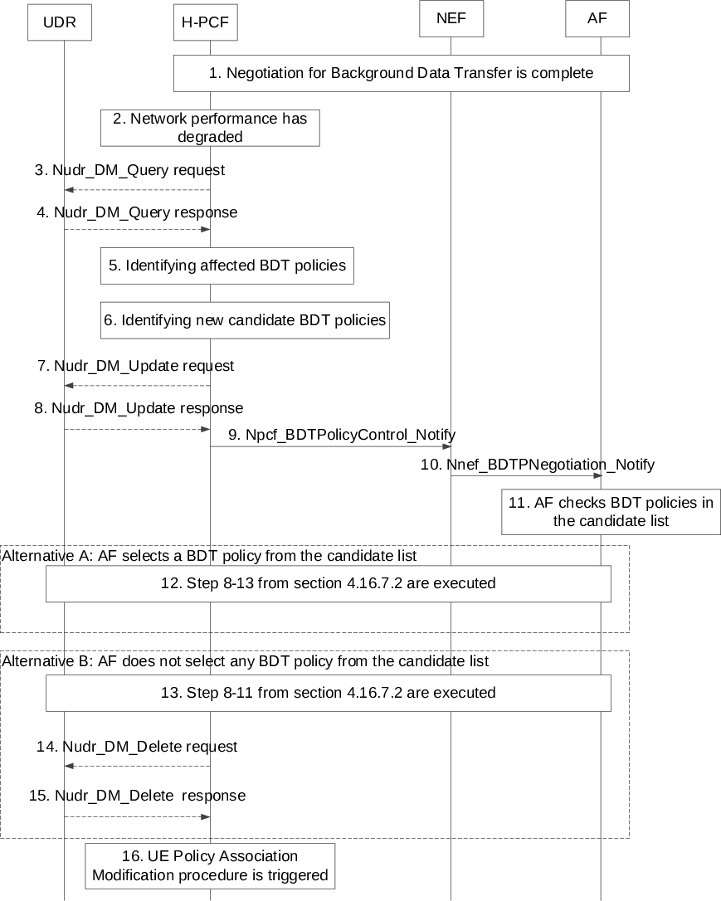

# 4.16.7 Negotiations for future background data transfer

## 4.16.7.1 General

The procedure for future background data transfer as specified in clause 4.16.7.2 enables the negotiation between the NEF and the H-PCF about the transfer policies for the future background data transfer (as described in clause 6.1.2.4 of TS 23.503 \[20\]). The transfer policies consist of a desired time window for the background data transfer, a reference to a charging rate for the time window, network area information and optionally a maximum aggregated bitrate, as described in clause 6.1.2.4 of TS 23.503 \[20\].

This negotiation is preliminarily conducted (when AF initiates a procedure to NEF) before the UE's PDU Session establishment. When the AF wants to apply the Background Data Transfer Policy to an existing PDU Session, then at the time the background data transfer is about to start the AF invokes the Npcf_PolicyAuthorization_Create service directly with PCF, or via the NEF, to apply the background data transfer policy for an individual UE. When the AF wants to apply the Background Data Transfer Policy to a future PDU Session, then the AF invokes Nnef_ApplyPolicy_Create service to provide, to the NEF, the Background Data Transfer Reference ID together with the External Identifier or External Group Identifier of the UE(s) that are subject to the policy.

The procedure for BDT warning notification as specified in clause 4.16.7.3 enables the PCF to notify the AF that the network performance in the area of interest goes below the criteria set by the operator as described in clause 6.1.2.4 of TS 23.503 \[20\].

## 4.16.7.2 Procedures for future background data transfer

Figure 4.16.7.2-1: Negotiation for future background data transfer

1\. The AF invokes the Nnef_BDTPNegotiation_Create (ASP Identifier, Number of UEs, Volume per UE, Desired time window and optionally External Group Identifier, Network Area Information, Request for notification, MAC address or IP 3-tuple of Application server). The Request for notification is an indication that BDT warning notification should be sent to the AF.

2a. Based on an AF request, the NEF requests to translate the External Group Identifier into the Internal Group Identifier using Nudm_SDM_Get (Group Identifier Translation, External Group Identifier).

2b. The NEF invokes the Npcf_BDTPolicyControl_Create (ASP Identifier, Number of UEs, Volume per UE, Desired time window and optionally Internal Group Identifier, the Network Area Information, Request for notification, MAC address or IP 3-tuple of Application server) with the H-PCF to authorize the creation of the policy regarding the background data transfer. If the PCF was provided with Request for notification, then PCF may send BDT warning notification to the AF as described in clause 4.16.7.3.

3 The H-PCF may request from the UDR the stored Background Data Transfer policies for all the ASPs using Nudr_DM_Query (Policy Data, Background Data Transfer) service operation.

NOTE 1: If only one PCF is deployed in the PLMN, the Background Data Transfer policy can be locally stored and no interaction with UDR is required.

4\. The UDR provides all the stored Background Data Transfer policies and corresponding related information (i.e. volume of data to be transferred per UE, the expected amount of UEs) to the H-PCF.

5\. The H-PCF determines, based on information provided by the AF and other available information one or more Background Data Transfer policies. The PCF may interact with the NWDAF and request the Network Performance analytics information for the Desired time window and the Network Area Information as defined in TS 23.288 \[50\].

NOTE 2: When the External Group Identifier was provided and the Network Area Information was not provided by the AF at step 1, the NWDAF derives the Network Area Information from the Internal Group ID as defined in clause 6.6 of TS 23.288 \[50\].

NOTE 3: The maximum aggregated bitrate is not enforced in the network.

6\. The H-PCF send the acknowledge message to the NEF with the acceptable Background Data T Transfer policies and a Background Data Transfer Reference ID.

7\. The NEF sends a Nnef_BDTPNegotiation_Create response to the AF to provide one or more background data transfer policies and the Background Data Transfer Reference ID to the AF. The AF stores the Background Data Transfer Reference ID for the future interaction with the PCF. If the NEF received only one background data transfer policy from the PCF, steps 8-11 are not executed and the flow proceeds to step 12. Otherwise, the flow proceeds to step 8.

NOTE 4: If the NEF receives only one Background Data T Transfer policy, the AF is not required to confirm.

8\. The AF invokes the Nnef_BDTPNegotiation_Update service to provide the NEF with Background Data Transfer Reference ID and the selected background data transfer policy.

9\. The NEF invokes the Npcf_BDTPolicyControl_Update service to provide the H-PCF with the selected background data transfer policy and the associated Background Data Transfer Reference ID.

10\. The H-PCF sends the acknowledge message to the NEF.

11\. The NEF sends the acknowledge message to the AF.

12\. The H-PCF stores the Background Data Transfer Reference ID together with the new Background Data T Transfer policy, the corresponding related information (i.e. volume of data to be transferred per UE, the expected amount of UEs), optionally MAC address or IP 3-tuple of Application server the information of request for notification, together with the relevant information received from the AF (as defined in clause 6.1.2.4 of TS 23.503 \[20\]) in the UDR by invoking Nudr_DM_Update (BDT Reference id, Policy Data, Background Data Transfer). This step is not executed, when the PCF decides to locally store the Background Data Transfer policy.

13\. The UDR sends a response to the H-PCF as its acknowledgement.

## 4.16.7.3 Procedure for BDT warning notification

Figure 4.16.7.3-1: The procedure for BDT warning notification

1\. The negotiation for Background Data Transfer (BDT) described in clause 4.16.7.2 is completed. In addition, the PCF has subscribed to analytics on "Network Performance" from NWDAF for the area of interest and time window of a background data transfer policy following the procedure and services described in TS 23.288 \[50\], including a Reporting Threshold in the Analytics Reporting information. The value for Reporting Threshold is set by the PCF based on operator configuration.

2\. The PCF is notified with the network performance analytics in the area of interest from the NWDAF when the NWDAF determines that the network performance goes below the threshold as described for the Network Performance analytics in TS 23.288 \[50\].

3\. The H-PCF may request from the UDR the stored BDT policies using Nudr_DM_Query (Policy Data, Background Data Transfer) service operation.

4\. The UDR provides all the Background Transfer Policies together with the relevant information received from the AF (as defined in clause 6.1.2.4 of TS 23.503 \[20\]) to the H-PCF.

5\. The H-PCF identifies the BDT policies affected by the notification received from NWDAF. For each of them, the H-PCF determines the ASP of which the background traffic will be influenced by the degradation of network performance and which requested the H-PCF to send the notification. The PCF then performs the following steps for each of the determined ASPs, i.e. Steps 6 - 16 can occur multiple times (i.e. once per ASP).

6\. The PCF decides based on operator policies, whether a new list of candidate Background Data Transfer policies can be calculated for the ASP. If the PCF does not find any new candidate BDT policy, the previously negotiated BDT policy shall be kept, no interaction with that ASP shall occur and the procedure stops for that BDT policy.

NOTE 1: The BDT policies of an ASP which did not request to be notified are kept and no interaction with this ASP occurs.

7\. The PCF sets the no longer valid BDT policy in the UDR as invalidated by invoking Nudr_DM_Update (Background Data Transfer Reference ID, invalidation flag) service.

NOTE 2: The BDT policies that are applicable for future sessions are checked by the PCF in step 6.

8\. The UDR sends a response to the H-PCF as acknowledgement.

9\. The PCF sends the notification to the NEF by invoking Npcf_PolicyControl_Notify (Background Data Transfer Reference ID, list of candidate Background Data Transfer policies) service operation.

10\. The NEF sends the BDT warning notification to the AF by invoking Nnef_BDTPNegotiation_Notify (Background Data Transfer Reference ID, list of candidate Background Data Transfer policies) service operation.

11\. The AF checks the new Background Data Transfer policies included in the candidate list in the BDT warning notification.

12\. If the AF selects any of the new Background Data Transfer policies, the steps 8-13 from clause 4.16.7.2 are executed.

13\. If the AF doesn't select any of the new Background Data Transfer policies, the steps 8-11 from clause 4.16.7.2 are executed, with the AF indicating that none of the candidate Background Data Transfer policies is acceptable.

14.-15. If the step 13 is executed, the PCF removes the no longer valid BDT policy from UDR for the corresponding Background Data Transfer Reference ID.

NOTE 3: The PCF can also remove the no longer valid BDT policy after an operator configurable time for the case that the AF does not respond.

16\. If there is a new Background Data Transfer policy stored in the UDR or a BDT policy removed from the UDR, the PCFs are notified by the UDR accordingly. The PCFs check if the corresponding URSP rules need to be updated or removed and if so, use the procedure defined in clause 4.16.12.2 to update URSP rules for the relevant UEs.

The AF can send a Stop notification by invoking Nnef_BDTPNegotiation_Update service, when the AF requests not to receive the BDT warning notification anymore. Then, the NEF invokes Npcf_BDTPolicyControl_Update service in order to provide this information for the H-PCF.
