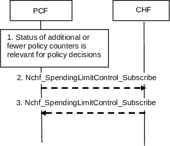
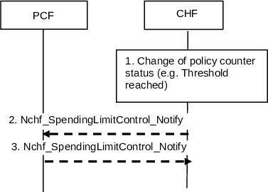

# 4.16.8 Procedures on interaction between PCF and CHF

## 4.16.8.1 General

The PCF may interact with the CHF to make session management policy decisions, UE policy decisions and Access and Mobility related policy decisions based on spending limits. For session management policy decisions, in the Home Routed roaming and Non-roaming case, the H-PCF will interact with the CHF in HPLMN. For Access and Mobility related policy decisions and UE policy decisions, the non-roaming case is supported when the PCF interaction with the CHF, both in the HPLMN.

## 4.16.8.2 Initial Spending Limit Retrieval

This clause describes the signalling flow for the PCF to retrieve the status of the policy counters available at the CHF and to subscribe to spending limit reporting (i.e. to notifications of policy counter status changes) by the CHF. If the PCF provides the list of policy counter identifier(s), the CHF returns the policy counter status per policy counter identifier provided by the PCF. If the PCF does not provide the list of policy counter identifier(s), the CHF returns the policy counter status of all policy counter(s), which are available for this subscriber.

The Initial Spending Limit Report Retrieval includes all subscriber Identifiers associated with the UE available at the PCF.

NOTE: If the CHF returns the status of all available policy counters some of these might not be relevant for a policy decision (e.g. those used in a policy decision only when roaming).

Figure 4.16.8.2.1: Initial Spending Limit Report Retrieval

1\. The PCF retrieves subscription information that indicates that policy decisions depend on the status of policy counter(s) held at the CHF and optionally the list of policy counter identifier(s).

2\. The PCF sends Nchf_SpendingLimitControl_Subscribe if this is the first time policy counter status information is requested for the user identified by a SUPI. It includes: the subscriber ID (e.g. SUPI), the EventId "policy counter status change" and optionally, the list of policy counter identifier(s) as Event Filter, the Notification Target Address, Event Reporting Information (continuous reporting).

The CHF responds to the Nchf_SpendingLimitControl_Subscribe service operation including the Subscription Correlation Id) and as Event Information provides a policy counter status and optionally pending policy counter statuses and their activation times, per required policy counter identifier and stores the PCF's subscription to spending limit reports for these policy counters. If no policy counter identifier(s) was provided the CHF returns the list of the policy counter status, optionally including pending policy counter statuses and their activation times, for all policy counter(s), which are available for this subscriber and stores the PCF's subscription to spending limit reports of all policy counters provided to the PCF.

## 4.16.8.3 Intermediate Spending Limit Report Retrieval

This clause describes the signalling flow for the PCF to retrieve the status of additional policy counters available at the CHF or to unsubscribe from spending limit reporting. If the PCF provides the list of policy counter identifier(s), the CHF returns the policy counter status per policy counter identifier provided by the PCF.

NOTE: If the CHF returns the status of all available policy counters some of these might not be relevant for a policy decision, (e.g. those used in a policy decision only when roaming).

Figure 4.16.8.3.1: Intermediate Spending Limit Report Retrieval

1\. The PCF determines that policy decisions depend on the status of additional policy counter(s) held at the CHF or that notifications of policy counter status changes for some policy counters are no longer required.

2\. The PCF sends Nchf_SpendingLimitControl_Subscribe to the CHF, including the Subscription Correlation Id, the EventId "policy counter status change" and an updated list of policy counter identifier(s) as EventFilters, that overrides the previously stored list of policy counter identifier(s).

The CHF responds to the Nchf_SpendingLimitControl_Subscribe service operation and provides as Event Information the policy counter status and optionally pending policy counter statuses and their activation times, per required policy counter identifier and stores or removes the PCF's subscription to spending limit reporting by comparing the updated list with the existing PCF subscriptions. If no policy counter identifier(s) was provided, the CHF returns the policy counter status, optionally including pending policy counter statuses and their activation times, for all policy counter(s), which are available for this subscriber and stores the PCF's subscription to spending limit reports of all policy counters provided to the PCF.

## 4.16.8.4 Final Spending Limit Report Retrieval

This clause describes the signalling flow for the PCF to cancel the subscriptions to status changes for the policy counters available at the CHF.

Figure 4.16.8.4.1: Final Spending Limit Report Retrieval

1\. The PCF decides that notifications of policy counter status changes are no longer needed.

2\. The PCF sends Nchf_SpendingLimitControl_Unsubscribe including the SubscriptionCorrelationId to the CHF to cancel the subscription to notifications of policy counter status changes from the CHF.

3\. The CHF removes the PCF's subscription to spending limit reporting and responds to the Nchf_SpendingLimitControl_Unsubscribe service operation to the PCF.

## 4.16.8.5 Spending Limit Report

This clause describes the signalling flow for the CHF to notify the change of the status of the subscribed policy counters available at the CHF for that subscriber. Alternatively, the signalling flow can be used by the CHF to provide one or more pending statuses for a subscribed policy counter together with the time they have to be applied.

Figure 4.16.8.5.1: Spending Limit Report

1\. The CHF detects that the status of a policy counter(s) has changed and the PCF subscribed to notifications of changes in the status of this policy counter. Alternatively, the CHF may detect that a policy counter status will change at a future point in time and decides to instruct the PCF to apply one or more pending statuses for a requested policy counter.

2\. The CHF sends Nchf_SpendingLimitControl_Notify with the SUPI, Notification Target Address and in the Event Information the policy counter status and optionally pending policy counter statuses and their activation times, for each policy counter that has changed and for which the PCF subscribed to spending limit reporting. Alternatively, the CHF sends one or more pending statuses for any of the subscribed policy counters together with the time they have to be applied.

3\. The PCF acknowledges sending Nchf_SpendingLimitControl_Notify response and takes that information into account as input for a policy decision.

## 4.16.8.6 CHF report the removal of the subscriber

This clause describes the signalling flow for the CHF to report the removal of the subscriber.

Figure 4.16.8.6-1: CHF report the removal of the subscriber

1\. The CHF decides that a subscriber is removed.

2\. The CHF sends the Nchf_SpendingLimitControl_Notify Request to H-PCF to notify the removal of the subscriber. The H-PCF removes the subscription to notification of policy counter status from CHF.

NOTE: Notification on the removing of a subscriber causes the H-PCF to make the applicable policy decision and act accordingly.

3\. The H-PCF responds to CHF using Nchf_SpendingLimitControl_Notify to acknowledge the receiving of the notification.
