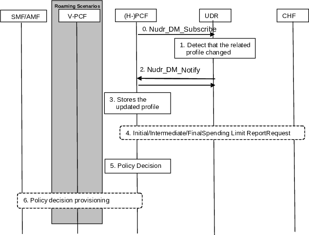

# 4.16.9 Update of the subscription information in the PCF

Figure-4.16.9-1: Procedure for update of the subscription information in the PCF

NOTE: The V-PCF is not used for session management related policy decisions in this procedure.

0\. The PCF performs the subscription to notification to the profile modified in the UDR by invoking Nudr_DM_Subscribe (Policy Data, SUPI, Notification Target Address (+ Notification Correlation Id), Event Reporting Information (continuous reporting), one or several of the following: "PDU Session Policy Control data", "Remaining allowed Usage data" or "UE context Policy Control data") service.

1\. The UDR detects that the related subscription profile has been changed.

2\. If subscribed by the PCF, the UDR notifies the PCF on the changed profile by invoking Nudr_DM_Notify (Notification Correlation Id, Policy Data, SUPI, updated data and one or several of the following data subtypes "PDU Session Policy Control Data" or "Remaining allowed Usage data" or "UE Context Policy Control data") service.

3\. The PCF stores the updated profile.

4\. If the updated subscriber profile requires the status of new policy counters available at the CHF then an Initial/Intermediate Spending Limit Report Retrieval is initiated by the PCF as defined in clauses 4.16.8,2 and 4.16.8.3. If the updated subscriber profile implies that no policy counter status is needed an Intermediate Spending Limit Report Request Retrieval is initiated by the PCF to unsubscribe or, if this is the last policy counter status, a Final Spending Limit Report Retrieval is initiated by the PCF as specified in clause 4.16.8.4.

5\. PCF makes an authorization and policy decision.

6\. The PCF provides new session management related policy decisions to the SMF, using the Policy related interaction in PDU Session Modification procedure in clause 4.16.6, new access and mobility related policy information to the AMF using the AM Policy Association Modification procedure in clause 4.16.2 or new UE policy information to the AMF using the UE Policy Association Modification procedure in clause 4.16.12.
