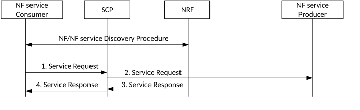

# 4.17.11 Indirect Communication without delegated discovery Procedure

This clause provides the call flow for indirect communication model without delegated discovery.

Figure 4.17.11-1: Procedure for Indirect Communication without delegated discovery

The NF/NF service discovery procedure is defined in clauses 4.17.4 and 4.17.5. In a successful discovery the NF service consumer gets the NF profile(s) matching the search criteria provided in the Nnrf_NFDiscovery_Request message.

1\. When the NF Service Consumer needs to send a Service Request and has obtained an endpoint address for the appropriate resources of the NF service producer from the reply to a previous service operation, the NF Service Consumer should indicate that endpoint address as target for the Service Request. Otherwise, if the NF Service Consumer has stored results from the Discovery Procedure, the NF Service Consumer selects an appropriate NF Producer / NF Service Producer instance from the list of NF profiles provided by the NRF. The NF Service Consumer considers the NF and NF service parameters (e.g. TAI, S-NSSAI, locality, priority etc) in the NF profiles. The NF Service consumer requests service from the NF Service producer by sending a service request message to the NF service producer via the SCP and the NF Service Consumer may provide a Routing Binding Indication with the same contents as the previously received Binding Indication.

2\. If the Routing Binding Indication is provided by the NF Service Consumer, SCP (re-)selects as specified in Table 6.3.1.0‑1 of TS 23.501 \[2\] and routes the service request to target accordingly. If the Routing Binding Indication is not provided by the NF Service Consumer, then the SCP routes the service request based on routing information available.

3\. The NF Service Producer responds via SCP.

4\. SCP forwards the response.
