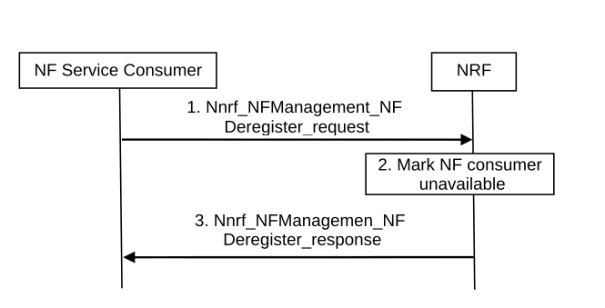

# 4.17.3 NF service deregistration

Figure 4.17.3-1: NF Service Deregistration procedure

1\. NF service consumer i.e. an NF instance sends Nnrf_NFManagement_NFDeregister Request message to NRF to inform the NRF of its unavailability when e.g. it's about to gracefully shut down or disconnect from the network.

2\. The NRF marks the NF service consumer unavailable. NRF may remove the NF profile of NF service consumer according to NF management policy.

3\. The NRF acknowledge NF Deregistration is accepted via Nnrf_NFManagement_NFDeregister response.
