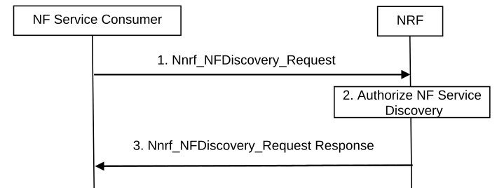

# 4.17.4 NF/NF service discovery by NF service consumer in the same PLMN

Figure 4.17.4-1: NF/NF service discovery in the same PLMN

1\. The NF service consumer intends to discover services available in the network based on service name and target NF type. The NF service consumer invokes Nnrf_NFDiscovery_Request (Expected NF service Name, NF Type of the expected NF instance, NF type of the NF consumer) from an appropriate configured NRF in the same PLMN. The parameter may include optionally producer NF Set ID, NF Service Set ID, SUPI, Data Set Identifier(s), External Group ID (for UDM, UDR discovery), UE's Routing Indicator and Home Network Public Key identifier (for UDM and AUSF discovery), S-NSSAI, NSI ID if available and other service related parameters. In addition, for AMF discovery, the parameters may include AMF Region ID, AMF Set ID, TAI. The NF service consumer may indicate a preference for target NF location in the Nnrf_NFDiscovery_Request. A complete list of parameters is provided in service definition in clause 5.2.7.3.2.

NOTE 1: The NF service consumer indicates its NF location for preference for target NF location.

NOTE 2: The use of NSI ID within a PLMN depends on the network deployment.

NOTE 3: The need for other service related parameters depends on the NF type of the expected NF instance(s) and refer to the clause 6.3 " Principles for Network function and Network Function Service discovery and selection" in TS 23.501 \[2\]. It is up to NF implementation whether one or multiple NF service instances are registered in the NRF.

2\. The NRF authorizes the Nnrf_NFDiscovery_Request. Based on the profile of the expected NF/NF service and the type of the NF service consumer, the NRF determines whether the NF service consumer is allowed to discover the expected NF instance(s). If the expected NF instance(s) or NF service instance(s) are deployed in a certain network slice, NRF authorizes the discovery request according to the discovery configuration of the Network Slice, e.g. the expected NF instance(s) are only discoverable by the NF in the same network slice.

3\. If allowed, the NRF determines a set of NF instance(s) matching the Nnrf_NFDiscovery_Request and internal policies of the NRF and sends the NF profile(s) of the determined NF instances. Each NF profile containing at least the output required parameters (see clause 5.2.7.3.2) to the NF service consumer via Nnrf_NFDiscovery_Request Response message.

If the target NF is UDR, UDM or AUSF, if SUPI was used as optional input parameter in the request, the NRF shall provide the corresponding UDR, UDM or AUSF instance(s) that matches the optional input SUPI. Otherwise, if SUPI is not provided in the request, the NRF shall return all applicable UDR instance(s) (e.g. based on the Data Set Id, NF type), UDM instance(s) or AUSF instance(s) (e.g. based on NF type) and if applicable, the information of the range of SUPI(s) and/or Data Set Id each UDR instance is supporting.

If the target NF is CHF, if SUPI, GPSI or PLMN ID was used as optional input parameter in the request, the NRF shall provide the corresponding CHF instance(s) that matches the optional input SUPI, GPSI or PLMN ID. The NRF shall provide the primary CHF instance and the secondary CHF instance pair(s) together, if configured in CHF instance profile. Otherwise, if neither SUPI/PLMN ID nor GPSI is provided in the request, the NRF shall return all applicable CHF instance(s) and if applicable, the information of the range of SUPI(s), GPSI(s) or PLMN ID(s).

If the NF service consumer provided a preferred target NF location, the NRF shall not limit the set of discovered NF instances or NF service instance(s) to the target NF location, e.g. the NRF may provide NF instance(s) or NF service instance(s) for which location is not the preferred target NF location if no NF instance or NF service instance could be found for the preferred target NF location.
