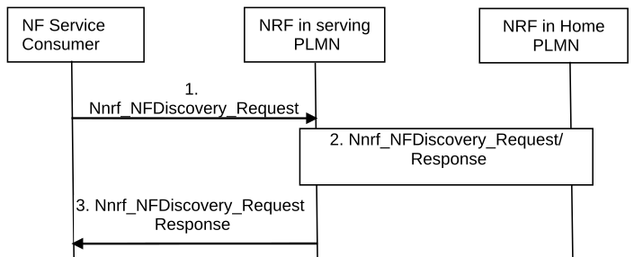

# 4.17.5 NF/NF service discovery across PLMNs in the case of discovery made by NF service consumer

In the case that the NF service consumer intends to discover the NF/NF service in home PLMN, the NRF in serving PLMN needs to request "NF Discovery" service from NRF in the home PLMN. The procedure is depicted in the figure below:

Figure 4.17.5-1: NF/NF service discovery across PLMNs

1\. The NF service consumer in the serving PLMN invokes Nnrf_NFDiscovery_Request (Expected Service Name, NF type of the expected NF, home PLMN ID, serving PLMN ID, NF type of the NF service consumer) to an appropriate configured NRF in the serving PLMN. The request may also include optionally producer NF Set ID, NF Service Set ID, S-NSSAI, NSI ID if available and other service related parameters. A complete list of parameters is provided in service definition in clause 5.2.7.3.2.

NOTE 1: The use of NSI ID within a PLMN depends on the network deployment.

2\. The NRF in serving PLMN identifies NRF in home PLMN (hNRF) based on the home PLMN ID and it requests "NF Discovery" service from NRF in home PLMN according the procedure in Figure 4.17.4-1 to get the expected NF profile(s) of the NF instance(s) deployed in the home PLMN. As the NRF in the serving PLMN triggers the "NF Discovery" on behalf of the NF service consumer, the NRF in the serving PLMN shall not replace the information of the service requester NF, i.e. NF consumer ID, in the Discovery Request message it sends to the hNRF.

The hNRF may further query another NRF within the home PLMN based on the input information received from NRF of the serving PLMN. The Endpoint Address(es) of the NF Discovery service(s) of this NRF in the home PLMN may be configured in the hNRF or may need to be discovered based on the input information. For further information about NRF-NRF interactions, see clauses 5.3.2.2.4 and 5.3.2.2.5 of TS 29.510 \[37\].

3\. The NRF in serving PLMN provides same as step 3 in clause 4.17.4 applies.
