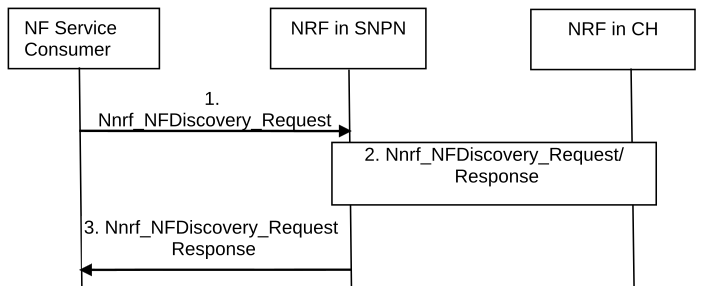

# 4.17.5a NF/NF service discovery between SNPN and Credentials Holder hosting AUSF/UDM or between SNPN and DCS hosting AUSF/UDM

Figure 4.17.5a-1: NF/NF service discovery across SNPN and Credentials Holder

In the case of a UE accessing SNPN using credentials from a Credentials Holder hosting AUSF/UDM, similar procedure can be used for service discovery across PLMNs as specified in clause 4.17.5 with the difference as below:

\- The Serving PLMN is replaced by SNPN and Home PLMN is replaced by CH;

\- In step 1:

\- the Home PLMN ID in Nnrf_NFDiscovery_Request is replaced by identification for the Credentials Holder, i.e.:

\- the realm in the case of Network Specific Identifier based SUCI/SUPI; or

\- the MCC and MNC in the case of an IMSI based SUCI/SUPI;

NOTE: When IMSI based SUPI is used for a UE of a CH, the IMSI is assumed to be globally unique and assigned by the owner of a PLMN ID containing MCC and MNC of the IMSI as defined in TS 23.501 \[2\].

\- the Serving PLMN ID is replaced by SNPN ID (i.e. PLMN ID and NID);

\- In step 2, the NRF in SNPN identifies NRF in CH based on the identification for the Credentials Holder.

In the case of a UE accessing ON-SNPN using Default UE credentials from a DCS hosting AUSF/UDM, a similar procedure can be used than for service discovery across PLMNs as specified in clause 4.17.5, with the difference as below:

\- The Serving PLMN is replaced by SNPN and Home PLMN is replaced by DCS;

\- In step 1:

\- the Home PLMN ID in Nnrf_NFDiscovery_Request is replaced by identification for the DCS, i.e.:

\- the realm in the case of Network Specific Identifier based SUCI/SUPI;

\- the Serving PLMN ID is replaced by SNPN ID (i.e. PLMN ID and NID);

\- In step 2, the NRF in SNPN identifies NRF in DCS based on the identification for the DCS.
