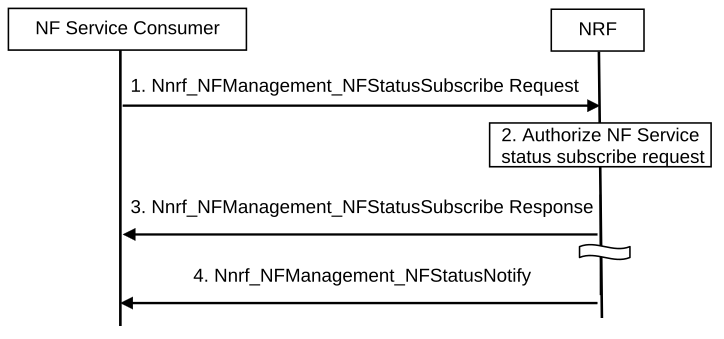

# 4.17.7 NF/NF service status subscribe/notify in the same PLMN

Figure 4.17.7-1: NF/NF service status subscribe/notify in the same PLMN

1\. The NF service consumer subscribes to be notified of newly registered/updated/deregistered NF instances along with its NF services. The NF service consumer invokes Nnrf_NFManagement_NFStatusSubscribe Request from an appropriate configured NRF in the same PLMN.

2\. The NRF authorizes the Nnrf_NFManagement_NFStatusSubscribe Request. Based on the profile of the expected NF/NF service and the type of the NF service consumer, the NRF determines whether the NF service consumer is allowed to subscribe to the status of the target NF instance(s) or NF service instance(s).

3\. If allowed, the NRF acknowledges the execution of Nnrf_NFManagement_NFStatusSubscribe Request.

4\. NRF notifies about newly registered/updated/deregistered NF instances along with its NF services to the subscribed NF service consumer.

NOTE 1: The NF service consumer unsubscribes to receive NF status notifications by invoking Nnrf_NFManagement_NFStatusUnSubscribe service operation.

NOTE 2: When the NF or NF service instance becomes unavailable, the NRF invokes Nnrf_NFManagement_NFStatusNotify service to notify the NF service consumer based on the subscription.
