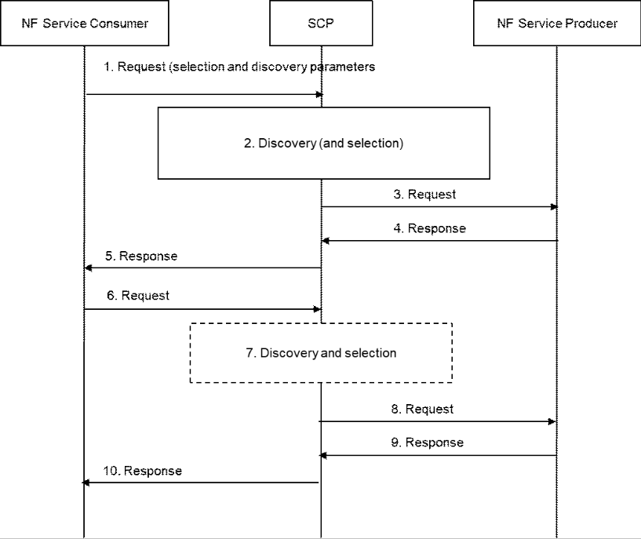

# 4.17.9 Delegated service discovery when NF service consumer and NF service producer are in same PLMN

Figure 4.17.9-1: Delegated NF service discovery when NF service consumer and NF service producer are in same PLMN

1\. The NF service consumer intends to communicate with an NF service producer. The NF service consumer sends the service request to an SCP. The request may include discovery and selection parameters necessary to discover and select a NF service producer instance. The discovery and selection parameters are included in the request by the NF service consumer in a way that the SCP does not need to parse the request body.

2\. The SCP may perform discovery upon the request either by interacting with an NRF using Nnrf_NFDiscovery service NRF or may use information collected during the previous interactions with an NRF (by the Nnrf_NFDiscovery service or Nnrf_NFManagement_NFStatusNotify service operation). The SCP together with the NRF authorizes the request. The SCP selects the target NF service producer.

NOTE 1: If the discovery and selection parameters in the request include a UE identity, e.g. SUPI or IMPI/IMPU, the SCP can resolve the requested NF's Group ID corresponding to the UE identity and then invoke the Nnrf_NFDiscovery service, as defined in clause 6.3.1 of TS 23.501 \[2\].

3\. If the NF service consumer is authorized to communicate with the NF service producer, the SCP forwards the request to the selected NF service producer according to the configuration of the Network Slice, e.g. the expected NF instances are only reachable by NFs in the same network slice.

4\. The NF service producer sends a response to the SCP. If the request in step 3 creates a resource in the NF service producer, such as depicted in Figure 4.17.9-1, the NF service producer responds with resource information identifying the created resource.

5\. The SCP routes the response to the NF service consumer.

If the NF service consumer receives a resource address, it uses it for subsequent requests regarding the concerned resource. Otherwise, the procedure ends here.

6\. On a subsequent operation on the created resource, the NF service consumer addresses the resource via the resource address returned by the NF service producer at step 4.

7\. The SCP resolves the NF service producer address and selects a target NF service producer instance. The SCP then routes the request to the selected NF service producer instance. See the clause 6.3.1.0 of TS 23.501 \[2\] for the details of selection of a target NF service producer instance by SCP.

8\. The SCP delivers the request to the NF service producer.

9\. The NF service producer sends a response to the SCP. The NF service producer may respond with an updated resource information different to the one received in the previous response.

10\. The SCP sends a response to the NF service consumer. If the resource information was updated, the NF service consumer uses the received resource information for subsequent operations (requests) on the resource.

NOTE 2: In the similar manner of handling the resource information, a binding indication may be also provided by the NF service producer and used for the subsequent requests of the NF service consumer. See more details in clause 4.17.12.
