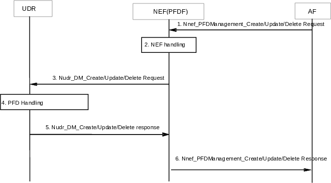
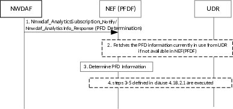
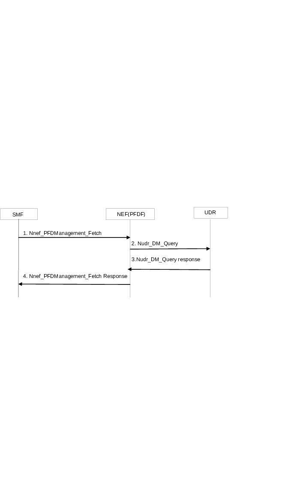
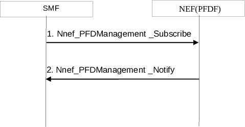

# 4.18 Procedures for Management of PFDs

## 4.18.1 General

NOTE: The PFDF service is functionality within the NEF.

## 4.18.2 PFD management via NEF (PFDF)

### 4.18.2.1 PFD management triggered by AF

Figure 4.18.2.1-1: Procedure for PFD management via NEF (PFDF) triggered by AF

1\. The AF invokes the Nnef_PFDManagement_Create/Update/Delete service. The Allowed Delay is an optional parameter. If the Allowed Delay is included, it indicates that the list of PFDs in this request should be provisioned within the time interval indicated by the Allowed Delay to the SMF(s) that have subscribed to the PFD management service using Nnef_PFDManagement_Subscribe service operation.

2\. NEF (PFDF) checks whether the AF is authorized to perform this request and if the AF is authorised to provision this PFD data based on the operator policies. The NEF (PFDF) may in addition subscribe to the NWDAF to receive PFD Determination analytics (defined in clause 6.16.3 of TS 23.288 \[50\]) for this Application Identifier.

3\. The NEF (PFDF) invokes the corresponding Nudr_DM_Create/Update/Delete (Data Key = Packet Flow Descriptions, Application Identifier, one or more PFDs, Allowed Delay) to the UDR.

4\. The UDR creates/updates/deletes the list of PFDs for the Application Identifier.

5\. The UDR sends a Nudr_DM_Create/Update/Delete Response to the NEF (PFDF).

6\. The NEF (PFDF) sends Nnef_PFDManagement_Create/Update/Delete Response to the Application Function.

### 4.18.2.2 PFD management based on PFD Determination analytics

Figure 4.18.2.2-1 shows the procedure that NEF (PFDF) determines the PFD information for the known Application Identifier(s), based on the PFD Determination analytics information notified/responded from the subscribed/requested NWDAF. The procedure enables the NEF (PFDF) to determine whether to create/update/delete PFD information corresponding to the known Application Identifier(s).

Figure 4.18.2.2-1: Procedure for PFD management based on PFD Determination analytics

1\. The NWDAF notifies/responds to PFD Determination analytics to the NEF (PFDF) as Consumer NF with PFD Information defined in clause 6.16.3 of TS 23.288 \[50\].

2\. The NEF (PFDF) fetches the PFD information currently in use from UDR if not available in NEF (PFDF) as described from step 2 to step 3 of clause 4.18.3.1.

3\. The NEF (PFDF) compares the PFD information from UDR with PFD information from the NWDAF to determine whether to create/update/delete PFD information corresponding to the Application Identifier.

4\. If the NEF (PFDF) has determined in step 3 to create/update/delete PFD information corresponding to the Application Identifier, the NEF (PFDF) invokes the Nudr_DM_Create/Update/Delete (Application Identifier, one or more sets of PFDs) to the UDR to create/update/delete PFD information corresponding to the Application Identifier, i.e. from step 3 to step 5 of clause 4.18.2.1 are executed. The NEF (PFDF) may forward new/updated PFD information to UPF via SMF to detect a known application, as defined in clause 6.1.2.3.1 of TS 23.503 \[20\].

## 4.18.3 PFD management in the SMF

### 4.18.3.1 PFD Retrieval by the SMF

This procedure enables the SMF to retrieve PFDs for an Application Identifier from the NEF (PFDF) when a PCC rule with this Application Identifier is provided/activated and PFDs provided by the NEF (PFDF) are not available at the SMF.

In addition, this procedure enables the SMF to retrieve PFDs from the NEF (PFDF)when the caching timer for an Application Identifier elapses and a PCC Rule for this Application Identifier is still active.

The NEF (PFDF) retrieves the PFDs from UDR unless already available in NEF (PFDF).

The SMF may retrieve PFDs for one or more Application Identifiers in the same Request. All PFDs related to an Application Identifier are provided in the response from the UDR to NEF (PFDF).

Figure 4.18.3.1-1 PFD Retrieval by the SMF

1\. SMF invokes the Nnef_PFDManagement_Fetch (Application Identifier (s)) to the NEF (PFDF).

2\. NEF (PFDF) checks if the PFDs for the Application Identifier (s) are available in the NEF (PFDF), if available, the NEF (PFDF) skips to step 4. If not, the NEF (PFDF) invokes Nudr_DM_Query (Application Identifier (s)) to retrieve the PFD(s) from UDR.

3\. The UDR provides a Nudr_DM_Query response (Application Identifier(s), PFD(s)) to the NEF (PFDF).

4\. The NEF (PFDF) replies to the SMF with Nnef_PFDManagement_Fetch (Application Identifier(s), PFD(s)).

### 4.18.3.2 Management of PFDs in the SMF

This procedure enables the provisioning, modification or removal of PFDs associated with an application identifier in the SMF. Either the complete list of all PFDs of all application identifiers, the complete list of all PFDs of one or more application identifiers or a subset of PFDs for individual application identifiers may be managed.

Each PFD of an application identifier is associated with a PFD id if a subset of the PFD(s) associated with an application identifier can be provisioned, updated or removed. If always the full set of PFD(s) for an application identifier is managed in each transaction, PFD ids do not need to be provided.

Figure 4.18.3.2-1 Management of PFDs in the SMF

1\. As pre-requisite condition to receiving push notifications, the SMF subscribes to PFD notifications from the NEF (PFDF) by sending Nnef_PFDManagement_Subscribe message.

2\. The NEF (PFDF) invokes Nnef_PFD_Management_Notify (Application Identifier, PFDs, PFDs operation) to the SMF(s) to which the PFD(s) shall be provided. The NEF (PFDF) may decide to delay the distribution of PFDs to the SMF(s) for some time to optimize the signalling load. If the NEF (PFDF) received an Allowed Delay for a PFD, the NEF (PFDF) shall distribute this PFD within the indicated time interval.
