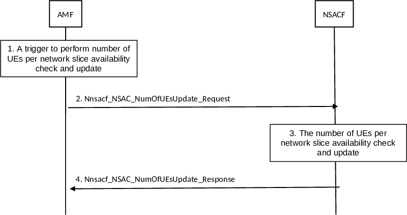

# 4.2.11.2 Number of UEs per network slice availability check and update procedure

This clause applies to Non-Hierarchical and centralized NSAC architectures. The difference between the two architectures for the various steps, where applicable, is described at the end of the clause.

The number of UEs per network slice availability check and update procedure is to update (i.e. increase or decrease) the number of UEs registered with an S-NSSAI which is subject to NSAC. The AMF is configured with the information indicating which network slice is subject to NSAC.

Figure 4.2.11.2-1: Number of UEs per network slice availability check and update procedure

1\. If the AMF is not aware of which NSACF to communicate, the AMF performs NSACF discovery as described in clause 6.3.22 of TS 23.501 \[2\] and in clause 5.2.7.3.2. The AMF triggers the Number of UEs per network slice availability check and update procedure to update the number of UEs registered with a network slice when a network slice subject to NSAC is included in the Allowed NSSAI or Partially Allowed NSSAI (i.e. the AMF requests to register the UE with the S-NSSAI) or removed from the Allowed NSSAI or Partially Allowed NSSAI (i.e. the AMF requests to de-register the UE from the S-NSSAI) for a UE. The trigger event at the AMF also includes the change of Allowed NSSAI or Partially Allowed NSSAI in the case of inter-AMF mobility. The procedure is triggered in the following cases:

\- At UE Registration procedure, according to clause 4.2.2.2.2 (including Registration types of Initial Registration or Mobility Registration Update in inter-AMF mobility in CM-CONNECTED or CM-IDLE state):

\- before the Registration Accept in step 21 if the EAC mode is active; or

\- after the Registration Accept message if the EAC mode is not active;

\- At UE Deregistration procedure, as per clause 4.2.2.3, after the Deregistration procedure is completed;

\- At UE Configuration Update procedure (which may result from NSSAA procedure or subscribed S-NSSAI change):

\- before the UE Configuration Update message if the EAC mode is active and the update flag is to increase; or

\- after the UE Configuration Update message if the EAC mode is active and the update flag is to decrease; or

\- after the UE Configuration Update message if the EAC mode is not active.

NOTE 1: Depending on the deployment, there may be different NSACF for different S-NSSAI subject to NSAC and hence, during the registration, AMF triggers the Number of UEs per network slice availability check and update procedure to multiple NSACFs.

2\. The AMF sends Nnsacf_NSAC_NumOfUEsUpdate_Request message to the NSACF. The AMF includes in the message the UE ID, Access Type to which the Allowed NSSAI or Partially Allowed NSSAI is applied, the S-NSSAI(s), the NF ID and the update flag which indicates whether the number of UEs registered with the S-NSSAI(s) is to be increased when the UE has gained registration to network slice(s) subject to NSAC or the number of UEs registered with the S-NSSAI(s) is to be decreased when the UE has deregistered from S-NSSAI(s) or could not renew its registration to an S-NSSAI subject to NSAC.

If this is the first time to perform NSAC procedure for the S-NSSAI towards the NSACF, the AMF includes notification endpoint for EAC Notification to implicitly subscribe the EAC notification for the S-NSSAI from the NSACF.

3\. The NSACF determines whether the Access Type provided by the AMF is configured for the NSAC based on its configuration. If the Access Type is not configured for the NSAC, the NSACF always accepts the request from the AMF without increasing or decreasing the number of UEs. If the Access Type is configured for the NSAC, the NSACF updates the current number of UEs registered for the S-NSSAI, i.e. increases or decrease the number of UEs registered per network slice based on the information provided by the AMF in the update flag parameter.

If the update flag parameter from the AMF indicates increase, the following applies:

\- If the UE ID is already in the list of UEs registered with the network slice, the current number of UEs is not increased as the UE has already been counted as registered with the network slice. The NSACF creates a new entry associated with this new update and shall also maintain the old entry associated with previous update. The multiple entries for the same UE ID in the NSACF are differentiated based on the NF ID of the NF sending the update request. The NSACF removes the entry associated with the NF ID upon reception of a request having update flag indicating decrease.

NOTE 2: The use case of having two or more entries in the NSACF for the same UE can happen during (a) inter-AMF mobility when the new AMF request update to the NSACF before the old AMF sends request to deregister the UE; or (b) PDN connections establishment in the EPC when multiple SMF +PGW-Cs (i.e. used for different PDN Connections associated with the same S-NSSAI) send update requests for maximum number of UEs to the NSACF.

NOTE 3: To handle AMF graceful removal, the NSACF can subscribe for unavailability notifications with the AMF (directly or via NRF) as described in clause 5.21.2.2 and act accordingly, e.g. update the NF ID with the target AMF ID.

\- If the UE ID is not in the list of UE IDs registered with the network slice and the maximum number of UEs registered with the network slice has not been reached yet, the NSACF adds the UE ID in the list of UEs registered with the network slice as a new entry associated with this new update and increases the current number of the UEs registered with the network slice. If the UE ID is not in the list of UEs registered with that S-NSSAI and the maximum number of UEs for that S-NSSAI has already been reached, then the NSACF returns a result parameter indicating that the maximum number of UEs registered with the network slice has been reached.

If the update flag parameter from the AMF indicates decrease and if there is only one entry associated with the UE ID, the NSACF removes the UE ID from the list of UEs registered with the network slice for each of the S-NSSAI(s) indicated in the request from the AMF and also the NSACF decreases the number of UEs per network slice that is maintained by the NSACF for each of these network slices. If there are multiple entries associated with the UE ID, the NSACF removes the entry associated with the NF ID but the UE ID is kept in the list of UEs registered with the S-NSSAI.

The NSACF takes access type into account for increasing and decreasing the number of UEs per network slice as described in clause 5.15.11.1 of TS 23.501 \[2\].

The NSACF stores the notification endpoint for EAC Notification associated with the S-NSSAI if it is received from the AMF. The NSACF can use this AMF notification endpoint to update the EAC mode as described in clause 4.2.11.3.

NOTE 4: This enables the NSACF to maintain up-to-date information about the AMFs serving the S-NSSAIs.

4\. The NSACF returns the Nnsacf_NSAC_NumOfUEsUpdate_Response message including Result indication per S-NSSAI. The Result indication includes either 'maximum number of UEs registered with the network slice reached' or 'maximum number of UEs registered with the network slice not reached'.

At UE Registration procedure, if only some of the S-NSSAIs reached the maximum number of UEs per S-NSSAI, the AMF sends a Registration Accept message to the UE in which the AMF includes the rejected S-NSSAI(s) in the rejected NSSAI list for which the NSACF has indicated that the maximum number of UEs per network slice has been reached and for each rejected S-NSSAI the AMF includes a reject cause set to 'maximum number of UEs per network slice reached' and optionally a back-off timer.

When for all the Requested S-NSSAI(s) provided in step 2 the NSACF returned the maximum number of UEs per network slice has been reached and if one or more subscribed S-NSSAIs are marked as default in the subscription data and not subject to NSAC, the AMF can decide to include these Default Subscribed S-NSSAIs in the Allowed NSSAI. Otherwise, the AMF rejects the UE request for registration. In the Registration Reject message, the AMF includes the rejected S-NSSAI(s) in the rejected NSSAI parameter and for each rejected S-NSSAI the AMF includes a reject cause to indicate that the maximum number of UEs per network slice has been reached and optionally a back-off timer.

NOTE 5: If the use case requires the UE to remain reachable at all times with at least one slice, it is recommended that at least one of the Subscribed S-NSSAIs is marked as the default S-NSSAI which is not subject to NSAC. This will ensure the UE is able to access to services even when maximum number of UEs per network slice has been reached.

For a centralized architecture the following differences apply:

\- In step 2, the AMF additionally includes the NSAC service area the AMF belongs to, if available, as an additional parameter in the Nnsacf_NSAC_NumOfUEsUpdate_Request.

\- In step 3, based on operator configuration, the NSACF performs the validation against the maximum number of Registered UEs registered per NSAC service area defined for the network slice if applicable and available, or the maximum number of Registered UEs in the entire PLMN for the network slice. Additionally the NSACF stores the NSAC service area of AMF if available.

NOTE 6: When a centralized NSAC architecture is deployed, NSACF does not perform any readmission at inter-AMF mobility since the UE is already admitted if the validation of maximum number of Registered UEs against the entire PLMN.
