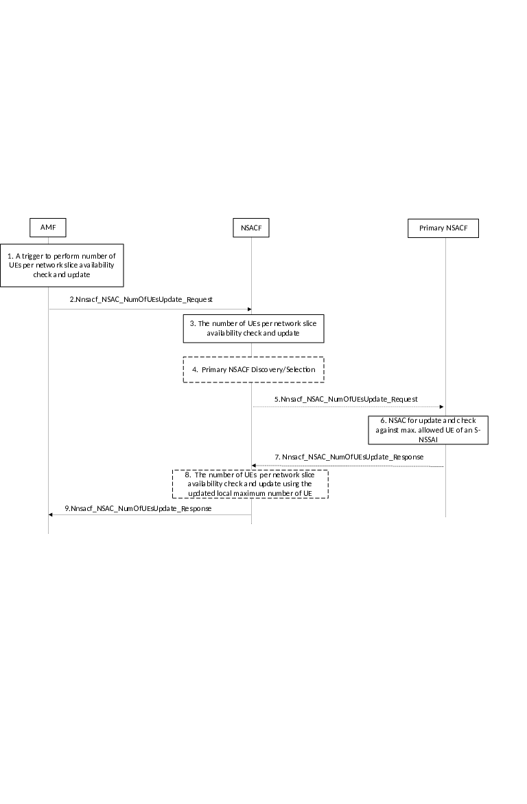

# 4.2.11.2a Hierarchical NSACF-based number of UEs per network slice availability check and update procedure

Figure 4.2.11.2a-1: Hierarchical NSACF-based number of UEs per network slice availability check and update procedure

For an S-NSSAIs subject to counting of the number of registered UEs, if hierarchical NSACF architecture is deployed in the network the enforcement of maximum number of UEs registered for an S-NSSAI is performed as follows:

1\. Same as the step 1 defined in clause 4.2.11.2.

2\. In addition to the information included in the Nnsacf_NSAC_NumOfUEsUpdate_Request as described in the step 2 of clause 4.2.11.2, the AMF may provide UE already registered indication to the NSACF if the UE has been registered with the S-NSSAI in another NSAC service area before. The AMF determines the indication based on the received Allowed NSSAI information from the source AMF (in case of inter AMF handover) or from SMF+PGW-C (in case of mobility from EPS to 5GS).

3\. The NSACF performs NSAC for the indicated S-NSSAI.

If the update flag parameter from the AMF indicates increase, the following applies:

\- For NSACF which support UE admission quota based control:

\- If the local maximum number of UEs is not reached yet, the NSACF executes the same action as specified in the step 3 in clause 4.2.11.2. The steps 4-8 are skipped.

\- If the local maximum number of UEs is reached, the NSACF sends a delegation request to the Primary NSACF. Steps 4-9 are executed.

\- For NSACF which supports UE admission threshold-based control, as defined in clause 5.15.11.1.2 of TS 23.501 \[2\]:

\- If the UE admission is below the threshold level, the NSACF executes the same action as the step 3 defined in clause 4.2.11.2. Steps 4-8 are skipped.

\- If the UE admission is at or above the threshold level and the local maximum number of UEs has not been reached, the NSACF checks whether the UE already registered indication is present.

\- If the UE already registered indication is not present then the NSACF immediately rejects the NSAC request. Steps 4-8 are skipped.

\- If the UE already registered indication is present the NSACF executes the same action as the step 3 defined in clause 4.2.11.2 in order to allow for service continuity. Steps 4-8 are skipped.

\- If the local maximum number has been reached and the UE already registered indication is present then the NSACF sends a delegation request of NSAC to the Primary NSACF in order to allow for service continuity. Steps 4-9 are executed.

If the update flag parameter from the AMF indicates decrease, the following applies:

\- If the UE entry to be deleted is stored at the NSACF, the NSACF executes the same action as the step 3 defined in clause 4.2.11.2. Steps 4-8 are skipped.

\- If the UE entry to be deleted is not stored at the NSACF, the NSACF sends a delegation request of NSAC to the Primary NSACF. Steps 4-9 are executed.

4\. If the Primary NSACF has not been discovered before, the NSACF discovers and selects the Primary NSACF which manages the entire PLMN NSAC service area according to clause 6.3.22 of TS 23.501 \[2\].

5\. The NSACF invokes Nnsacf_NSAC_NumOfUEsUpdate_Request service operation to the Primary NSACF. The request includes the NSAC request information received from AMF, which may include the UE already Registered indication only if it is received from AMF and the UE admission type is quota-based.

6\. The Primary NSACF performs NSAC for the indicated S-NSSAI.

If the update flag parameter from the NSACF indicates increase, the following applies:

\- If the Primary NSACF decided to delegate the NSAC update request to the NSACF, per the applied UE admission type of the network, the Primary NSACF adjusts the local maximum number for UE quota-based admission or the UE admission threshold for UE admission-threshold in its response to the NSACF. The Primary NSACF does not create a new entry associated with the UE ID in the received NSAC request.

NOTE 1: When NSACF sends a delegation request to the Primary NSACF, the Primary NSACF either increases local maximum number at NSACF or rejects the NSAC request.

\- For quota-based admission type and if the Primary NSACF decided not to delegate the request to the NSACF and the UE already Registered indication is not included, the Primary NSACF rejects the NSAC request. If the UE already Registered indication is included and if the Primary NSACF decided to store the UE entry, it creates a new entry associated with the UE ID within the received NSAC. If the Primary NSACF is not able to store the UE entry, the Primary NSACF rejects the request. The Primary NSACF respond accordingly the NSACF as in step 7.

\- For threshold-based admission and if the Primary NSACF decided not to delegate the request to the NSACF, the same action as for step 3 in clause 4.2.11.2 is executed with the replacement of NSACF with Primary NSACF.

NOTE 2: To support the session continuity across different NSAC service area, the Primary NSACF always reserves part of the global maximum number for its own use, i.e. the whole global maximum number is not distributed to all contacted NSACF(s).

If the update flag parameter from the NSACF indicates decrease and the UE entry is managed by the Primary NSACF, the same action as step 3 in clause 4.2.11.2 is executed with the replacement of NSACF with Primary NSAC. This applies to both admission types.

7\. The Primary NSACF returns the Nnsacf_NSAC_NumOfUEsUpdate_Response message to the NSACF. The response may include the Result indication as described in step 4 in clause 4.2.11.2.

If the Primary NSACF determines to adjust the configured value stored at the NSACF, the updated local maximum number of UEs or UE admission threshold is also included in the response respectively.

8\. The NSACF checks the response from Primary NSACF.

If the response includes the updated configured value,

\- The NSACF, which supports UE admission quota based control, replaces the existing local maximum number of UEs with the received updated value. The same action is executed as for step 3 in clause 4.2.11.2 based on the updated configured value.

\- The NSACF, which supports UE admission threshold based control, replaces the existing UE admission threshold with the received updated value. The same action is executed as for step 3 in clause 4.2.11.2 based on the updated configured value.

If the response does not include the updated configured value, the NSACF returns the response to AMF based on the received NSAC response from Primary NSACF.

9\. Same as for step 4 defined in clause 4.2.11.2.
