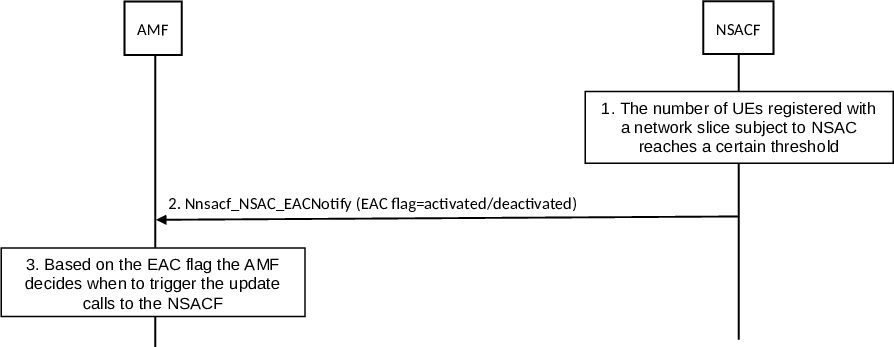

# 4.2.11.3 Configuration for Early Admission Control (EAC) update procedure

The configuration for Early Admission Control (EAC) update procedure indicates to the AMF the activation or the deactivation of the EAC mode for the S-NSSAI subject to NSAC. EAC mode means that the AMF is required to perform the number of UEs per network slice availability check and update procedure before the S-NSSAI subject to NSAC is included in the Allowed NSSAI or Partially Allowed NSSAI and sent to the UE. EAC mode is only applicable in the AMF when the update flag is set to increase.

The AMF implicitly subscribes to the EAC notification for the S-NSSAI when it performs the first network slice availability check and update procedure for the S-NSSAI with the NSACF. The NSACF sends the EAC mode notification towards all notification endpoints associated with the S-NSSAI.

Figure 4.2.11.3-1: Early Admission Control (EAC) update procedure

1\. The number of UEs registered with a network slice subject to NSAC crosses a certain operator defined threshold. The NSACF determines whether to activate or deactivate the EAC mode.

2\. The NSACF triggers Nnsacf_NSAC_EACNotify operation including the S-NSSAI(s) for which the EAC mode is to be activated or deactivated and a EAC flag(s) set to activated if the number of UEs registered with the network slice is above certain threshold or set to deactivated if the number of the UEs registered with the network slice is below certain threshold which may be same or different with respect to the activation threshold.

NOTE 1: When the operator set the EAC inactive threshold, the Denial-of-Service issue due to a potential burst of registration request needs to be taken into account.

3\. The AMF uses the EAC flag to decide when to trigger the number of UEs per network slice availability check and update procedure so that delays to the registration procedure and impact to the already allowed network slices are avoided.

If the EAC flag indicates EAC mode activated, the AMF triggers the number of UEs per network slice availability check and update procedure before the Registration Accept step of the registration procedure or before the UE Configuration Update message.

If the EAC flag indicates EAC mode deactivated, the AMF triggers the number of UEs per network slice availability check and update procedure after Registration Accept step of the registration procedure or after the UE Configuration Update.

NOTE 2: When the S-NSSAI subject to NSAC and NSSAA, with EAC mode activated or deactivated, the AMF performs them as described in clause 4.2.11.2.
