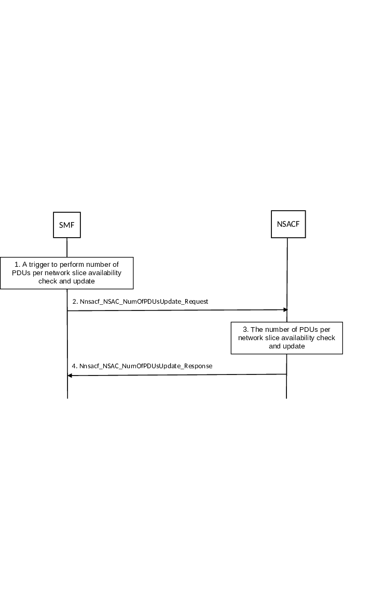

# 4.2.11.4 Number of PDU Sessions per network slice availability check and update procedure

This clause applies to Non-Hierarchical NSAC and centralized NSAC architectures. The difference between the two architectures for the various steps, where applicable, is described at the end of the clause.

The number of PDU Sessions per network slice availability check and update procedure is to update (i.e. increase or decrease) the number of PDU Sessions established on S-NSSAI which is subject to NSAC. The SMF is configured with the information indicating which network slice is subject to NSAC.

NOTE 1: EAC mode is not applicable for Number of PDU Sessions per network slice availability check and update procedure.

Figure 4.2.11.4-1: Number of PDU Sessions per network slice availability check and update procedure

1\. If the SMF is not aware of which NSACF to communicate, the SMF performs NSACF discovery as described in clause 6.3.22 of TS 23.501 \[2\] and in clause 5.2.7.3.2. The SMF anchoring the PDU session triggers the Number of PDU Sessions per network slice availability check and update procedure for the network slices that are subject to NSAC at the beginning of a PDU Session Establishment procedure (clause 4.3.2.2.1 and clause 4.3.2.2.2) only for new PDU Sessions to be established and as a last step of successful PDU Session Release procedure (clause 4.3.4.2 and clause 4.3.4.3).

NOTE 2: SMFs handling PDU sessions associated with UE Request Type "Existing PDU Session" for intra access handover purposes do not interact with the NSACF.

2\. The SMF anchoring the PDU session sends Nnsacf_NSAC_NumOfPDUsUpdate_Request message to the NSACF. The SMF includes in the message the UE-ID, the PDU session ID, S-NSSAI for which the number of PDU Sessions per network slice update is required, Access Type and the update flag. The update flag may include one of the following values:

\- 'increase' which indicates that the number of PDUs established on the S-NSSAI is to be increased when the procedure is triggered at the beginning of PDU Session Establishment procedure or when a new user plane leg is to be established for an MA PDU Session;

\- 'decrease' which indicates that the number of PDU Sessions on the S-NSSAI is to be decreased when the procedure is triggered at the end of PDU Sessions Release procedure or when an existing user plane leg is to be released for an MA PDU Session. In the case of a PDU Session Establishment failure, the anchor SMF triggers another request to the NSACF with the update flag parameter equal to decrease in order to re-adjust back the PDU Session counter in the NSACF; or

\- 'update' which indicates that for existing PDU Session the Access Type is to be replaced with a new Access Type during inter access mobility.

NOTE 3: For SSC mode 3 PDU session, the SMF of the new PDU Session invokes the NSACF to increase the number of PDU Session and adds the new PDU session ID in the NSACF. When the old PDU session is released the SMF of the old PDU session invokes the NSACF to decrease the number of PDU Session and remove the old PDU session ID in the NSACF.

NOTE 4: An SMF anchoring an IPv6 Multi-homed PDU session does not invoke NSACF for an S-NSSAI subject to NSAC when the PDU session replaces an existing anchor according to clause 4.3.5.3.

3\. The NSACF updates the current number of PDU Sessions established on the S-NSSAI, i.e. increase or decrease the number of PDU Sessions per network slice based on the information provided by the anchor SMF in the update flag parameter.

If the update flag parameter from the SMF anchoring the PDU session indicates increase value and the maximum number of PDU Sessions established on the S-NSSAI has already been reached, then the NSACF returns a result parameter indicating that the maximum number of PDU Sessions per network slice has been reached. If the maximum number of PDU Sessions established on the S-NSSAI has not been reached, the NSACF checks the UE ID. If the UE ID is located, the NSACF, stores the PDU Session ID and the Access Type and increases the number of PDU Sessions for that S-NSSAI. If the NSACF did not locate the UE ID, it creates an entry for the UE ID, stores the PDU Session ID and Access Type and increases the number of PDU Sessions for that S-NSSAI.

If the update flag parameter from the SMF anchoring the PDU session indicates decrease value, the current number of PDU Sessions per S-NSSAI, the NSACF locates the UE ID and decreases the number of PDU Sessions for that S-NSSAI and removes the related PDU Session ID entry. If the UE ID has no more PDU sessions, after the decrease, the NSACF removes the UE ID entry.

If the update flag parameter from the SMF anchoring the PDU session indicates update value, the NSACF locates the existing entry with UE ID and PDU Session ID and replaces the Access Type in the existing entry.

The NSACF takes the Access Type parameter into account for increasing and decreasing the number of PDU Sessions per S-NSSAI as described in clause 5.15.11.2 of TS 23.501 \[2\]. For MA PDU Session, if the SMF received information that the UE is registered over both accesses, the SMF provides multiple Access Types to the NSACF. If the NSACF receives a request containing multiple Access Types, the NSACF provides a Result indication for each Access Type.

4\. The NSACF acknowledges the update to the anchor SMF with Nnsacf_NSAC_NumOfPDUsUpdate_Response message including a Result indication. If the NSACF returns a Result indication including 'maximum number of PDU Sessions per S-NSSAI reached', the SMF rejects the PDU Session establishment request with reject cause set to 'maximum number of PDU Sessions per S-NSSAI reached' and optionally a back-off timer and the Access Type.

For MA PDU Session Establishment, the NSACF may accept the MA PDU Session and may provide to the SMF a Result indicating 'maximum number of PDU Sessions per S-NSSAI reached' or 'maximum number of PDU Sessions per S-NSSAI not reached' associated with an Access Type. If the NSACF indicates a failure that is associated with the Access Type over which the UE sent the MA PDU Session Establishment Request, the SMF sends to the UE a PDU Session Establishment Reject with a Result indication including 'maximum number of PDU Sessions per S-NSSAI reached' ,optionally a back-off timer and the Access Type. When the SMF rejects the MA PDU Session, the SMF sets the Access Type parameter as follows:

\- If the UE is registered via both accesses and:

\- If the NSACF indicates failure for both accesses, the Access Type indicates both accesses;

\- If the NSACF indicates failure for the access over which the MA PDU Session Establishment Request is received, the Access Type indicates the access over which the MA PDU Session Request is received.

NOTE 5: If the UE is registered in both accesses and the NSACF indicates failure for the access different from the access over which the MA PDU Session Establishment Request is received, the SMF accepts the MA PDU Session Request and does not provide back-off timer to the UE.

\- If the UE is registered via a single access, the Access Type indicates the access over which the MA PDU Session Request is received.

\- For MA PDU Session Release over single Access Type, the NSACF locates the existing entry with PDU Session ID and if founds the entry with both Access Type then it removes only the received Access Type entry while keeping the PDU Session ID.

For a centralized architecture the following differences apply:

\- In step 2, the SMF additionally includes the NSAC service area the SMF belongs to, if available, as an additional parameter in the Nnsacf_NSAC_NumOfPDUsUpdate_Request.

\- In step 3, based on operator configuration, the NSACF performs the validation against the maximum number of PDU Sessions established on the S-NSSAI per NSAC service area, if applicable and available, or maximum number of PDU Sessions established on the S-NSSAI in the entire PLMN. Additionally the NSACF stores the NSAC service area of SMF if available.
