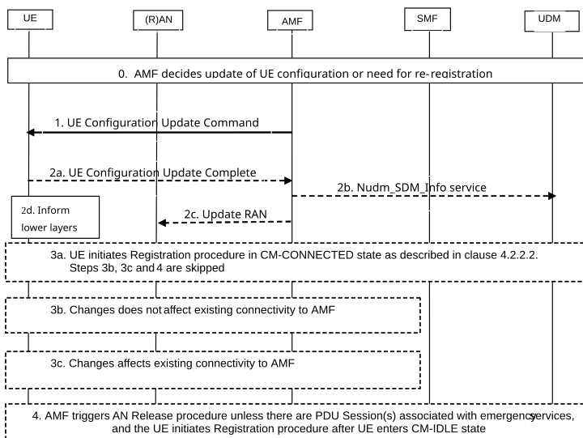

# 4.2.4.2 UE Configuration Update procedure for access and mobility management related parameters

This procedure is initiated by the AMF when the AMF wants to update access and mobility management related parameters in the UE configuration.

This procedure is also used to trigger UE to perform, based on network indication, either Mobility Registration Update procedure while the UE is in CM-CONNECTED state to modify NAS parameters that require negotiation (e.g. MICO mode) or to steer the UE towards EPC as specified in clause 5.31.3 of TS 23.501 \[2\], or Mobility Registration Update procedure after the UE enters CM-IDLE state (e.g. for changes to Allowed NSSAI that require re-registration) or to update the UE with the Alternative S-NSSAI. If a Registration procedure is needed, the AMF provides an indication to the UE to initiate a Registration procedure.

UE Configuration Update shall be sent over the Access Type (i.e. 3GPP access or non-3GPP access) the UE Configuration Update is applied to, when applicable. If the AMF wants to update NAS parameters in the UE which require UE acknowledgement, then the AMF provides an indication to the UE of whether the UE shall acknowledge the command or not. The AMF should not request acknowledgement of the NITZ command. The AMF shall request acknowledgement for NSSAI information (e.g. Allowed NSSAI, Partially Allowed NSSAI, S-NSSAI rejected partially in the RA), 5G-GUTI, TAI List, \[TAI List for S-NSSAIs in Partially Allowed NSSAI\], \[TAI List for S-NSSAI(s) rejected partially in RA\] and Mobility Restrictions, LADN Information, MICO, Operator-defined access category definitions, PLMN-assigned UE Radio Capability ID, S-NSSAI location availability information and SMS subscription.

Figure 4.2.4.2-1: UE Configuration Update procedure for access and mobility management related parameters

0\. AMF determines the necessity of UE configuration change due to various reasons (e.g. UE mobility change, NW policy, reception of Subscriber Data Update Notification from UDM, change of Network Slice configuration (including due to change of the NSSRG information in subscription information as specified in clause 5.15.12 of TS 23.501 \[2\], or due to change of NSAG Information as specified in clause 5.15.14 of TS 23.501 \[2\]), or to remove S-NSSAI from the Allowed NSSAI due to expiry of slice deregistration inactivity timer or to provide the UE with updated Slice Usage Policy as specified in clause 5.15.15 of TS 23.501 \[2\], need to assign PLMN-assigned UE Radio Capability ID, change of Enhanced Coverage Restriction information in the UE context, informing MBSR (IAB-UE) authorization state changes as specified in clause 5.35A.4 of TS 23.501 \[2\] based on operator configuration, a change related to discontinuous coverage (e.g. out-of-coverage period change), need to notify the UE to reconnect to the network due to NG-RAN timing synchronization status change as specified in clause 4.15.9.4) or that the UE needs to perform a Registration Procedure. If a UE is in CM-IDLE, the AMF can wait until the UE is in CM-CONNECTED state or triggers Network Triggered Service Request (in clause 4.2.3.3).

NOTE 1: It is up to the network implementation whether the AMF can wait until the UE is in CM-CONNECTED state or trigger the Network Triggered Service Request.

NOTE 2: The AMF can check whether Network Slice configuration needs to be updated by using the Nnssf_NSSelection_Get service operation and in such case the AMF compares the stored information with the output from the NSSF to decide whether an update of the UE is required.

The AMF may include Mobility Restriction List in N2 message that delivers UE Configuration Update Command to the UE if the service area restriction for the UE is updated.

1\. The AMF sends UE Configuration Update Command containing one or more UE parameters (Configuration Update Indication, 5G-GUTI, TAI List, Allowed NSSAI, Mapping Of Allowed NSSAI, \[Partially Allowed NSSAI\], \[Mapping Of Partially Allowed NSSAI\], \[TAI List for S-NSSAIs in Partially Allowed NSSAI\], Configured NSSAI for the Serving PLMN, Mapping Of Configured NSSAI, \[NSSRG Information\], rejected S-NSSAIs, \[TAI List for S-NSSAI(s) rejected partially in RA\], NITZ, Mobility Restrictions, LADN Information, MICO, Operator-defined access category definitions, SMS Subscribed Indication, \[PLMN-assigned UE Radio Capability ID\], \[PLMN-assigned UE Radio Capability ID deletion indication\], \["List of PLMN(s) to be used in Disaster Condition"\], \[Disaster Roaming wait range information\], \[Disaster Return wait range information\], \[MPS priority\], \[MCX priority\], \[UAS services Indication\], MBSR authorization information, \[S-NSSAI location availability information\], \[Mapping Of Alternative NSSAI\], UE reconnection indication, \[Slice Usage Policy\], \[Maximum Time Offset\]) to the UE. Optionally, the AMF may update the rejected S-NSSAIs in the UE Configuration Update command.

The AMF includes one or more of 5G-GUTI, TAI List, Allowed NSSAI, Mapping Of Allowed NSSAI, Partially Allowed NSSAI, Mapping Of Partially Allowed NSSAI, \[TAI List for S-NSSAIs in Partially Allowed NSSAI\], Configured NSSAI for the Serving PLMN, Mapping Of Configured NSSAI, rejected S-NSSAIs, \[TAI List for S-NSSAI(s) rejected partially in RA\], NITZ (Network Identity and Time Zone), Mobility Restrictions parameters, LADN Information, Operator-defined access category definitions, PLMN-assigned UE Radio Capability ID, or SMS Subscribed Indication if the AMF wants to update these NAS parameters without triggering a UE Registration procedure.

The AMF may include in the UE Configuration Update Command also Configuration Update Indication parameters indicating whether:

\- Network Slicing Subscription Change has occurred;

\- the UE shall acknowledge the command; and

\- whether a Registration procedure is requested.

If the AMF indicates Network Slicing Subscription Change, then the UE shall locally erase all the network slicing configuration for all PLMNs and if applicable, update the configuration for the current PLMN based on any received information. If the AMF indicates Network Slicing Subscription Change, the UE shall also be requested to acknowledge in step 2.

If the AMF also includes in the UE Configuration Update Command message a new Configured NSSAI for the Serving PLMN, then the AMF should also include a new Allowed NSSAI with, if available, the associated Mapping Of Allowed NSSAI, unless the AMF cannot determine the new Allowed NSSAI after the Subscribed S-NSSAI(s) are updated, in which case the AMF does not include in the UE Configuration Update Command message any Allowed NSSAI. If the UE has indicated its support of the subscription-based restrictions to simultaneous registration of network slices feature in the UE 5GMM Core Network Capability, the AMF includes, if available, the NSSRG Information, defined in clause 5.15.12 of TS 23.501 \[2\]. If the UE has not indicated its support of the subscription-based restrictions to simultaneous registration of network slices feature and the subscription information for the UE includes NSSRG information and the AMF is providing the Configured NSSAI to the UE, the Configured NSSAI shall include the S-NSSAIs according to clause 5.15.12 of TS 23.501 \[2\]. For a non-roaming UE, if the UE has indicated its support of Slice Usage Policy in the UE 5GMM Core Network Capability, the AMF may include Slice Usage Policies for slices in the Configured NSSAI as described in clause 5.15.15 of TS 23.501 \[2\]. In the Slice Usage Policy, the AMF indicates an S-NSSAI is on demand slice and slice deregistration inactivity timer value. If the AMF includes slice deregistration timer value, the UE starts any slice deregistration inactivity timer for the on demand S-NSSAIs as described in clause 5.15.15 of TS 23.501 \[2\].

If the UE has indicated its support of NSAG feature in 5GMM Core Network Capability, the AMF includes, if available, the NSAG Information, defined in clause 5.15.14 of TS 23.501 \[2\] when providing a new Configured NSSAI which includes S-NSSAIs with associated NSAG Value(s) or when the NSAG Information changes for some S-NSSAI in the Configured NSSAI. When NSAG Information is provided to the UE, the AMF requests the UE to acknowledge the UE Configuration Command message.

When the UE and the AMF supports RACS as defined in clause 5.4.4.1a of TS 23.501 \[2\] and the AMF needs to configure the UE with a UE Radio Capability ID and the AMF already has the UE radio capabilities other than NB-IoT radio capabilities for the UE and the AMF may provide the UE with the UE Radio Capability ID for the UE radio capabilities the UCMF returns to the AMF in a Nucmf_assign service operation for this UE.

If the UE is needed to be redirected to the dedicated frequency band(s) for S-NSSAI(s), the AMF may determine a Target NSSAI, as described in clause 5.3.4.3.3 of TS 23.501 \[2\], itself or by interacting with the NSSF using Nnssf_NSSelection_Get which includes e.g. the Rejected S-NSSAI(s) for RA and Allowed NSSAI. The AMF may determine RFSP index associated to the Target NSSAI by interacting with the PCF using Npcf_AMPolicyControl_Update which includes the Target NSSAI to retrieve a corresponding RFSP index or based on local configuration in case PCF is not deployed. The Target NSSAI and the RFSP index associated with the Target NSSAI are provided to the NG-RAN within the N2 message carrying the UE Configuration Update Command message.

If the UE and AMF supports Disaster Roaming service, the AMF may include the "list of PLMN(s) to be used in Disaster Condition", Disaster Roaming wait range information and Disaster Return wait range information as specified in TS 23.501 \[2\]. When the disaster condition is no longer applicable, the serving AMF that provides Disaster Roaming service may notify the UE as specified in clause 5.40.5 of TS 23.501 \[2\].

If the AMF receives a Subscriber Data Update Notification from the UDM that includes MPS priority or MCX priority, the AMF includes MPS priority or MCX priority in the UE Configuration Update Command, respectively, as specified in clause 5.22.2 of TS 23.501 \[2\].

If UAS service becomes enabled or disabled (e.g. because the aerial subscription is part of the UE subscription data retrieved from UDM changes), the AMF may include an Indication of UAS services being enabled or disabled in the UE Configuration Update Command.

If the UE indicates its support of LADN per DNN and S-NSSAI in the UE MM Core Network Capability during the Registration procedure as specified in clause 4.2.2.2.2, the AMF may include LADN Information per DNN and S-NSSAI.

For MBSR (IAB-UE) registered in AMF, the AMF may update the MBSR authorization information as specified in clause 5.35A.4 of TS 23.501 \[2\].

If the UE indicated a support for the Network Slice Replacement feature in the 5GMM Core Network Capability and the AMF determines that an S-NSSAI from an Allowed NSSAI is to be replaced with an Alternative S-NSSAI (as described in clause 5.15.19 of TS 23.501 \[2\]), the AMF includes the Mapping Of Alternative NSSAI within the UE Configuration Update Command to the UE and also adds the Alternative S-NSSAI to the Allowed NSSAI and/or Configured NSSAI, if not already included.

If both the UE and the network support unavailability due to discontinuous coverage, the AMF determines this Maximum Time Offset as described in clause 5.4.13.5 of TS 23.501 \[2\]. The AMF includes the Maximum Time Offset within the UE Configuration Update Command to the UE.

2a. If the UE Configuration Update Indication requires acknowledgement of the UE Configuration Update Command, then the UE shall send a UE Configuration Update complete message to the AMF. The AMF should request acknowledgement for all UE Configuration Updates, except when only NITZ is provided. If Registration procedure is not required, steps 3a, 3b, 3c and step 4 are skipped. If the Configuration Update Indication is included in the UE Configuration Update Command message and it requires a Registration procedure, depending on the other NAS parameters included in the UE Configuration Update command, the UE shall execute steps 3a or 3b or 3c+4 as applicable.

If the PLMN-assigned UE Radio Capability ID is included in step1, the AMF stores the UE Radio Capability ID in UE context if receiving UE Configuration Update complete message.

If the UE receives PLMN-assigned UE Radio Capability ID deletion indication in step 1, the UE shall delete the PLMN-assigned UE Radio Capability ID(s) for this PLMN. If UE Configuration Update is only for this purpose, the following steps are skipped.

2b. \[Conditional\] The AMF also uses the Nudm_SDM_Info service operation to provide an acknowledgment to UDM that the UE received CAG information as part of the Mobility Restrictions (if the CAG information was updated), or the Network Slicing Subscription Change Indication (if this was indicated in step 1) and acted upon it.

2c. \[Conditional\] If the AMF has reconfigured the 5G-GUTI over 3GPP access, the AMF informs the NG-RAN of the new UE Identity Index Value (derived from the new 5G-GUTI) when the AMF receives the acknowledgement from the UE in step 2a.

\[Conditional\] If the UE is registered to the same PLMN via both 3GPP and non-3GPP access and if the AMF has reconfigured the 5G-GUTI over non-3GPP access and the UE is in CM-CONNECTED state over 3GPP access, then the AMF informs the NG-RAN of the new UE Identity Index Value (derived from the new 5G-GUTI) when the AMF receives the acknowledgement from the UE in step 2a.

\[Conditional\] If the AMF has configured the UE with a PLMN-assigned UE Radio Capability ID, the AMF informs NG-RAN of the UE Radio Capability ID, when it receives the acknowledgement from the UE in step 2a.

\[Conditional\] If the Mobility Restrictions for the UE were updated and the Mobility Restrictions were not provided in the N2 message that delivers the UE Configuration Update Command, the AMF provides the NG-RAN with updated Mobility Restrictions unless the AMF releases the UE in this step (see below).

If the AMF initiated the UE Configuration Update procedure due to receiving Nudm_SDM_Notification and the CAG information has changed such that a CAG Identifier has been removed from the Allowed CAG list or the UE is only allowed to access CAG cells, the AMF shall release the NAS signalling connection by triggering the AN Release procedure for UEs that are not receiving Emergency Services as defined in TS 23.501 \[2\].

If the AMF need to update Allowed CAG list to the NG-RAN due to change of validity condition as described in TS 23.501 \[2\], the AMF may either update NG-RAN and keep the NAS signalling connection or release the NAS signalling connection by triggering the AN Release procedure, without updating Allowed CAG list to the NG-RAN, for the UEs that are not receiving Emergency Services as defined in TS 23.501 \[2\].

NOTE 3: If validity condition needs to be applied immediately before the NG-RAN enforces Allowed CAG list, the AMF can trigger AN Release without sending updated Allowed CAG list to the NG-RAN.

NOTE 4: When the UE is accessing the network for emergency service the conditions in clause 5.16.4.3 of TS 23.501 \[2\] apply.

2d \[Conditional\] If the UE is configured with a new 5G-GUTI in step 2a via non-3GPP access and the UE is registered to the same PLMN via both 3GPP and non-3GPP access, then the UE passes the new 5G-GUTI to its 3GPP access' lower layers.

If the UE is configured with a new 5G-GUTI in step 2a over the 3GPP access, the UE passes the new 5G-GUTI to its 3GPP access' lower layers.

NOTE 5: Steps 2c and 2d are needed because the NG-RAN may use the RRC_INACTIVE state and a part of the 5G-GUTI is used to calculate the Paging Frame (see TS 38.304 \[44\] and TS 36.304 \[43\]). It is assumed that the UE Configuration Update Complete is reliably delivered to the AMF after the 5G-AN has acknowledged its receipt to the UE.

3a. \[Conditional\] If only NAS parameters that can be updated without transition from CM-IDLE are included (e.g. MICO mode, Enhanced Coverage Restricted information) the UE shall initiate a Registration procedure immediately after the acknowledgement to re-negotiate the updated NAS parameter(s) with the network. Steps 3b, 3c and step 4 are skipped.

3b. \[Conditional\] If a new Allowed NSSAI and/or a new Mapping Of Allowed NSSAI and/or Partially Allowed NSSAI and/or Mapping Of Partially Allowed NSSAI and/or a new Configured NSSAI provided by the AMF to the UE in step 1 does not affect the existing connectivity to AMF, the AMF needs not release the NAS signalling connection for the UE after receiving the acknowledgement in step 2 and immediate registration is not required. The UE can start immediately using the new Allowed NSSAI and/or the new Mapping Of Allowed NSSAI and/or Partially Allowed NSSAI and/or Mapping Of Partially Allowed NSSAI. If one or more PDU Sessions use a S-NSSAI that is not part of the new Allowed NSSAI or Partially Allowed NSSAI, the AMF indicates to the SMF(s) the corresponding PDU Session ID(s) and each SMF releases the PDU Session(s) according to clause 4.3.4.2. The UE cannot connect to an S-NSSAI included in the new Configured NSSAI for the Serving PLMN but not included in the new Allowed NSSAI or Partially Allowed NSSAI until the UE performs a Registration procedure and includes a Requested NSSAI based on the new Configured NSSAI, following the requirements described in clause 5.15.5.2 of TS 23.501 \[2\]. Steps 3c and 4 are skipped.

The AMF may, based on its policy, provide anyway an indication that a Registration procedure is required even though the UE Configuration Update Command in step 1 does not affect the existing connectivity to Network Slices: in such a case only step 3c is skipped.

3c. \[Conditional\] If a new Allowed NSSAI and/or a new Mapping Of Allowed NSSAI and/or Partially Allowed NSSAI and/or Mapping Of Partially Allowed NSSAI and/or a new Configured NSSAI provided by the AMF to the UE in step 1 affects ongoing existing connectivity to AMF, then the AMF shall provide an indication that the UE shall initiate a Registration procedure.

4\. \[Conditional\] After receiving the acknowledgement in step 2, the AMF shall release the NAS signalling connection for the UE by triggering the AN Release procedure, unless there is one established PDU Sessions associated with regulatory prioritized services. If there is one established PDU Session associated with regulatory prioritized services, the AMF informs SMFs to release the PDU Session(s) associated with non regulatory prioritized services for this UE (see clause 4.3.4).

The AMF shall reject any NAS Message from the UE carrying PDU Session Establishment Request for a non-emergency PDU Session before the required Registration procedure has been successfully completed by the UE.

The UE initiates a Registration procedure (see clauses 4.2.2.2.2 and 4.13.3.1) with registration type Mobility Registration Update after the UE enters CM-IDLE state and shall not include the 5G-S-TMSI or GUAMI in Access Stratum signalling and shall include, subject to the conditions set out in clause 5.15.9 of TS 23.501 \[2\], a Requested NSSAI in access stratum signalling. If there is an established PDU Session associated with emergency service and the UE has received an indication to perform the Registration procedure, the UE shall initiate the Registration procedure only after the PDU Session associated with emergency service is released.

NOTE 6: Receiving UE Configuration Update command without an indication requesting to perform re-registration, can still trigger Registration procedure by the UE for other reasons.
